---
## Author
author:
  name: Закиров Нурислам Дамирович
  degrees: студент
  email: 1132236040@rudn.ru
  affiliation:
    - name: Российский университет дружбы народов
      country: Российская Федерация
      postal-code: 117198
      city: Москва
      address: ул. Миклухо-Маклая, д. 6
## Title
title: Лабораторная работа №3
subtitle: Агентное моделирование. Модель Daisyworld
license: CC BY
date: today
date-format: "YYYY-MM-DD"
---

# Информация

## Докладчик

:::::::::::::: {.columns align=center}
::: {.column width="70%"}

  * Закиров Нурислам Дамирович
  * студент группы НФИбд-01-23
  * Российский университет дружбы народов
  * [1132236040@rudn.ru](mailto:1132236040@rudn.ru)

:::
::: {.column width="30%"}


:::
::::::::::::::

:::
::::::::::::::

# Вводная часть

## Цель работы

Освоить методологию **агентного моделирования** (Agent-Based Modeling) на примере классической модели **Daisyworld**:

- реализовать модель **Daisyworld** на языке Julia с использованием **Agents.jl**;
- изучить механизм **саморегуляции экосистемы**;
- преобразовать рабочие скрипты в **литературный стиль** с использованием **Quarto**;
- сгенерировать производные форматы и интегрировать документацию в отчёт.

## Задачи

- Создать проект DrWatson `lab03` с необходимыми зависимостями
- Выполнить предложенный код модели Daisyworld
- Создать скрипты визуализации (базовая, анимация, динамика, комплексная)
- Преобразовать код в литературный стиль
- Сгенерировать производные форматы: `.jl`, `.ipynb`, `.html`
- Выполнить Jupyter notebooks
- Добавить **сравнительный анализ** для различных комбинаций параметров
- Интегрировать Quarto-документацию в отчёт

## Агентное моделирование

:::::::::::::: {.columns}
::: {.column width="50%"}

**Ключевые компоненты:**

- **Агенты** — автономные сущности со свойствами и правилами
- **Среда** — пространство существования (сетка, непрерывное)
- **Взаимодействия** — локальные, глобальные, через среду

**Принципы:**

- Эмерджентность
- Автономия
- Гетерогенность
- Локальность

:::
::: {.column width="50%"}

**Пакет Agents.jl:**

```julia
@agent struct Daisy(GridAgent{2})
    breed::Symbol
    age::Int
    albedo::Float64
end
```

Модель на клеточной сетке 30×30

:::
::::::::::::::

# Теоретическое введение

## Модель Daisyworld --- описание

:::::::::::::: {.columns}
::: {.column width="50%"}

**Два вида маргариток:**

| Вид | Альбедо | Эффект |
|-----|---------|--------|
| Чёрные | 0.25 | Нагревают |
| Белые | 0.75 | Охлаждают |

**Механизм саморегуляции:**

- Холодно → размножаются чёрные
- Тепло → размножаются белые

:::
::: {.column width="50%"}


Начальное состояние (шаг 1)

:::
::::::::::::::

## Модель Daisyworld --- уравнения

$$L_{\text{abs}} = (1 - \alpha) \cdot L$$

$$T_{\text{local}} = 72 \cdot \ln(L_{\text{abs}}) + 80$$

$$P_{\text{seed}} = 0.1457 \cdot T - 0.0032 \cdot T^2 - 0.6443$$

| Параметр | Значение | Смысл |
|----------|----------|-------|
| `griddims` | (30, 30) | размер сетки |
| `max_age` | 25 | максимальный возраст |
| `init_white` | 0.2 | начальная доля белых |
| `albedo_white` | 0.75 | альбедо белых |
| `albedo_black` | 0.25 | альбедо чёрных |
| `solar_luminosity` | 1.0 | светимость |

# Выполнение лабораторной работы

## Инициализация проекта DrWatson

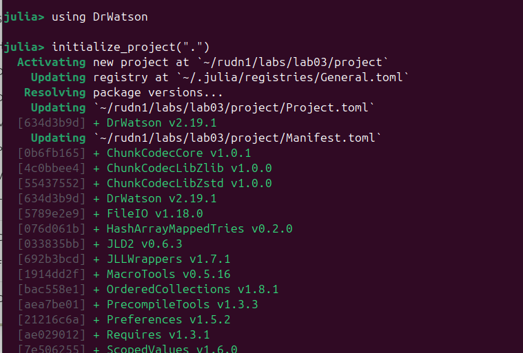

`initialize_project(".")` --- создание структуры проекта

## Структура проекта


- `scripts/` — исполняемые скрипты
- `src/` — базовый код модели
- `literate/` — Quarto документы
- `plots/` — результаты визуализации

## Код модели Daisyworld

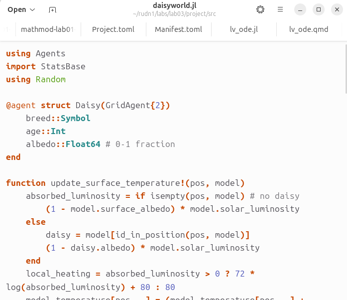

```julia
function update_surface_temperature!(pos, model)
    absorbed_luminosity = if isempty(pos, model)
        (1 - model.surface_albedo) * model.solar_luminosity
    else
        (1 - daisy.albedo) * model.solar_luminosity
    end
    local_heating = 72 * log(absorbed_luminosity) + 80
    model.temperature[pos...] = 
        (model.temperature[pos...] + local_heating) / 2
end
```

## Базовая визуализация


`julia --project=@. scripts/daisyworld.jl`

## Результаты базовой визуализации

:::::::::::::: {.columns}
::: {.column width="33%"}


Шаг 1

:::
::: {.column width="33%"}


Шаг 5

:::
::: {.column width="33%"}


Шаг 40

:::
::::::::::::::

Группировка маргариток в зонах с оптимальной температурой

## Анимация модели

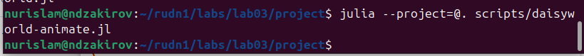

`julia --project=@. scripts/daisyworld-animate.jl`

Результат: `simulation.mp4` (60 кадров)

## Динамика числа маргариток


`julia --project=@. scripts/daisyworld-count.jl`

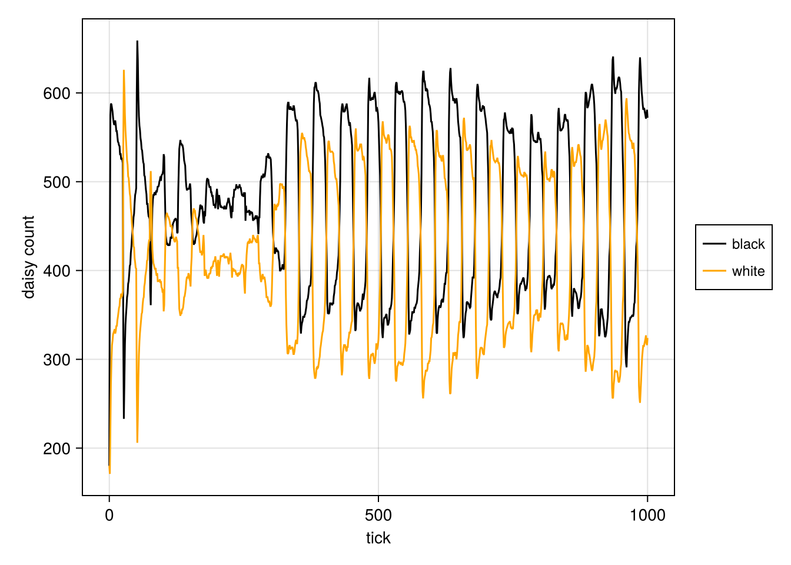

Колебания популяций чёрных и белых маргариток (1000 шагов)

## Комплексная динамика

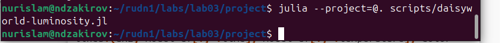

`julia --project=@. scripts/daisyworld-luminosity.jl`


Три подграфика: численность, температура, светимость (сценарий `:ramp`)

## Визуализация с параметрами


`julia --project=@. scripts/daisyworld__param.jl`

Вариация: `max_age ∈ {25, 40}`, `init_white ∈ {0.2, 0.8}`

## Результаты с параметрами

:::::::::::::: {.columns}
::: {.column width="50%"}

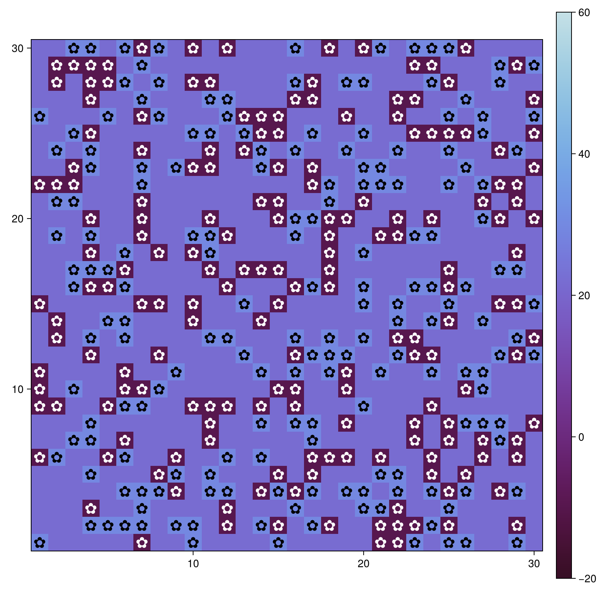

`max_age=25, init_white=0.2` (шаг 1)

:::
::: {.column width="50%"}


`max_age=40, init_white=0.8` (шаг 4)

:::
::::::::::::::

## Динамика с параметрами


`julia --project=@. scripts/daisyworld-count__param.jl`

:::::::::::::: {.columns}
::: {.column width="50%"}

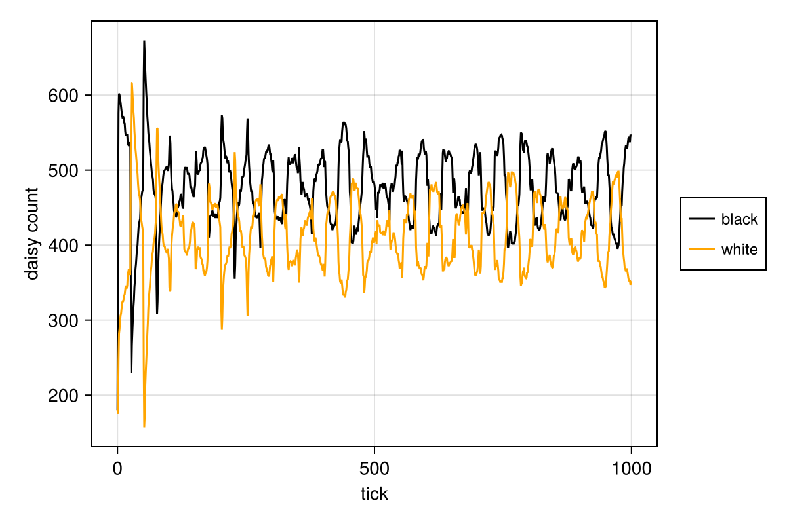

`max_age=25, init_white=0.2`

:::
::: {.column width="50%"}


`max_age=40, init_white=0.8`

:::
::::::::::::::

## Комплексная динамика с параметрами

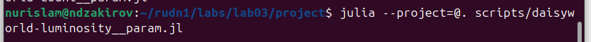

`julia --project=@. scripts/daisyworld-luminosity__param.jl`

:::::::::::::: {.columns}
::: {.column width="50%"}


`max_age=25, init_white=0.2`

:::
::: {.column width="50%"}


`max_age=40, init_white=0.8`

:::
::::::::::::::

## Литературное программирование

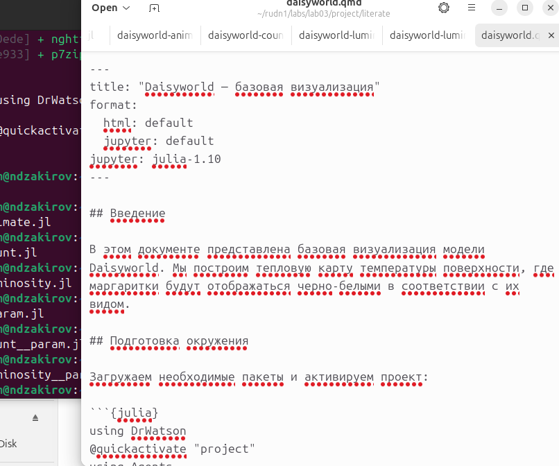

Создание QMD файлов с разделением кода и комментариев

## Рендеринг в HTML

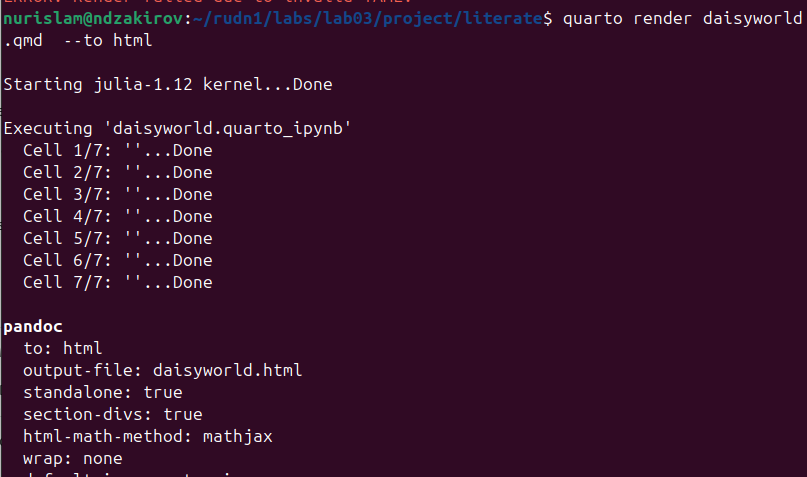

`quarto render literate/daisyworld.qmd --to html`

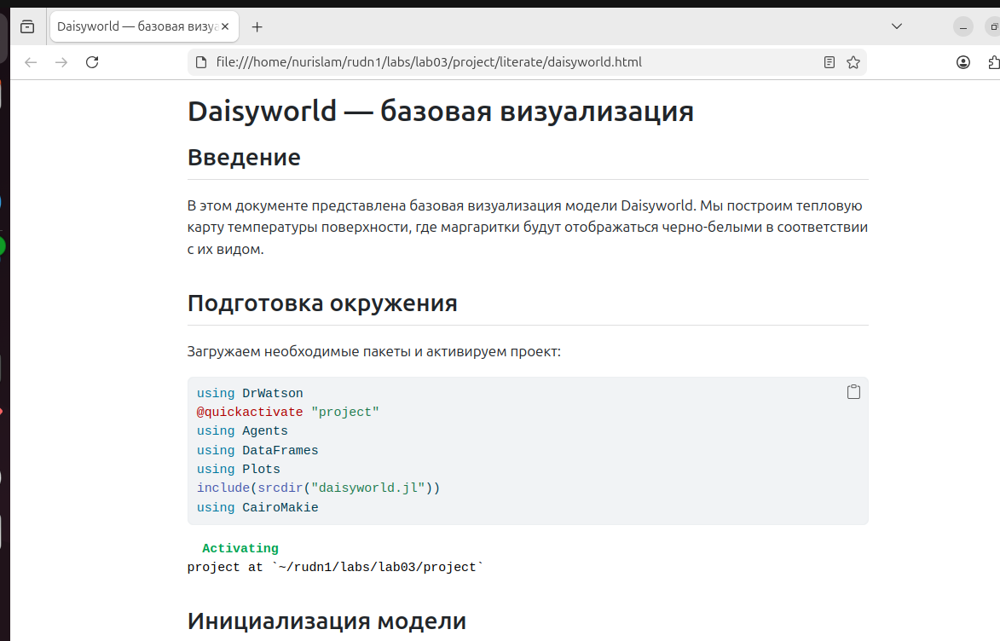

HTML документация в браузере

## Рендеринг в Jupyter

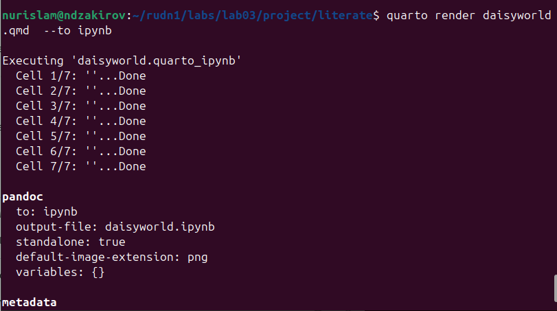

`quarto render literate/daisyworld.qmd --to ipynb`

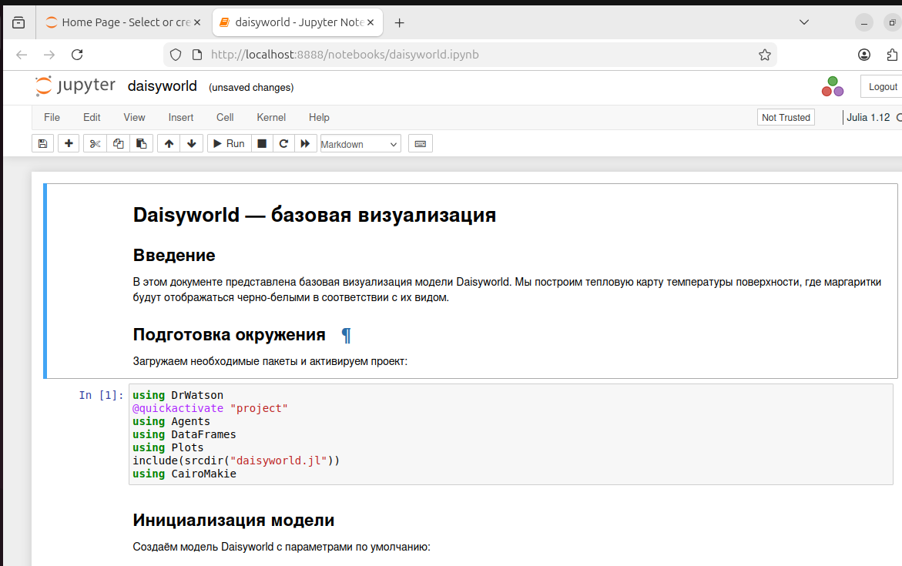

Jupyter Notebook в браузере

## Конвертация в чистый код


`python3 -m nbconvert --to script daisyworld.ipynb`


Конвертированный JL скрипт

## Структура literate

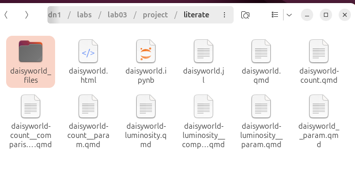

8 QMD файлов для всех скриптов

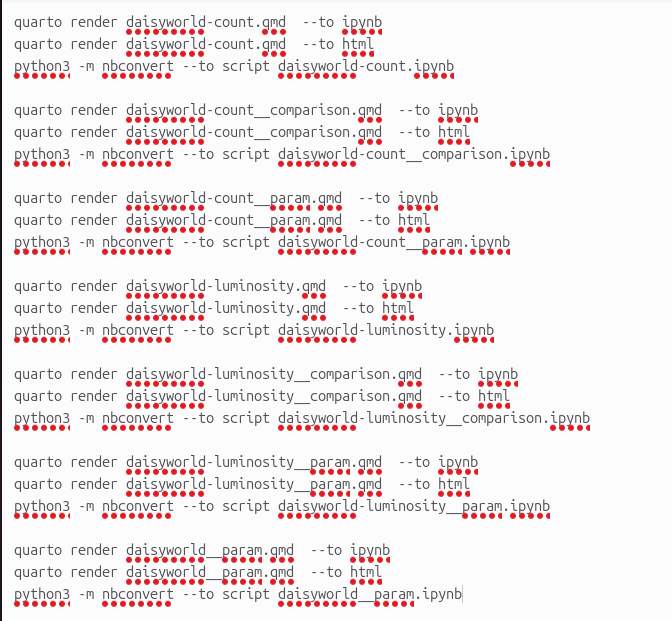

Список всех команд рендеринга

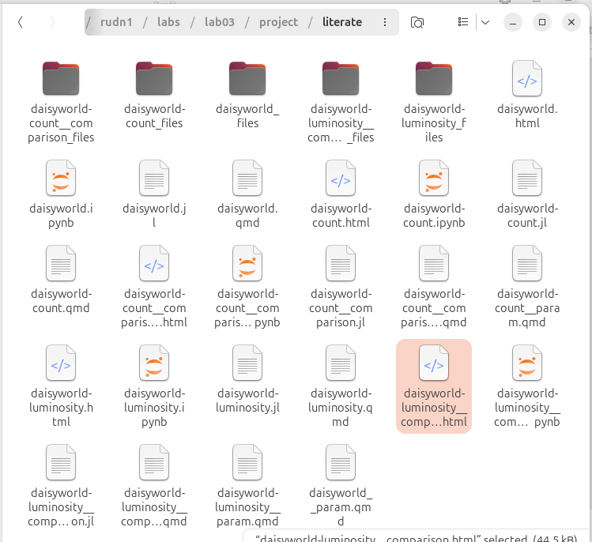

Сгенерированные файлы (HTML, IPYNB, JL)

# Сравнительный анализ

## Динамика численности: 4 комбинации параметров


**Выводы:**

- `max_age=40` → стабильная популяция
- `init_white=0.8` → доминирование белых
- Система устойчива к вариациям параметров

## Комплексная динамика: 4 комбинации


**Результаты:**

- Все комбинации сходятся к стабильному состоянию
- Температура регулируется в диапазоне 5–30°C
- Модель подтверждает гипотезу Геи

# Результаты

## Ключевые результаты

**Базовая визуализация:**

- 3 тепловых карты (шаги 1, 5, 40)
- Группировка маргариток в оптимальных зонах

**Анимация:**

- 60 кадров эволюции модели
- Динамическая саморегуляция

**Динамика числа:**

- Колебания популяций (1000 шагов)
- Противофазные колебания чёрных и белых

**Комплексная динамика:**

- Температура: 5–30°C
- Сценарий `:ramp`: светимость 1.0 → 1.9 → 1.4

**Сравнительный анализ:**

- 4 комбинации параметров
- Устойчивость к вариациям `max_age` и `init_white`

## Выводы

- Изучены основы **агентного моделирования** на примере Daisyworld
- Реализована модель с **механизмом саморегуляции** температуры
- Созданы **7 скриптов визуализации** (базовая, анимация, динамика, комплексная, с параметрами)
- Освоено **литературное программирование** (QMD → HTML, IPYNB, JL)
- Выполнен **сравнительный анализ** для 4 комбинаций параметров
- Все материалы размещены на **GitHub** и **GitLab** (релиз v1.0.0)
- Записаны **скринкасты** (YouTube, RuTube, VK Video)

## Научная ценность

**Модель Daisyworld** наглядно демонстрирует:

- Принципы **гипотезы Геи** — планета как единая саморегулирующаяся система
- Механизм **отрицательной обратной связи** через альбедо маргариток
- **Устойчивость (robustness)** к вариациям биологических параметров

Несмотря на простоту, модель воспроизводит поддержание температуры в благоприятном диапазоне за счёт взаимодействия двух видов.
