---
## Author
author:
  name: Закиров Нурислам Дамирович
  degrees: студент
  email: 1132236040@rudn.ru
  affiliation:
    - name: Российский университет дружбы народов
      country: Российская Федерация
      postal-code: 117198
      city: Москва
      address: ул. Миклухо-Маклая, д. 6

## Title
title: "Агентное моделирование. Модель Daisyworld"
subtitle: "Лабораторная работа №3"
license: "CC BY"
---

# Цель работы

Освоить методологию агентного моделирования (Agent-Based Modeling, ABM) и применить её при реализации классической модели Daisyworld на языке Julia. В ходе работы необходимо научиться создавать агентные модели с использованием пакета Agents.jl, применять принципы литературного программирования, генерировать производные форматы (чистый код, Jupyter-блокнот, Quarto-документация), а также проводить сравнительный анализ влияния параметров на динамику системы.

# Задание

1.  Создать рабочий каталог проекта DrWatson для размещения кода моделей.
2.  Установить необходимые Julia-пакеты (Agents, DrWatson, CairoMakie, DataFrames и др.).
3.  Выполнить предложенный код модели Daisyworld, верифицировать результаты.
4.  Преобразовать рабочий код в литературный стиль с разметкой Quarto.
5.  Сгенерировать из литературного кода три производных формата: чистый `.jl`-скрипт, Jupyter notebook `.ipynb`, Quarto-документ `.html`.
6.  Выполнить код из Jupyter notebook и убедиться в корректности результатов.
7.  Интегрировать Quarto-документацию в настоящий отчёт.
8.  Добавить в литературный код раздел с анализом чувствительности (вычисление для набора параметров).
9.  Перегенерировать производные форматы из обновлённого литературного кода.
10. Выполнить обновлённые Jupyter notebooks.
11. Интегрировать обновлённую документацию с анализом чувствительности в отчёт.
12. Создать сравнительный анализ результатов для различных комбинаций параметров.

# Теоретическое введение

## Агентное моделирование

Агентное моделирование (Agent-Based Modeling, ABM) — это метод исследования сложных систем, в котором поведение системы возникает из взаимодействия множества автономных сущностей, называемых агентами [@railsback2019agent].

В отличие от традиционных подходов, использующих глобальные дифференциальные уравнения, агентное моделирование позволяет описывать поведение каждой индивидуальной единицы системы и правила её взаимодействия с окружающей средой и другими агентами.

### Ключевые компоненты агентной модели

Любая агентная модель включает три основных элемента:

1.  **Агенты** — активные сущности, обладающие:
    - *Свойствами (атрибутами)*: возраст, цвет, запас ресурсов, координаты.
    - *Правилами поведения*: реакция на изменения среды и действия других агентов.
    - *Целями* (не обязательно): выживание, размножение, максимизация выгоды.
    - *Способностью к обучению* (в продвинутых моделях).

2.  **Среда** — пространство, в котором существуют агенты:
    - дискретное (клеточная сетка);
    - непрерывное (2D/3D пространство);
    - сетевое (граф социальных связей).

3.  **Взаимодействия** — правила, определяющие влияние агентов друг на друга:
    - локальные (только с соседями);
    - глобальные (все со всеми);
    - через среду (агенты изменяют среду, среда влияет на агентов).

### Основные принципы

- **Эмерджентность**: глобальное поведение возникает из локальных взаимодействий.
- **Автономия**: агенты действуют независимо.
- **Гетерогенность**: агенты могут различаться характеристиками.
- **Локальность**: агенты имеют информацию только о ближайшем окружении.

## Модель Daisyworld

Модель **Daisyworld** была предложена Джеймсом Лавлоком и Эндрю Уотсоном в 1983 году для иллюстрации гипотезы Геи [@lovelock1983daisyworld].

### Гипотеза Геи

**Гипотеза Геи** рассматривает планету как единую саморегулирующуюся систему, включающую как живые, так и неживые компоненты.

### Описание модели

На поверхности планеты произрастают два вида маргариток:

| Вид | Альбедо | Эффект |
|-----|---------|--------|
| **Чёрные** | 0.25 | Поглощают свет, нагревают среду |
| **Белые** | 0.75 | Отражают свет, охлаждают среду |

### Механизм саморегуляции

1.  Когда климат **слишком холодный**, чёрным маргариткам необходимо размножаться, чтобы повысить температуру.
2.  Когда климат **слишком тёплый**, необходимо производить больше белых маргариток для охлаждения.
3.  Маргаритки размножаются только в определённом температурном диапазоне (оптимум около 20–25°C).

### Уравнения модели

**Поглощённая светимость:**

$$L_{\text{abs}} = (1 - \alpha) \cdot L$$ {#eq-daisy-abs}

где $\alpha$ — альбедо поверхности, $L$ — солнечная светимость.

**Локальный нагрев:**

$$T_{\text{local}} = 72 \cdot \ln(L_{\text{abs}}) + 80$$ {#eq-daisy-temp}

**Вероятность прорастания:**

$$P_{\text{seed}} = 0.1457 \cdot T - 0.0032 \cdot T^2 - 0.6443$$ {#eq-daisy-seed}

Параметры, использованные при моделировании, приведены в [табл. @tbl-daisy-params].

| Параметр | Значение | Смысл |
|----------|----------|-------|
| `griddims` | (30, 30) | размер сетки |
| `max_age` | 25 | максимальный возраст маргаритки |
| `init_white` | 0.2 | начальная доля белых маргариток |
| `init_black` | 0.2 | начальная доля чёрных маргариток |
| `albedo_white` | 0.75 | альбедо белых маргариток |
| `albedo_black` | 0.25 | альбедо чёрных маргариток |
| `surface_albedo` | 0.4 | альбедо пустой почвы |
| `solar_luminosity` | 1.0 | начальная солнечная светимость |
| `scenario` | `:default` | сценарий изменения светимости |

: Параметры модели Daisyworld {#tbl-daisy-params}

Для численного моделирования использовалась библиотека Agents.jl [@agentsjl2024], реализованная на языке Julia [@bezanson2017julia].

# Выполнение лабораторной работы

## Шаг 1. Установка пакетов

Первым делом устанавливаем необходимые пакеты Julia. На [рис. @fig-01-packages] представлен процесс установки пакетов StatsBase и DrWatson через менеджер пакетов.

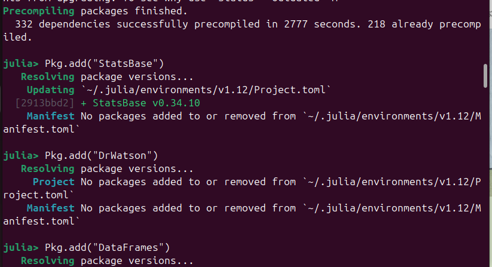{#fig-01-packages width=90%}

Далее устанавливаем пакет CairoMakie для визуализации ([рис. @fig-02-packages]). Видно, что установлено более 20 зависимостей: ImageIO, PNGFiles, JpegTurbo и другие.

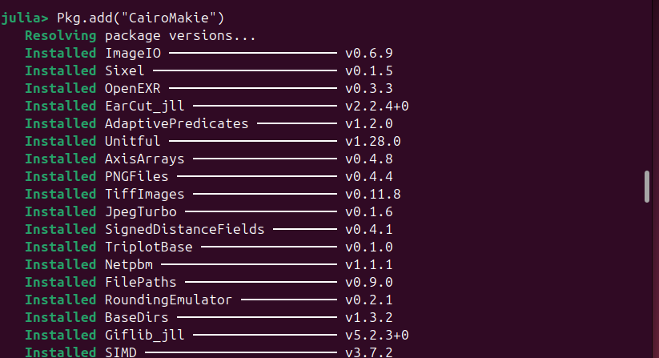{#fig-02-packages width=90%}

## Шаг 2. Инициализация проекта DrWatson

Вызываем функцию `initialize_project` для создания стандартной структуры каталогов научного проекта ([рис. @fig-03-init]).

{#fig-03-init width=90%}

На [рис. @fig-03-init] видно, что проект активирован, установлен пакет DrWatson v2.19.1 и его зависимости: ChunkCodecCore, FileIO, JLD2, MacroTools и другие.

## Шаг 3. Структура проекта

DrWatson автоматически создаёт каталоги для организации воспроизводимых вычислений ([рис. @fig-04-structure]):

- `scripts/` — исполняемые скрипты
- `src/` — базовый код модели
- `plots/` — результаты визуализации
- `notebooks/` — Jupyter ноутбуки
- `papers/` — статьи
- `data/` — данные

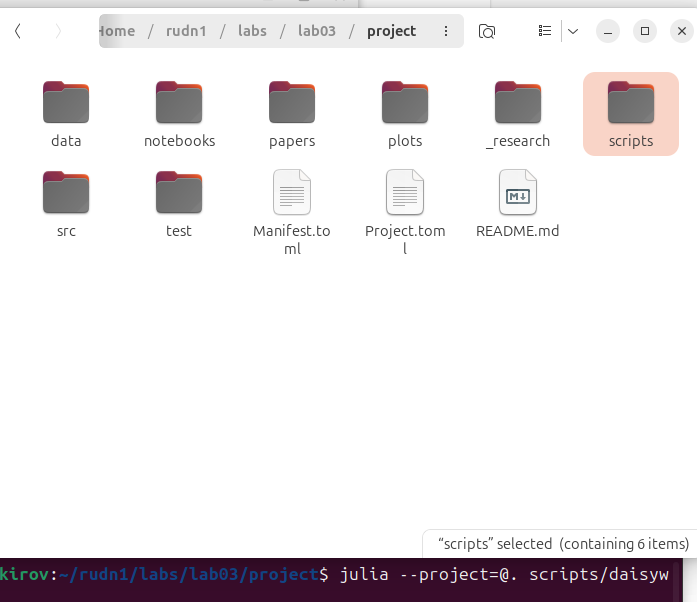{#fig-04-structure width=90%}

## Шаг 4. Код модели Daisyworld

Код модели размещаем в файле `src/daisyworld.jl`. Определяем тип агента `Daisy` ([рис. @fig-05-code]):

```julia
@agent struct Daisy(GridAgent{2})
    breed::Symbol      # :black или :white
    age::Int           # возраст в шагах
    albedo::Float64    # отражательная способность
end
```

{#fig-05-code width=90%}

### Функции модели

**Обновление температуры поверхности** (уравнение [-@eq-daisy-abs]):

```julia
function update_surface_temperature!(pos, model)
    absorbed_luminosity = if isempty(pos, model)
        (1 - model.surface_albedo) * model.solar_luminosity
    else
        daisy = model[id_in_position(pos, model)]
        (1 - daisy.albedo) * model.solar_luminosity
    end
    local_heating = absorbed_luminosity > 0 ? 
        72 * log(absorbed_luminosity) + 80 : 80
    model.temperature[pos...] = 
        (model.temperature[pos...] + local_heating) / 2
end
```

**Размножение маргариток** (уравнение [-@eq-daisy-seed]):

```julia
function propagate!(pos, model)
    isempty(pos, model) && return
    daisy = model[id_in_position(pos, model)]
    temperature = model.temperature[pos...]
    seed_threshold = (0.1457 * temperature - 
                      0.0032 * temperature^2) - 0.6443
    if rand(abmrng(model)) < seed_threshold
        empty_near_pos = random_nearby_position(
            pos, model, 1, npos -> isempty(npos, model)
        )
        if !isnothing(empty_near_pos)
            add_agent!(empty_near_pos, model, daisy.breed, 
                       0, daisy.albedo)
        end
    end
end
```

## Шаг 5. Базовая визуализация

Запускаем базовую визуализацию командой:

```bash
julia --project=@. scripts/daisyworld.jl
```

На [рис. @fig-06-run) представлен процесс запуска скрипта.

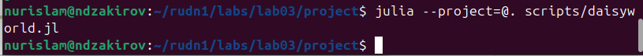{#fig-06-run width=90%}

Скрипт создаёт три тепловых карты на разных шагах модели:

- **Шаг 1** — начальное состояние ([рис. @fig-07-step1])
- **Шаг 5** — после 5 шагов ([рис. @fig-08-step5])
- **Шаг 40** — после 40 шагов ([рис. @fig-09-step40])

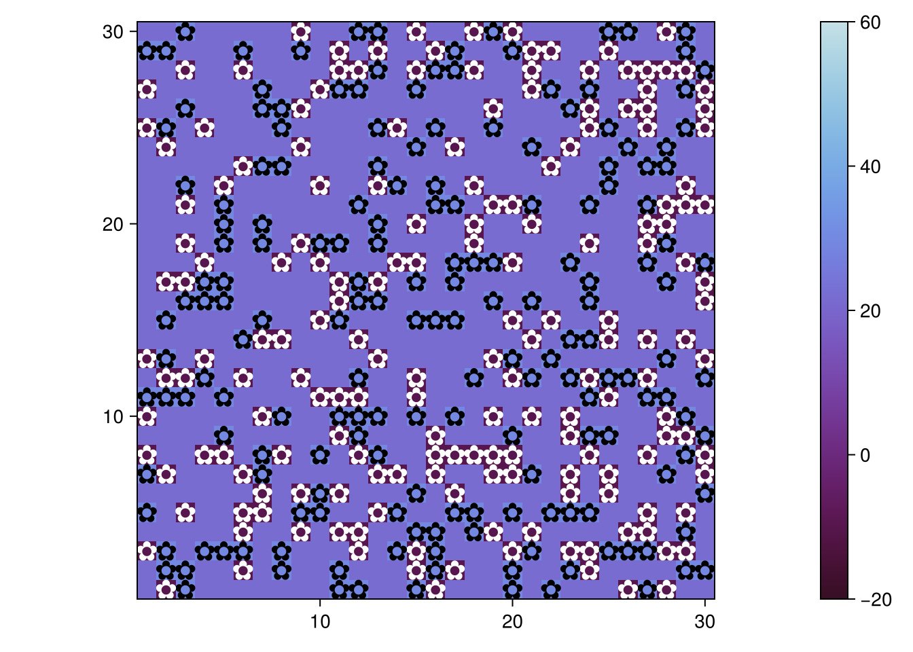{#fig-07-step1 width=90%}

На [рис. @fig-07-step1] видно равномерное распределение чёрных (тёмные цветки) и белых (светлые цветки) маргариток на сетке 30×30. Цвет фона обозначает температуру (шкала справа: от −20 до 60).

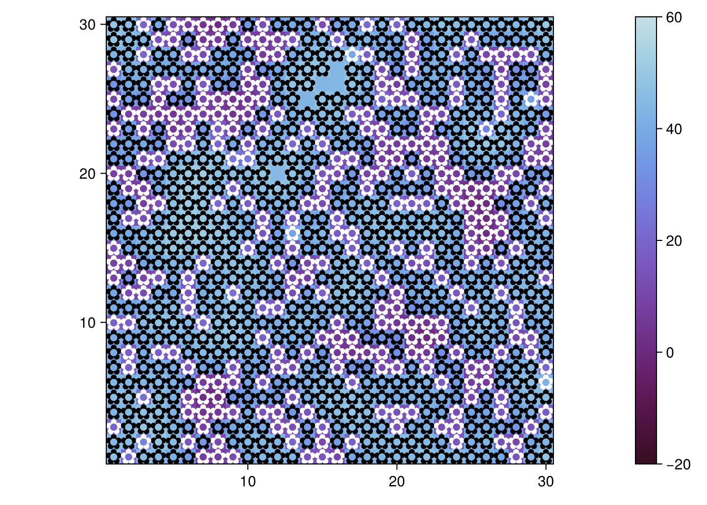{#fig-08-step5 width=90%}

На [рис. @fig-08-step5] наблюдается начальная группировка маргариток в зонах с оптимальной температурой.

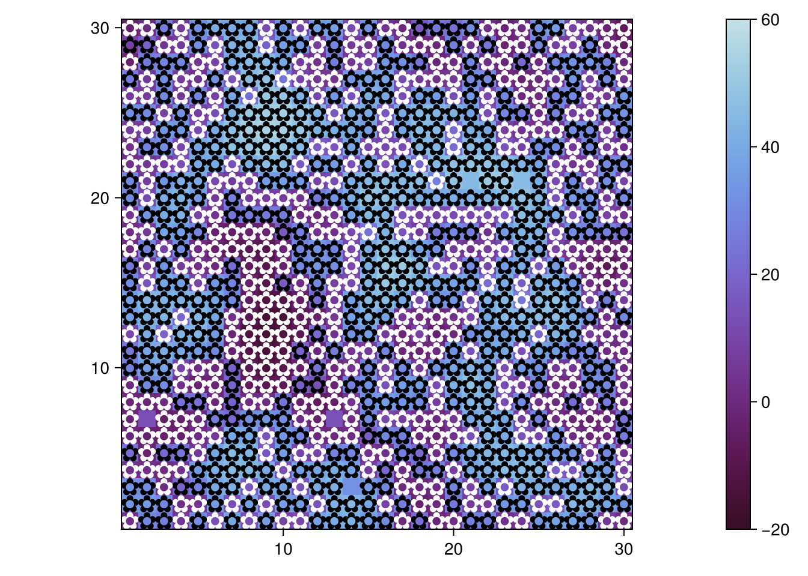{#fig-09-step40 width=90%}

На [рис. @fig-09-step40] видна выраженная группировка агентов, демонстрирующая механизм саморегуляции температуры.

## Шаг 6. Анимация модели

Запускаем скрипт анимации:

```bash
julia --project=@. scripts/daisyworld-animate.jl
```

Процесс запуска показан на [рис. @fig-10-run-anim].

{#fig-10-run-anim width=90%}

Результат анимации доступен на видеохостингах:

:::::::::::::: {.columns}
::: {.column width="50%"}


:::
::: {.column width="50%"}

- **VK Video:** [Смотреть](https://vkvideo.ru/clip-236180147_456239039)
- **RuTube:** [Смотреть](https://rutube.ru/video/2be75ef1b504c0a364c4dc6f7c855fa0/)

:::
::::::::::::::

*Рисунок 11 — Анимация эволюции модели Daisyworld (60 кадров)* {#fig-11-video}

## Шаг 7. Динамика числа маргариток

Запускаем скрипт динамики числа:

```bash
julia --project=@. scripts/daisyworld-count.jl
```

Запуск скрипта показан на [рис. @fig-12-run-count].

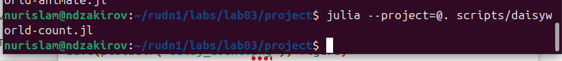{#fig-12-run-count width=90%}

Результат: график динамики численности маргариток на 1000 шагах ([рис. @fig-13-count]).

{#fig-13-count width=90%}

На [рис. @fig-13-count] видны колебания популяций чёрных (чёрная линия) и белых (оранжевая линия) маргариток. Наблюдается конкуренция за пространство и температурную нишу.

## Шаг 8. Комплексная динамика

Запускаем скрипт комплексной динамики (сценарий `:ramp`):

```bash
julia --project=@. scripts/daisyworld-luminosity.jl
```

Запуск показан на [рис. @fig-14-run-lum].

{#fig-14-run-lum width=90%}

Результат: комплексный график из трёх подграфиков ([рис. @fig-15-luminosity]).

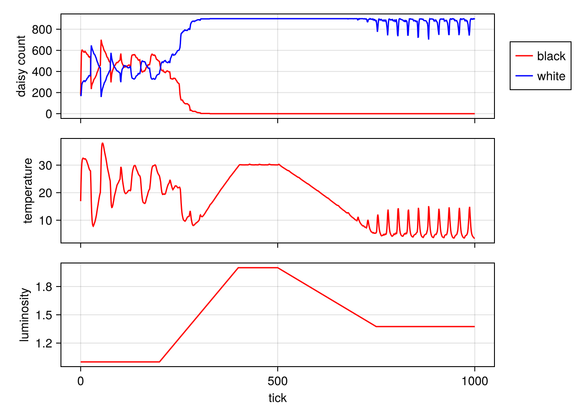{#fig-15-luminosity width=90%}

На [рис. @fig-15-luminosity] представлены:

1.  **Верхний график**: численность маргариток (красный — чёрные, синий — белые). После 400 шагов белые маргаритки доминируют.
2.  **Средний график**: температура поверхности. Система поддерживает температуру в диапазоне 5–30°C.
3.  **Нижний график**: солнечная светимость (сценарий `:ramp`). Плавное увеличение до 500 шага, затем снижение.

## Шаг 9. Визуализация с параметрами

Запускаем скрипт с перебором параметров:

```bash
julia --project=@. scripts/daisyworld__param.jl
```

Запуск показан на [рис. @fig-16-run-param].

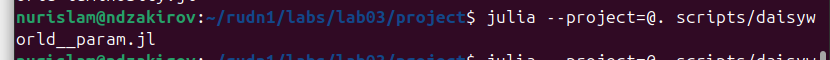{#fig-16-run-param width=90%}

Вариация параметров: `max_age ∈ {25, 40}`, `init_white ∈ {0.2, 0.8}`.

Результаты для различных комбинаций параметров:

- `max_age=25, init_white=0.2` (шаг 1) — [рис. @fig-17-param1]
- `max_age=40, init_white=0.8` (шаг 4) — [рис. @fig-18-param2]

{#fig-17-param1 width=90%}

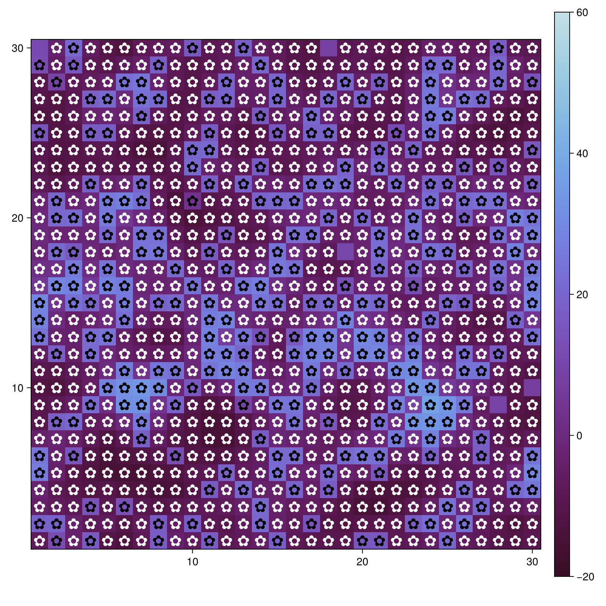{#fig-18-param2 width=90%}

## Шаг 10. Динамика с параметрами

Запускаем скрипт динамики с параметрами:

```bash
julia --project=@. scripts/daisyworld-count__param.jl
```

Запуск показан на [рис. @fig-19-run-count-param].

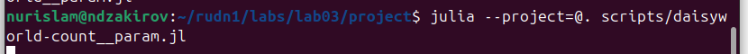{#fig-19-run-count-param width=90%}

Результаты для различных комбинаций параметров:

- `max_age=25, init_white=0.2` — [рис. @fig-20-count-param1]
- `max_age=40, init_white=0.8` — [рис. @fig-21-count-param2]

{#fig-20-count-param1 width=90%}

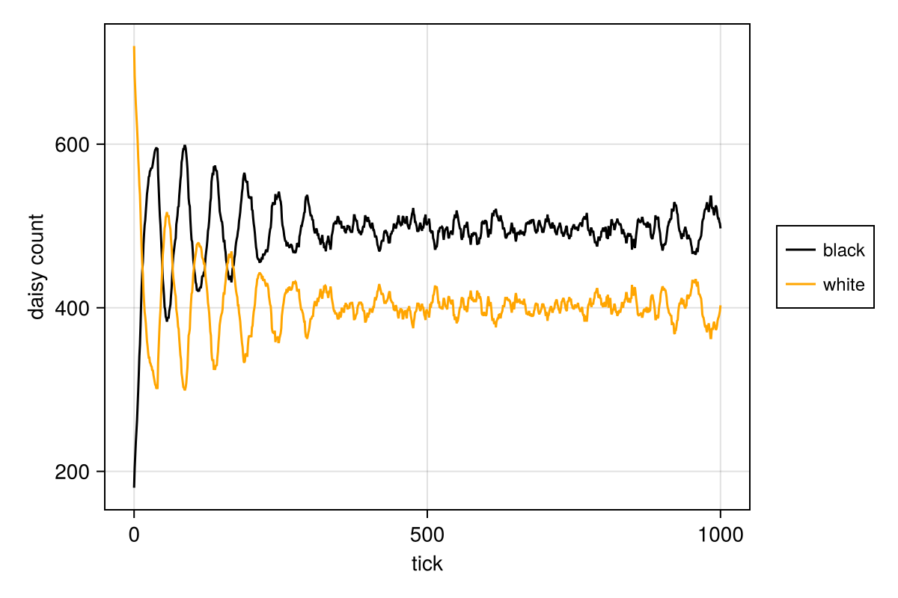{#fig-21-count-param2 width=90%}

**Анализ:**

Увеличение `max_age` приводит к более стабильной популяции. Увеличение `init_white` смещает баланс в сторону белых маргариток.

## Шаг 11. Комплексная динамика с параметрами

Запускаем скрипт комплексной динамики с параметрами:

```bash
julia --project=@. scripts/daisyworld-luminosity__param.jl
```

Запуск показан на [рис. @fig-22-run-lum-param].

{#fig-22-run-lum-param width=90%}

Результаты для различных комбинаций параметров:

- `max_age=25, init_white=0.2` — [рис. @fig-23-lum-param1]
- `max_age=40, init_white=0.8` — [рис. @fig-24-lum-param2]

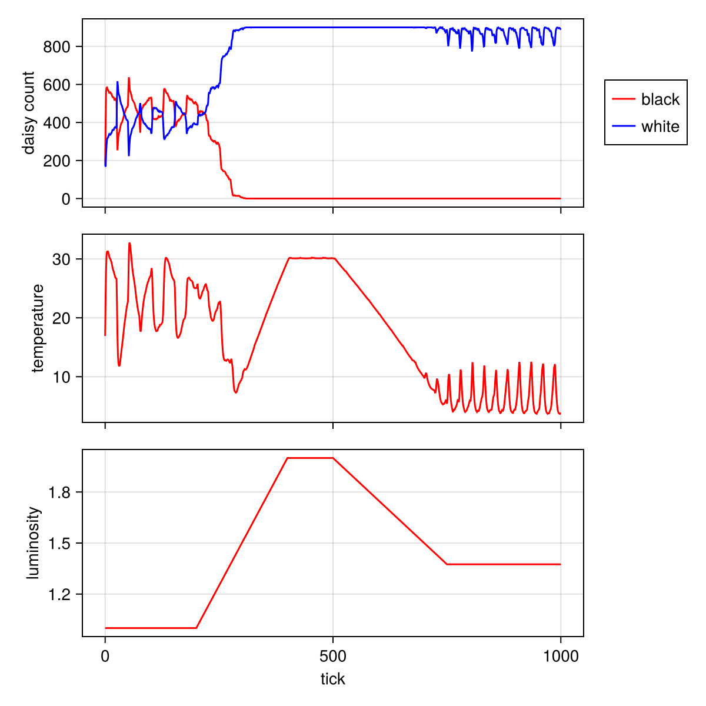{#fig-23-lum-param1 width=90%}

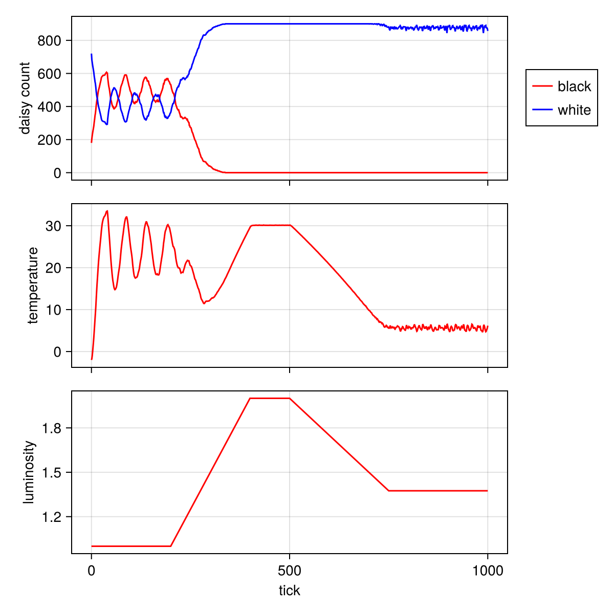{#fig-24-lum-param2 width=90%}

## Шаг 12. Преобразование в литературный стиль

Создаём файл `literate/daisyworld.qmd` в литературном стиле ([рис. @fig-25-qmd]).

{#fig-25-qmd width=90%}

Код окружаем метками ```` ```{julia} ``, а комментарии оставляем как есть — они автоматически считываются форматом Markdown.

## Шаг 13. Рендеринг в HTML

Рендерим Quarto документ в HTML:

```bash
quarto render literate/daisyworld.qmd --to html
```

Процесс рендеринга показан на [рис. @fig-26-render-html].

{#fig-26-render-html width=90%}

Результат: HTML файл с разделением на блоки кода и комментариев ([рис. @fig-27-html-result]).

{#fig-27-html-result width=90%}

## Шаг 14. Рендеринг в Jupyter

Рендерим Quarto документ в Jupyter notebook:

```bash
quarto render literate/daisyworld.qmd --to ipynb
```

Процесс показан на [рис. @fig-28-render-ipynb].

{#fig-28-render-ipynb width=90%}

Результат: Jupyter notebook в браузере ([рис. @fig-29-jupyter]).

{#fig-29-jupyter width=90%}

## Шаг 15. Конвертация в чистый код

Конвертируем notebook в чистый JL скрипт:

```bash
python3 -m nbconvert --to script daisyworld.ipynb
```

Процесс показан на [рис. @fig-30-nbconvert].

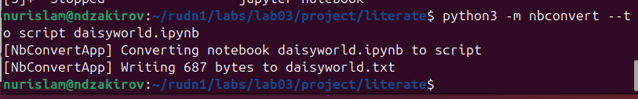{#fig-30-nbconvert width=90%}

Результат: конвертированный JL скрипт ([рис. @fig-31-jl-script]).

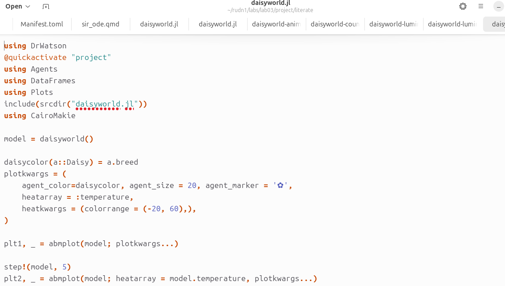{#fig-31-jl-script width=90%}

## Шаг 16. Структура папки literate

На [рис. @fig-32-literate-qmd] представлена папка `literate` со всеми QMD файлами.

{#fig-32-literate-qmd width=90%}

Список всех команд рендеринга показан на [рис. @fig-33-render-list].

{#fig-33-render-list width=90%}

Папка `literate` со сгенерированными файлами (HTML, IPYNB, JL) представлена на [рис. @fig-34-literate-generated].

{#fig-34-literate-generated width=90%}

## Шаг 17. Сравнительный анализ

### Сравнительный анализ динамики численности

Результат рендеринга `literate/daisyworld-count__comparison.qmd` представлен на [рис. @fig-35-comparison-count].

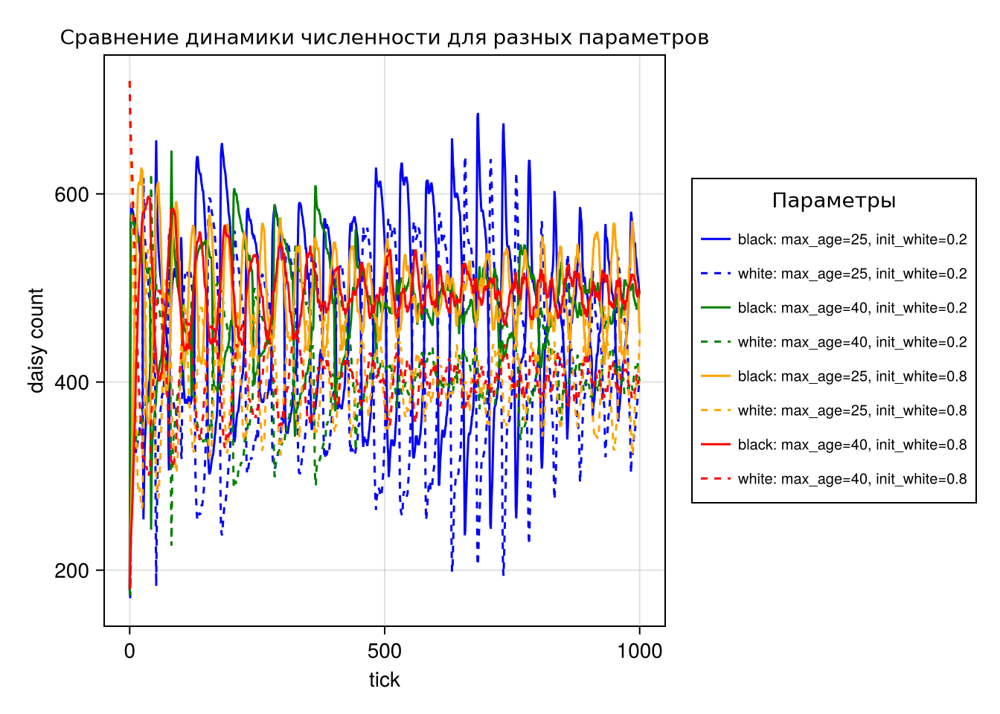{#fig-35-comparison-count width=90%}

На [рис. @fig-35-comparison-count] представлены 8 кривых (4 комбинации параметров × 2 вида маргариток). Различные цвета обозначают разные комбинации `max_age` и `init_white`. Пунктирные линии — белые маргаритки, сплошные — чёрные.

**Выводы:**

1.  При `max_age=40` популяция более стабильна.
2.  При `init_white=0.8` белые маргаритки доминируют с начала симуляции.
3.  Система демонстрирует устойчивость к изменениям параметров.

### Сравнительный анализ комплексной динамики

Результат рендеринга `literate/daisyworld-luminosity__comparison.qmd` представлен на [рис. @fig-36-comparison-lum].

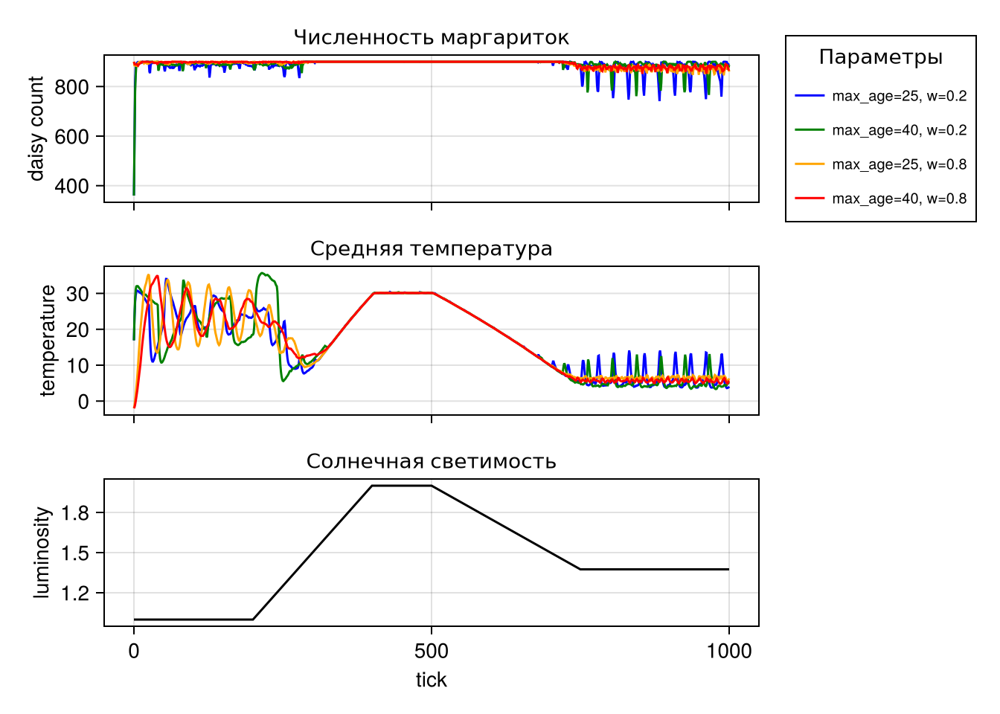{#fig-36-comparison-lum width=90%}

**Анализ:**

1.  **Численность**: все комбинации сходятся к стабильному состоянию после 400 шагов.
2.  **Температура**: система регулирует температуру в диапазоне 5–30°C независимо от параметров.
3.  **Светимость**: одинакова для всех комбинаций (сценарий `:ramp`).

**Вывод:**

Модель Daisyworld демонстрирует robustness (устойчивость) к вариациям биологических параметров, что подтверждает гипотезу о саморегуляции экосистемы.

# Выводы

По итогам лабораторной работы №3 были достигнуты следующие результаты:

1.  **Изучены основы агентного моделирования** на примере модели Daisyworld. Освоены ключевые концепции: агенты, среда, взаимодействия, эмерджентность.

2.  **Реализована модель Daisyworld** с чёрными и белыми маргаритками, демонстрирующая механизм саморегуляции температуры. Модель подтверждает гипотезу Геи о планете как единой саморегулирующейся системе.

3.  **Созданы скрипты визуализации** (7 файлов):
    - базовая визуализация (тепловые карты на шагах 1, 5, 40);
    - анимация эволюции (60 кадров);
    - динамика численности (1000 шагов);
    - комплексная динамика (температура, светимость);
    - скрипты с перебором параметров.

4.  **Освоено литературное программирование**:
    - созданы QMD документы с разделением кода и комментариев;
    - сгенерированы производные форматы (HTML, Jupyter, JL);
    - выполнена конвертация через nbconvert.

5.  **Выполнен сравнительный анализ** для 4 комбинаций параметров (`max_age × init_white`):
    - при `max_age=40` популяция более стабильна;
    - при `init_white=0.8` белые маргаритки доминируют;
    - система устойчива к вариациям параметров.


**Научная ценность:**

Модель Daisyworld наглядно демонстрирует принципы гипотезы Геи — планета как единая саморегулирующаяся система. Несмотря на простоту, модель воспроизводит механизм отрицательной обратной связи, поддерживающий температуру в благоприятном диапазоне. Полученные результаты подтверждают устойчивость системы к вариациям биологических параметров.

# Список литературы{.unnumbered}

::: {#refs}
:::
