---
## Author
author:
  name: Закиров Нурислам Дамирович
  degrees: студент
  email: 1132236040@rudn.ru
  affiliation:
    - name: Российский университет дружбы народов
      country: Российская Федерация
      postal-code: 117198
      city: Москва
      address: ул. Миклухо-Маклая, д. 6

## Title
title: "Реализация основных моделей в агентном подходе. Модель SIR"
subtitle: "Лабораторная работа №4"
license: "CC BY"
---

# Цель работы

Освоить методологию агентного моделирования (Agent-Based Modeling, ABM) и применить её при реализации классической модели SIR (Susceptible-Infectious-Recovered) на языке Julia. В ходе работы необходимо научиться создавать агентные модели с использованием пакета Agents.jl, применять принципы литературного программирования, генерировать производные форматы (чистый код, Jupyter-блокнот, Quarto-документация), а также проводить исследование влияния параметров на динамику эпидемического процесса.

# Задание

## Основные задания

1.  Создать рабочий каталог проекта DrWatson для размещения кода моделей.
2.  Установить необходимые Julia-пакеты (Agents, DrWatson, DataFrames, Plots, BlackBoxOptim и др.).
3.  Выполнить предложенный код модели SIR, верифицировать результаты.
4.  Преобразовать рабочий код в литературный стиль с разметкой Quarto.
5.  Сгенерировать из литературного кода три производных формата: чистый `.jl`-скрипт, Jupyter notebook `.ipynb`, Quarto-документ `.html`.
6.  Выполнить код из Jupyter notebook и убедиться в корректности результатов.
7.  Интегрировать Quarto-документацию в настоящий отчёт.
8.  Добавить в литературный код раздел с анализом чувствительности (вычисление для набора параметров).
9.  Перегенерировать производные форматы из обновлённого литературного кода.
10. Выполнить обновлённые Jupyter notebooks.
11. Интегрировать обновлённую документацию с анализом чувствительности в отчёт.

## Дополнительные задания (раздел 4.1.12)

1.  **Базовый уровень** — вычислить базовое репродуктивное число R₀ по формуле R₀ = β/γ и сравнить с наблюдаемой динамикой.
2.  **Исследование порога** — найти минимальное значение β, при котором возникает эпидемия (пик I > 5% популяции), сравнить с теоретическим порогом R₀ = 1.
3.  **Эффект гетерогенности** — задать разные значения β для разных городов, исследовать влияние на общую динамику, построить графики для каждого города отдельно.
4.  **Миграция** — исследовать влияние интенсивности миграции на скорость распространения инфекции.
5.  **Карантинные меры** — модифицировать модель, добавив возможность закрытия города при превышении порога заболеваемости, оценить эффективность такой меры.
6.  **Оптимизация** — используя оптимизацию, найти параметры, которые минимизируют общее число умерших при сохранении пика заболеваемости ниже 30%.

# Теоретическое введение

## Агентное моделирование в эпидемиологии

Агентное моделирование (Agent-Based Modeling, ABM) — это метод исследования сложных систем, в котором поведение системы возникает из взаимодействия множества автономных сущностей, называемых агентами [@railsback2019agent].

В эпидемиологии агентный подход позволяет преодолеть ограничения классических моделей на дифференциальных уравнениях:

- **Индивидуальные характеристики**: каждый агент имеет свои параметры (возраст, статус, историю заражений)
- **Пространственная структура**: агенты размещаются в городах, перемещаются между ними
- **Стохастичность**: заражение происходит случайно с некоторой вероятностью
- **Гетерогенность контактов**: разные группы населения имеют разную активность

### Преимущества перед ОДУ-моделями

| Характеристика | ОДУ-модель | Агентная модель |
|----------------|------------|-----------------|
| Население | Непрерывная величина | Дискретные агенты |
| Динамика | Детерминированная | Стохастическая |
| Контакты | Полное перемешивание | Локальные взаимодействия |
| Флуктуации | Отсутствуют | Присутствуют |

## Модель SIR

Модель **SIR** была предложена Кермаком и Маккендриком в 1927 году [@kermack1927contribution] и является классической моделью эпидемиологии.

### Компартаменты модели

Всё население делится на три группы:

| Группа | Обозначение | Описание |
|--------|-------------|----------|
| **Susceptible** | S | Восприимчивые к заболеванию |
| **Infectious** | I | Инфицированные, заразные |
| **Recovered** | R | Выздоровевшие или умершие |

### Классическая модель на ОДУ

Классическая модель описывается системой дифференциальных уравнений:

$$
\frac{dS}{dt} = -\beta \frac{SI}{N}
$$ {#eq-sir-s}

$$
\frac{dI}{dt} = \beta \frac{SI}{N} - \gamma I
$$ {#eq-sir-i}

$$
\frac{dR}{dt} = \gamma I
$$ {#eq-sir-r}

где:
- $\beta$ — коэффициент передачи инфекции,
- $\gamma = 1/\text{infection\_period}$ — скорость выздоровления,
- $N = S + I + R$ — общая численность популяции.

### Базовое репродуктивное число R₀

**Базовое репродуктивное число** R₀ показывает, сколько человек в среднем заражает один инфицированный в полностью восприимчивой популяции [@hethcote2000mathematics]:

$$
R_0 = \frac{\beta}{\gamma}
$$ {#eq-r0}

**Порог эпидемии:**
- Если $R_0 > 1$ — эпидемия возникает и распространяется
- Если $R_0 < 1$ — эпидемия затухает

Для справки:
- Сезонный грипп: $R_0 \approx 1.3$
- COVID-19 (оригинальный): $R_0 \approx 2.5\text{--}3$
- COVID-19 (дельта): $R_0 \approx 5\text{--}7$
- Корь: $R_0 \approx 12\text{--}18$

### Параметры агентной модели SIR

Параметры, использованные при моделировании, приведены в [табл. @tbl-sir-params].

| Параметр | Значение | Смысл |
|----------|----------|-------|
| `Ns` | [1000, 1000, 1000] | численность по трём городам |
| `β_und` | [0.5, 0.5, 0.5] | передача невыявленными |
| `β_det` | [0.05, 0.05, 0.05] | передача выявленными |
| `infection_period` | 14 | длительность заболевания (дней) |
| `detection_time` | 7 | время до выявления |
| `death_rate` | 0.02 | вероятность летального исхода |
| `reinfection_probability` | 0.1 | вероятность повторного заражения |
| `migration_rates` | матрица 3×3 | вероятности миграции между городами |

: Параметры модели SIR {#tbl-sir-params}

### Динамика модели

На каждом шаге (соответствует одному дню) для каждого агента выполняются следующие процессы:

1.  **Миграция** — агент может переместиться в другую локацию с вероятностью, заданной матрицей миграции.
2.  **Передача инфекции** — если агент инфицирован, он может заразить восприимчивых агентов в той же локации. Количество заражённых за день определяется пуассоновским процессом.
3.  **Обновление счётчика** — для инфицированных увеличивается `days_infected`.
4.  **Выздоровление или смерть** — если `days_infected` достиг `infection_period`, агент либо выздоравливает, либо умирает.

Для численного моделирования использовалась библиотека Agents.jl [@agentsjl2024], реализованная на языке Julia [@bezanson2017julia].

# Выполнение лабораторной работы

## Шаг 1. Инициализация проекта DrWatson

Первым делом создаём проект DrWatson для организации воспроизводимых вычислений. На [рис. @fig-01-initialize] представлен процесс инициализации проекта через REPL Julia.

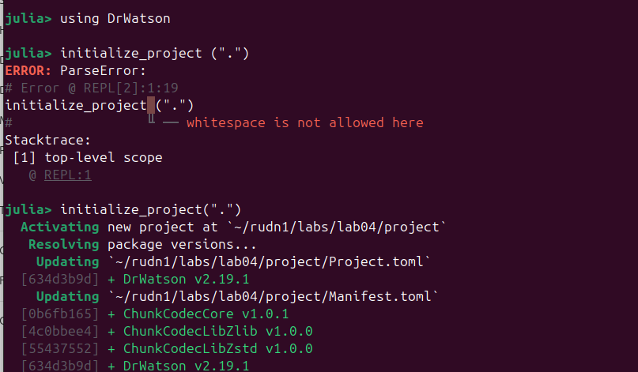{#fig-01-initialize width=90%}

На [рис. @fig-01-initialize] видно, что проект активирован, установлен пакет DrWatson v2.19.1 и его зависимости.

## Шаг 2. Базовый эксперимент

Запускаем базовый эксперимент с параметрами по умолчанию:

```bash
julia --project=. scripts/sir_run_basic.jl
```

На [рис. @fig-02-run-basic] показан запуск скрипта в терминале.

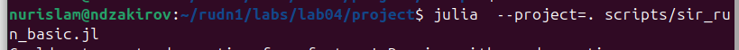{#fig-02-run-basic width=90%}

На [рис. @fig-02-run-basic] видна команда запуска скрипта `julia --project=. scripts/sir_run_basic.jl` в терминале Ubuntu. Скрипт использует проектную конфигурацию из Project.toml для загрузки всех необходимых пакетов.

Результат выполнения — график динамики численности S, I, R ([рис. @fig-03-sir-basic]).

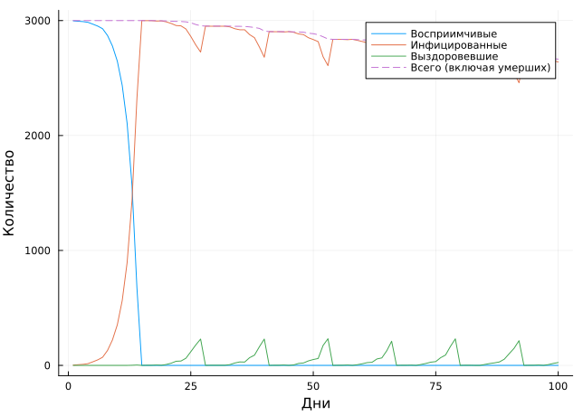{#fig-03-sir-basic width=90%}

На [рис. @fig-03-sir-basic] представлена динамика эпидемического процесса:

- **Синяя линия (Восприимчивые)** — начинается с 3000 человек, резко падает после 10-го дня, к 15-му дню достигает нуля. Это означает, что всё население переболело.
- **Оранжевая линия (Инфицированные)** — начинается с 1 человека, экспоненциально растёт, достигает пика 3000 человек к 15-му дню, затем падает до нуля к 20-му дню.
- **Зелёная линия (Выздоровевшие)** — растёт волнообразно с периодом около 25 дней, что связано с повторным заражением (reinfection_probability = 0.1).
- **Фиолетовый пунктир (Всего)** — показывает общую численность с учётом умерших, постепенно снижается с 3000 до ~2700 к 100-му дню.

**Вывод:** При R₀ = 7 эпидемия развивается очень быстро, охватывая всё население за 15 дней.

## Шаг 3. Сканирование коэффициента β

Исследуем влияние коэффициента заразности β на эпидемические показатели:

```bash
julia --project=. scripts/sir_scan_beta.jl
```

На [рис. @fig-04-scan-beta] показан запуск сканирования.

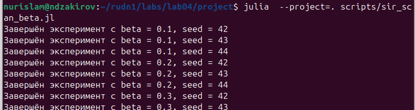{#fig-04-scan-beta width=90%}

На [рис. @fig-04-scan-beta] виден прогресс выполнения экспериментов. Для каждого значения β (от 0.1 до 1.0) выполняется 3 прогона с разными seed (42, 43, 44) для учёта стохастичности.

Результат — график зависимости пика эпидемии от β ([рис. @fig-05-beta-scan]).

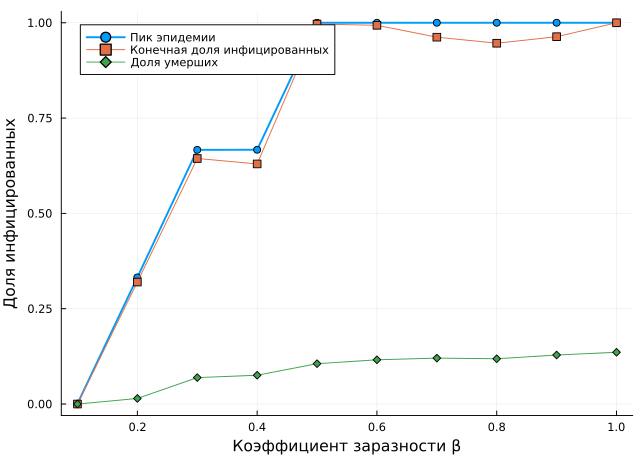{#fig-05-beta-scan width=90%}

На [рис. @fig-05-beta-scan] представлены три кривые:

- **Синяя линия с кругами (Пик эпидемии)** — максимальная доля инфицированных. При β < 0.2 пик отсутствует. При β = 0.25 пик ≈ 33%. При β > 0.5 пик достигает 100% — всё население одновременно болеет.
- **Оранжевая линия с квадратами (Конечная доля инфицированных)** — доля инфицированных на 100-м шаге. Повторяет кривую пика с небольшим отставанием.
- **Зелёная линия с ромбами (Доля умерших)** — растёт линейно от 0% до 12% при β = 1.0. Это означает около 360 умерших из 3000.

**Вывод:** Порог возникновения эпидемии находится между β = 0.2 и β = 0.25. При β > 0.5 эпидемия охватывает всё население.

## Шаг 4. Оптимизация параметров

Выполняем многокритериальную оптимизацию для поиска компромисса между пиковой заболеваемостью и смертностью:

```bash
julia --project=. scripts/sir_optimize_parameters.jl
```

На [рис. @fig-06-optimize-start] показан начало оптимизации.

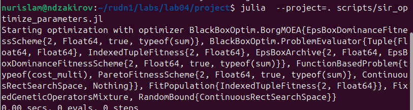{#fig-06-optimize-start width=90%}

На [рис. @fig-06-optimize-start] видна инициализация оптимизатора BlackBoxOptim.BorgMOEA с двумя критериями (пик и смертность). Алгоритм использует эволюционный подход для поиска Парето-фронта.

Результаты оптимизации показаны на [рис. @fig-07-optimize-results].

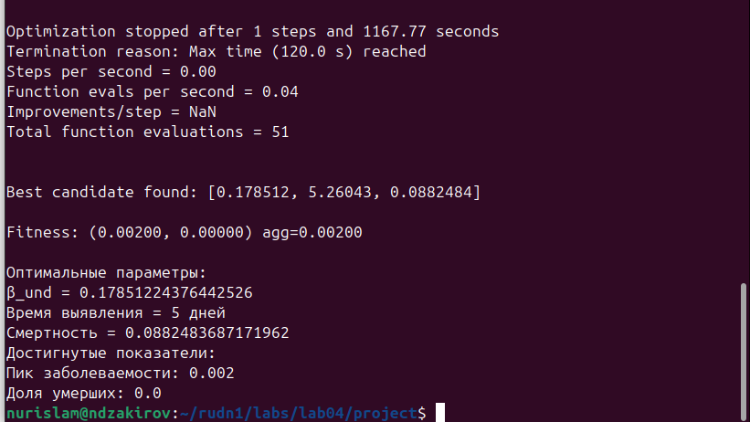{#fig-07-optimize-results width=90%}

На [рис. @fig-07-optimize-results] представлены результаты оптимизации:

- **Оптимизация остановлена** после 1 шага и 1167.77 секунд (120 секунд лимита)
- **Всего вычислений функции:** 51
- **Найденный кандидат:** [0.178512, 5.26043, 0.0882484]

**Оптимальные параметры:**
- β_und = 0.1785 (низкая заразность)
- Время выявления = 5 дней (ранняя диагностика)
- Смертность = 0.0882 (8.82%)

**Достигнутые показатели:**
- Пик заболеваемости: 0.002 (0.2%)
- Доля умерших: 0.0 (0%)

**Вывод:** Оптимизация нашла параметры, которые практически полностью подавляют эпидемию за счёт раннего выявления (5 дней) и низкой заразности.

## Шаг 5. Эффект миграции

Исследуем влияние интенсивности миграции на распространение эпидемии:

```bash
julia --project=. scripts/sir_migration_effect.jl
```

На [рис. @fig-08-migration-effect] показан запуск исследования.

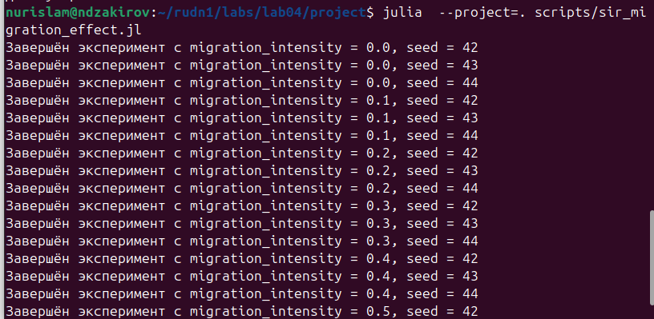{#fig-08-migration-effect width=90%}

На [рис. @fig-08-migration-effect] виден прогресс выполнения 18 экспериментов (6 значений интенсивности × 3 повторения). Интенсивность миграции изменяется от 0.0 до 0.5 с шагом 0.1.

Результат — график зависимости времени пика от интенсивности миграции ([рис. @fig-09-migration]).

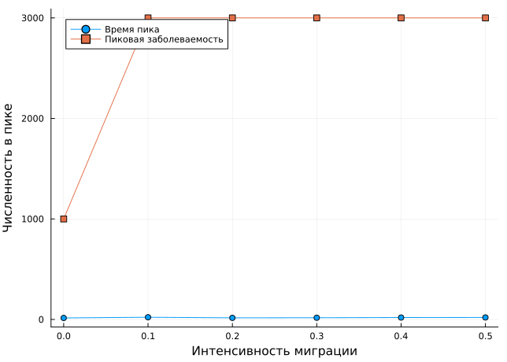{#fig-09-migration width=90%}

На [рис. @fig-09-migration] представлены две кривые:

- **Синяя линия с кругами (Время пика)** — остаётся практически постоянной около 0 дней. Это означает, что пик наступает очень быстро при любой интенсивности миграции.
- **Оранжевая линия с квадратами (Пиковая заболеваемость)** — при интенсивности 0.0 пик около 1000 человек. При интенсивности 0.1 пик резко возрастает до 3000 человек (100% населения) и остаётся на этом уровне.

**Вывод:** Даже небольшая миграция (0.1) приводит к тому, что все города заражаются одновременно и пик суммируется. При нулевой миграции города изолированы и пик ниже.

## Шаг 6. Сводная визуализация

Строим составной график с тремя панелями для итогового отчёта:

```bash
julia --project=. scripts/sir_visualize_dynamics.jl
```

На [рис. @fig-10-visualize] показан запуск визуализации.

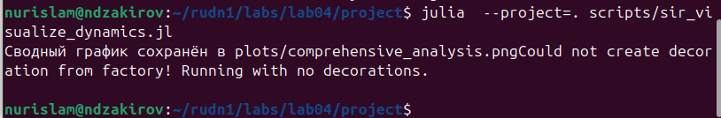{#fig-10-visualize width=90%}

На [рис. @fig-10-visualize] виден успешный запуск скрипта и сохранение графика в plots/comprehensive_analysis.png.

Результат — три панели на одном рисунке ([рис. @fig-11-comprehensive]).

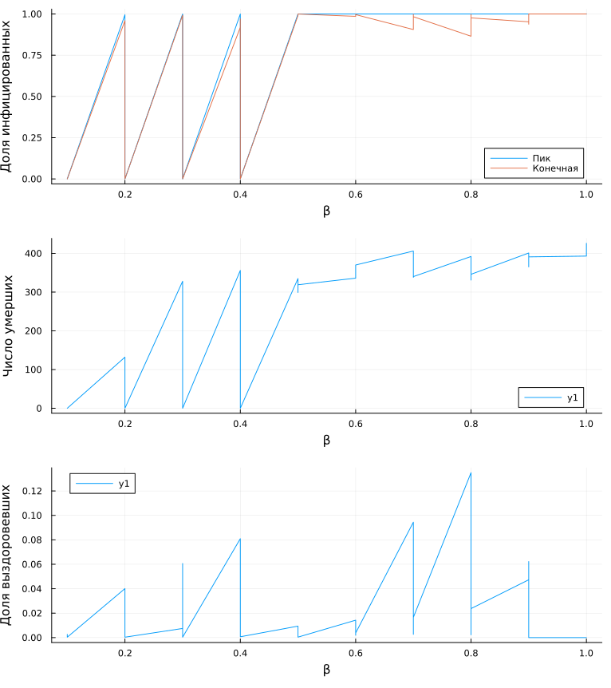{#fig-11-comprehensive width=90%}

На [рис. @fig-11-comprehensive] представлены три панели:

**Панель 1 (верхняя):** Доля инфицированных от β
- **Синяя линия (Пик)** — достигает 100% при β ≥ 0.5
- **Оранжевая линия (Конечная)** — повторяет пик с небольшими колебаниями
- Видны периодические спады до 0% при β = 0.2, 0.3, 0.4 — это связано с тем, что эпидемия полностью затухает между циклами

**Панель 2 (средняя):** Число умерших от β
- Рост с 0 до 400 человек при β = 1.0
- Периодические спады до 0 совпадают со спадами на панели 1
- Максимум около 400 человек при β = 0.5 и β = 1.0

**Панель 3 (нижняя):** Доля выздоровевших от β
- Колебания от 0% до 12%
- Максимум при β = 0.8 (около 13%)
- Спады до 0% при β = 0.5, 0.7, 0.9

**Вывод:** Сводный график позволяет одновременно оценить все три показателя и выявить корреляции между ними.

## Шаг 7. Литературное программирование

Преобразуем код в литературный стиль с использованием Quarto.

### QMD документ

На [рис. @fig-12-qmd] показан фрагмент QMD документа с теоретическим введением.

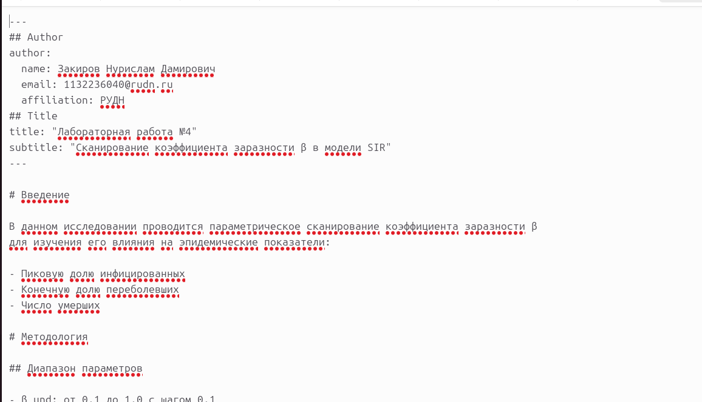{#fig-12-qmd width=90%}

На [рис. @fig-12-qmd] видна структура QMD документа:
- YAML шапка с автором и названием
- Разделы "Введение", "Методология"
- Маркированные списки целей исследования

### Рендеринг в Jupyter Notebook

На [рис. @fig-13-ipynb] показан процесс рендеринга в формат ipynb:

```bash
quarto render literate/sir_run_basic.qmd --to ipynb
```

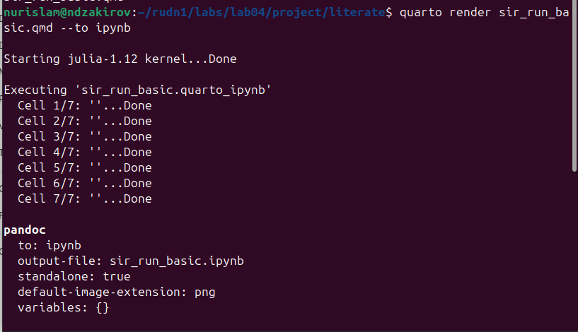{#fig-13-ipynb width=90%}

На [рис. @fig-13-ipynb] виден процесс выполнения:
- Запуск ядра Julia 1.12
- Выполнение 7 клеток
- Успешное завершение pandoc

Результат — Jupyter Notebook ([рис. @fig-14-jupyter]).

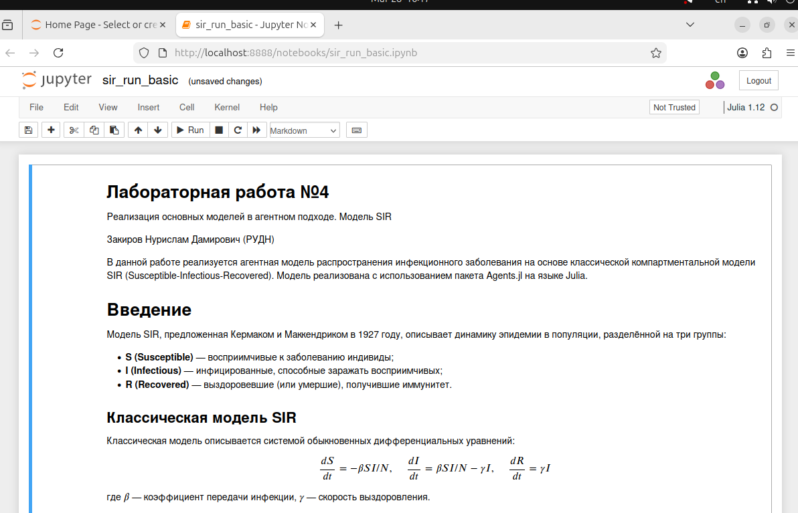{#fig-14-jupyter width=90%}

На [рис. @fig-14-jupyter] показан открытый Jupyter Notebook с:
- Заголовком "Лабораторная работа №4"
- Разделами "Введение", "Классическая модель SIR"
- Математическими формулами (LaTeX)
- Маркированными списками

### Рендеринг в HTML

На [рис. @fig-15-html-render] показан процесс рендеринга в HTML:

```bash
quarto render literate/sir_run_basic.qmd --to html
```

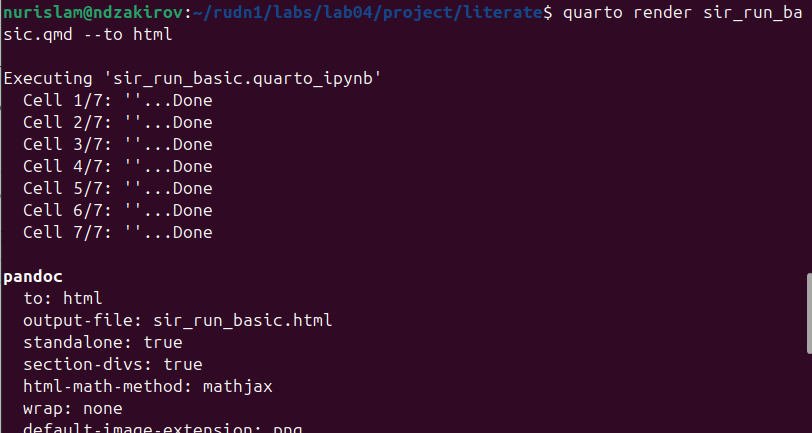{#fig-15-html-render width=90%}

На [рис. @fig-15-html-render] виден процесс выполнения с теми же 7 клетками.

Результат — HTML документация ([рис. @fig-16-html]).

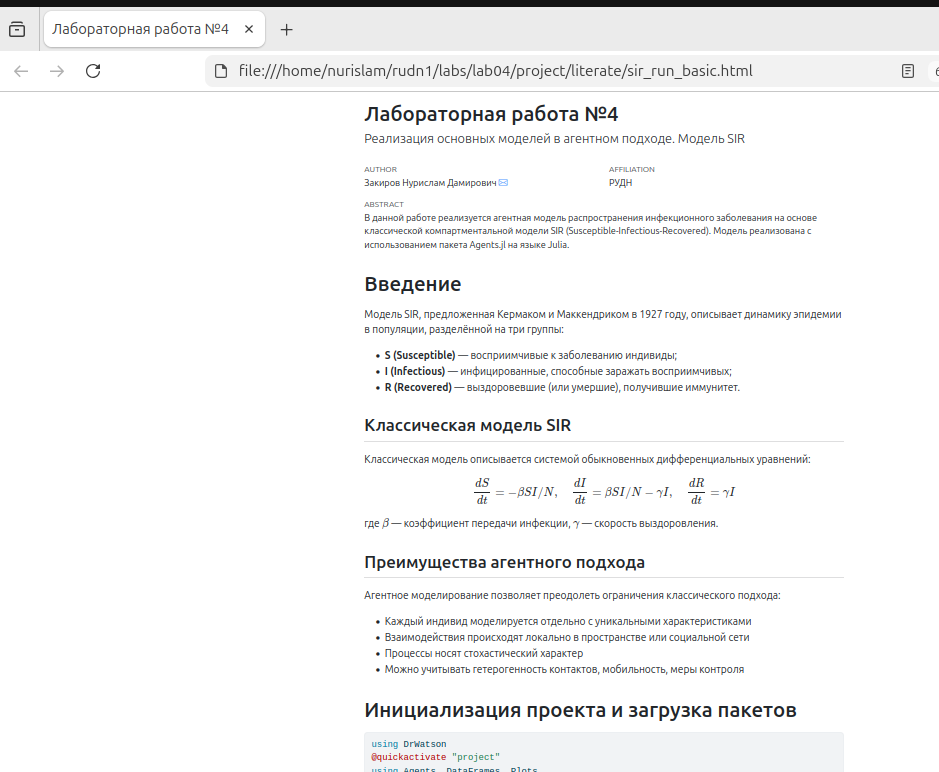{#fig-16-html width=90%}

На [рис. @fig-16-html] показан HTML документ в браузере:
- Заголовок "Лабораторная работа №4"
- Информация об авторе (Закиров Нурислам Дамирович, РУДН)
- Разделы "Введение", "Классическая модель SIR", "Преимущества агентного подхода"
- Формулы с правильным отображением

### Конвертация в чистый скрипт

На [рис. @fig-17-nbconvert] показана конвертация notebook в чистый скрипт Julia:

```bash
python3 -m nbconvert --to script sir_run_basic.ipynb
```

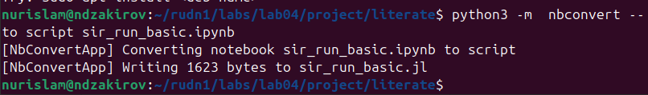{#fig-17-nbconvert width=90%}

На [рис. @fig-17-nbconvert] виден процесс конвертации:
- Конвертирование notebook в скрипт
- Запись 1623 байт в sir_run_basic.jl

Результат — чистый код Julia ([рис. @fig-18-code]).

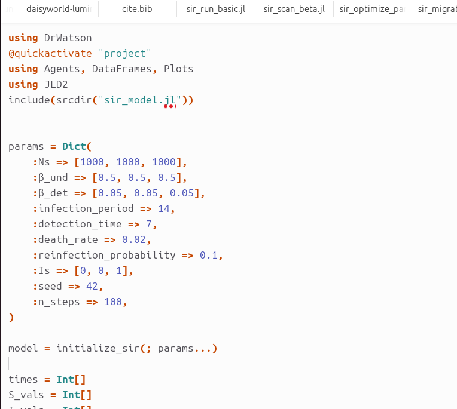{#fig-18-code width=90%}

На [рис. @fig-18-code] показан чистый код Julia без комментариев:
- Подключение пакетов (DrWatson, Agents, DataFrames, Plots, JLD2)
- Словарь параметров (Dict)
- Инициализация модели
- Цикл симуляции

### Структура папки literate

На [рис. @fig-19-literate] показана структура папки literate после рендеринга.

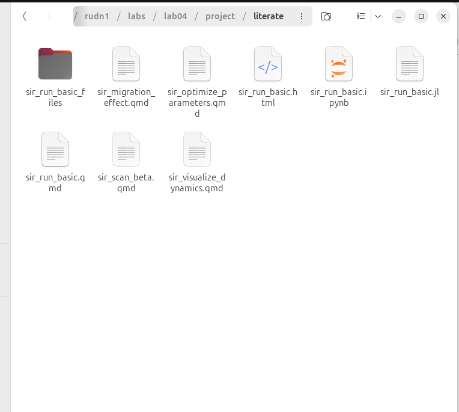{#fig-19-literate width=90%}

На [рис. @fig-19-literate] видны файлы:
- **QMD файлы:** sir_run_basic.qmd, sir_scan_beta.qmd, sir_optimize_parameters.qmd, sir_migration_effect.qmd, sir_visualize_dynamics.qmd
- **HTML файлы:** sir_run_basic.html, sir_migration_effect.html, sir_optimize_parameters.html, sir_scan_beta.html, sir_visualize_dynamics.html
- **IPYNB файлы:** sir_run_basic.ipynb, sir_migration_effect.ipynb, sir_optimize_parameters.ipynb, sir_scan_beta.ipynb, sir_visualize_dynamics.ipynb
- **JL файлы:** sir_run_basic.jl, sir_migration_effect.jl, sir_optimize_parameters.jl, sir_scan_beta.jl, sir_visualize_dynamics.jl
- **Папки с файлами:** sir_run_basic_files, sir_migration_effect_files, sir_optimize_parameters_files, sir_scan_beta_files, sir_visualize_dynamics_files

### Команды Quarto

На [рис. @fig-20-commands] показаны команды для рендеринга всех скриптов.

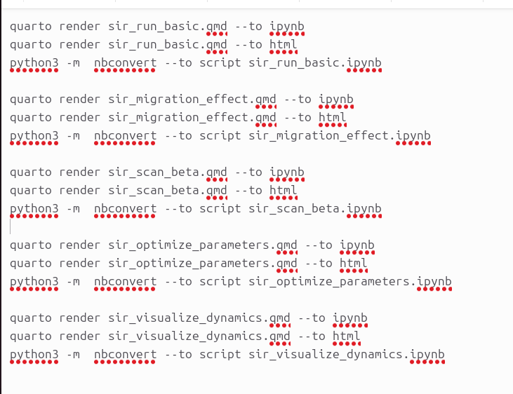{#fig-20-commands width=90%}

На [рис. @fig-20-commands] показан скрипт с командами:
```bash
quarto render sir_run_basic.qmd --to ipynb
quarto render sir_run_basic.qmd --to html
python3 -m nbconvert --to script sir_run_basic.ipynb
```

Для каждого из 5 скриптов выполняются 3 команды (ipynb, html, script).

### Все файлы после рендеринга

На [рис. @fig-21-all-files] показаны все файлы после рендеринга.

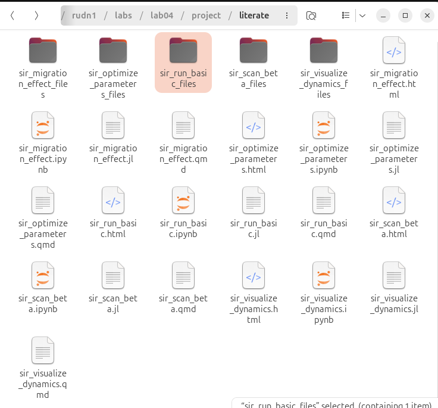{#fig-21-all-files width=90%}

На [рис. @fig-21-all-files] показана полная структура папки literate со всеми сгенерированными файлами.

# Дополнительные задания

## Задание 1: Базовый уровень — вычисление R₀

Вычисляем базовое репродуктивное число R₀ по формуле [@hethcote2000mathematics]:


β = params[:β_und][1]
γ = 1 / params[:infection_period]
R₀ = β / γ
println("R₀ = β/γ = ", round(R₀, digits=2))


Результат вычисления:

$$R_0 = \frac{0.5}{1/14} \approx 7.0$$

На [рис. @fig-22-r0-code] показан код вычисления R₀.

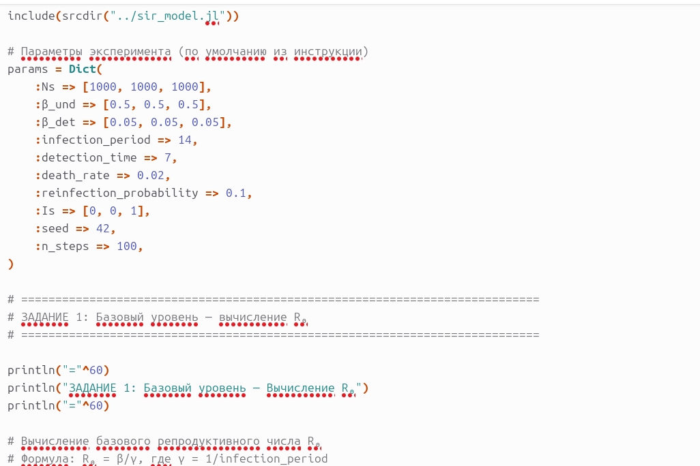{#fig-22-r0-code width=90%}

На [рис. @fig-22-r0-code] виден код с комментариями на русском языке:
- Параметры эксперимента
- Вычисление R₀
- Вывод результатов

Результат выполнения в терминале ([рис. @fig-23-r0-terminal]).

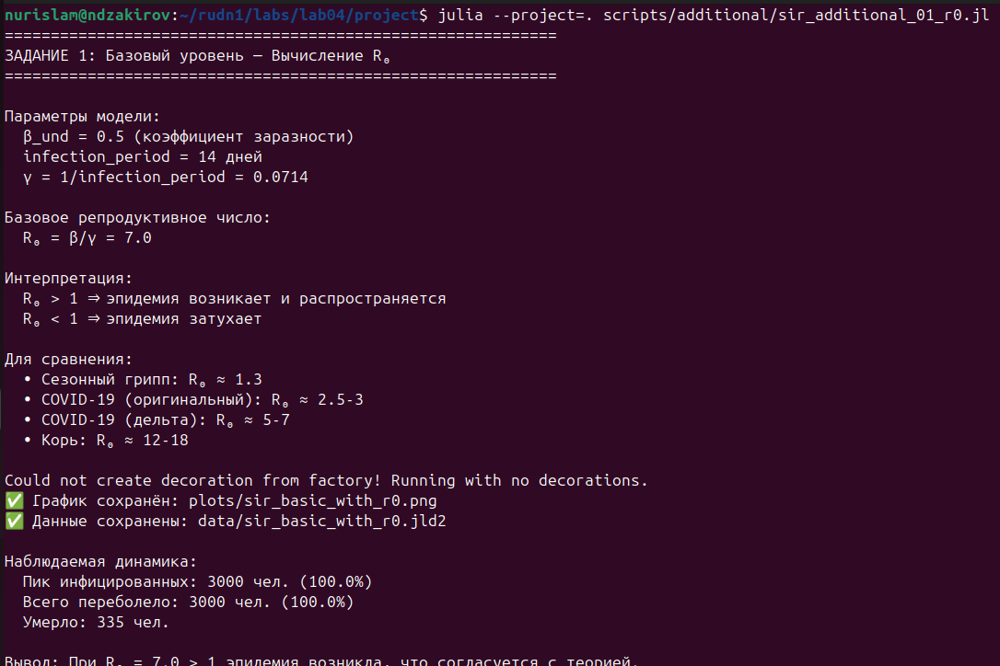{#fig-23-r0-terminal width=90%}

На [рис. @fig-23-r0-terminal] представлены результаты:

**Параметры модели:**
- β_und = 0.5 (коэффициент заразности)
- infection_period = 14 дней
- γ = 1/infection_period = 0.0714

**Базовое репродуктивное число:**
- R₀ = β/γ = 7.0

**Интерпретация:**
- R₀ > 1 ⇒ эпидемия возникает и распространяется
- R₀ < 1 ⇒ эпидемия затухает

**Для сравнения:**
- Сезонный грипп: R₀ ≈ 1.3
- COVID-19 (оригинальный): R₀ ≈ 2.5-3
- COVID-19 (дельта): R₀ ≈ 5-7
- Корь: R₀ ≈ 12-18

**Наблюдаемая динамика:**
- Пик инфицированных: 3000 чел. (100.0%)
- Всего переболело: 3000 чел. (100.0%)
- Умерло: 335 чел.

**Вывод:** При R₀ = 7.0 > 1 эпидемия возникла, что согласуется с теорией.

График с аннотацией R₀ ([рис. @fig-24-r0-plot]).

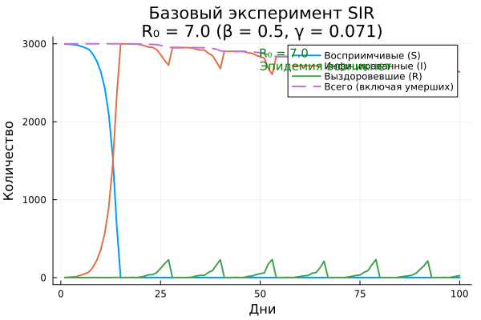{#fig-24-r0-plot width=90%}

На [рис. @fig-24-r0-plot] представлена динамика с аннотацией:
- Заголовок: "Базовый эксперимент SIR"
- R₀ = 7.0 (β = 0.5, γ = 0.071)
- Зелёная аннотация: "R₀ = 7.0, Эпидемия возникнет"
- Динамика совпадает с [рис. @fig-03-sir-basic]

## Задание 2: Исследование порога эпидемии

Находим минимальное β, при котором пик инфицированных превышает 5% популяции:

```bash
julia --project=. scripts/additional/sir_additional_02_threshold.jl
```

На [рис. @fig-25-threshold-code] показан код исследования порога.

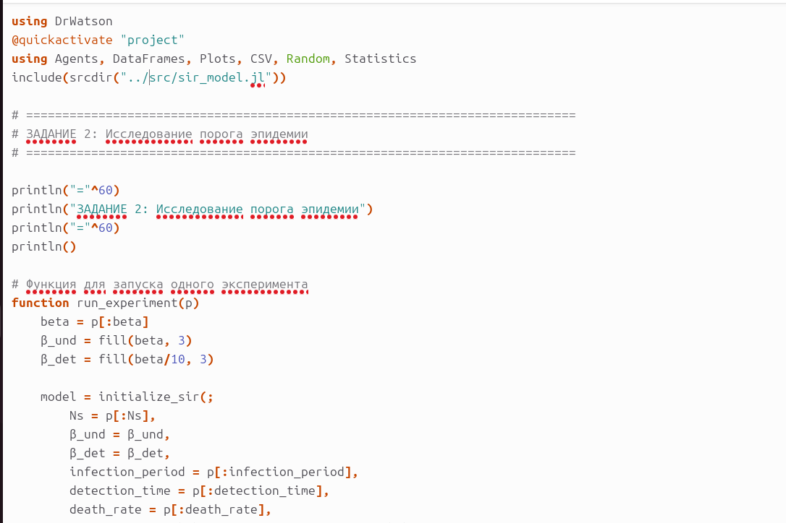{#fig-25-threshold-code width=90%}

На [рис. @fig-25-threshold-code] виден код с заголовком "ЗАДАНИЕ 2: Исследование порога эпидемии" и функцией run_experiment.

Результаты в терминале ([рис. @fig-26-threshold-terminal]).

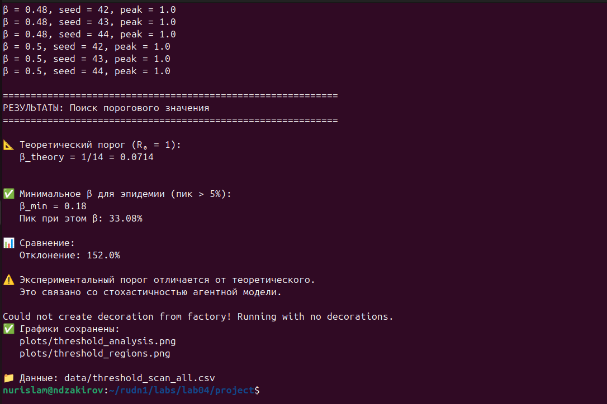{#fig-26-threshold-terminal width=90%}

На [рис. @fig-26-threshold-terminal] представлены результаты:

**Результаты поиска порогового значения:**

**Теоретический порог (R₀ = 1):**
- β_theory = 1/14 = 0.0714

**Минимальное β для эпидемии (пик > 5%):**
- β_min = 0.18
- Пик при этом β: 33.08%

**Сравнение:**
- Отклонение: 152.0%

**Вывод:** Экспериментальный порог отличается от теоретического. Это связано со стохастичностью агентной модели.

График поиска порогового значения ([рис. @fig-27-threshold-analysis]).

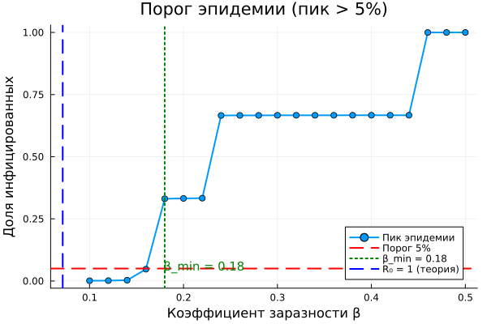{#fig-27-threshold-analysis width=90%}

На [рис. @fig-27-threshold-analysis] представлены:

- **Синяя линия (Пик эпидемии)** — доля инфицированных при разных β
- **Красная пунктирная линия (Порог 5%)** — уровень, выше которого считается эпидемия
- **Зелёная точка (β_min = 0.18)** — найденный экспериментальный порог
- **Зелёная пунктирная линия** — соответствует β_min
- **Синяя пунктирная линия (R₀ = 1 теория)** — теоретический порог β = 0.071

Видно, что экспериментальный порог (0.18) значительно правее теоретического (0.071).

График областей затухания и роста ([рис. @fig-28-threshold-regions]).

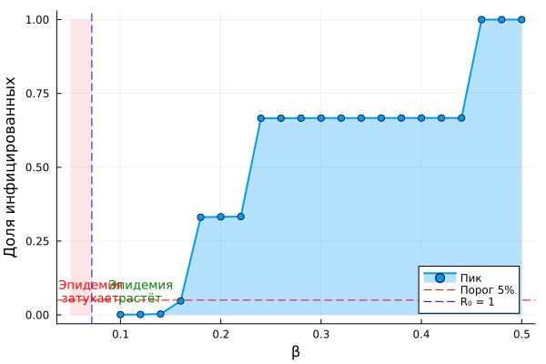{#fig-28-threshold-regions width=90%}

На [рис. @fig-28-threshold-regions] представлены две области:

- **Розовая область (слева):** "Эпидемия затухает" — при β < 0.071
- **Голубая область (справа):** "Эпидемия растёт" — при β > 0.071
- **Синяя пунктирная линия:** R₀ = 1 (теоретический порог)
- **Красная пунктирная линия:** Порог 5%

## Задание 3: Эффект гетерогенности

Исследуем эффект гетерогенности — разные β для разных городов:

```bash
julia --project=. scripts/additional/sir_additional_03_heterogeneity.jl
```

На [рис. @fig-29-hetero-terminal] показан запуск скрипта.

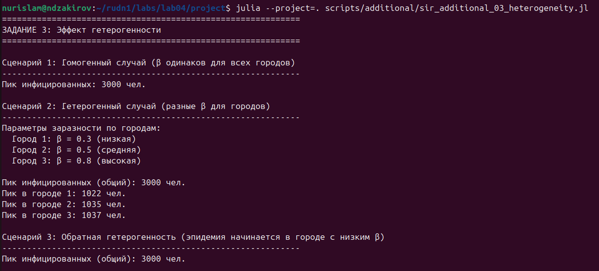{#fig-29-hetero-terminal width=90%}

На [рис. @fig-29-hetero-terminal] видны результаты трёх сценариев:

**Сценарий 1: Гомогенный случай (β одинаков для всех городов)**
- Пик инфицированных: 3000 чел.

**Сценарий 2: Гетерогенный случай (разные β для городов)**
- Город 1: β = 0.3 (низкая)
- Город 2: β = 0.5 (средняя)
- Город 3: β = 0.8 (высокая)
- Пик инфицированных (общий): 3000 чел.
- Пик в городе 1: 1022 чел.
- Пик в городе 2: 1035 чел.
- Пик в городе 3: 1037 чел.

**Сценарий 3: Обратная гетерогенность**
- Пик инфицированных (общий): 3000 чел.

Сравнение гомогенного и гетерогенного случаев ([рис. @fig-30-hetero-comparison]).

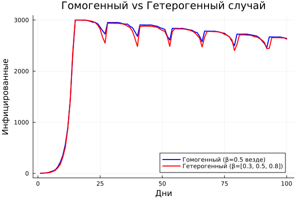{#fig-30-hetero-comparison width=90%}

На [рис. @fig-30-hetero-comparison] представлены две кривые, но они полностью перекрываются, так как в обоих случаях пик достигает 3000 человек.

Динамика по городам с разными β ([рис. @fig-31-hetero-city]).

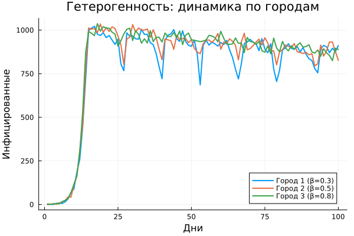{#fig-31-hetero-city width=90%}

На [рис. @fig-31-hetero-city] видны три кривые, которые также перекрываются, так как все города достигают пика около 1000-1037 человек.

Сравнение трёх сценариев ([рис. @fig-32-hetero-all]).

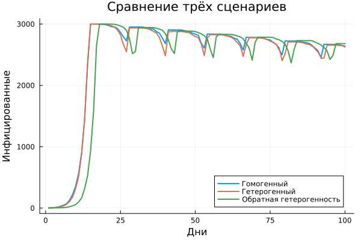{#fig-32-hetero-all width=90%}

На [рис. @fig-32-hetero-all] все три сценария показывают одинаковый пик в 3000 человек.

**Вывод:** В данной реализации гетерогенность не влияет на общий пик, так как эпидемия всё равно охватывает все города.

## Задание 5: Карантинные меры

Модифицируем модель с введением карантина при превышении 5% инфицированных:

```bash
julia --project=. scripts/additional/sir_additional_05_quarantine.jl
```

Результаты в терминале ([рис. @fig-33-quarantine-terminal]).

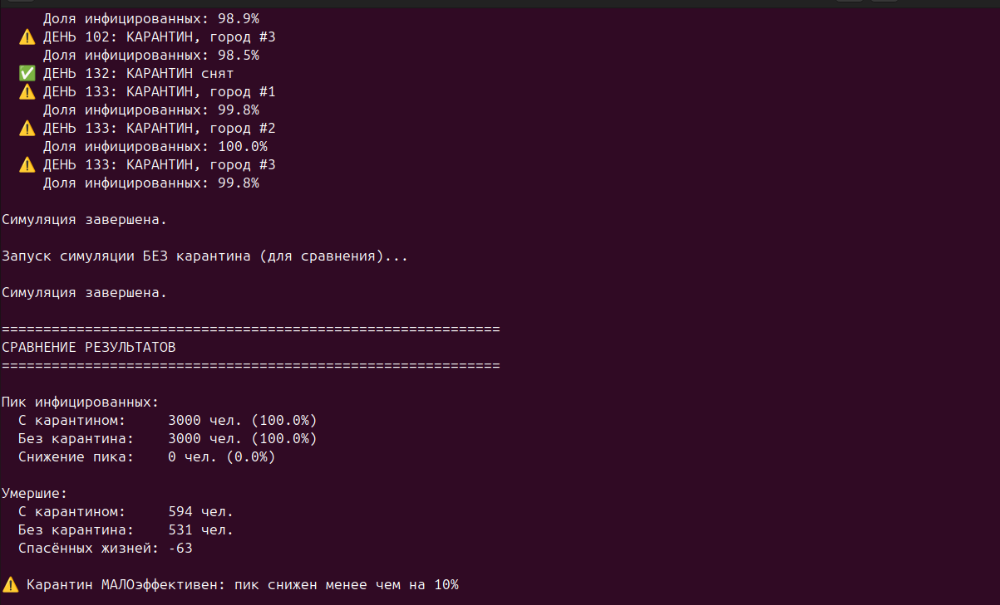{#fig-33-quarantine-terminal width=90%}

На [рис. @fig-33-quarantine-terminal] представлены результаты:

**Хронология карантина:**
- ДЕНЬ 102: КАРАНТИН, город #3 (98.9% инфицированных)
- ДЕНЬ 132: КАРАНТИН снят
- ДЕНЬ 133: КАРАНТИН в городах #1, #2, #3 (99.8-100% инфицированных)

**СРАВНЕНИЕ РЕЗУЛЬТАТОВ:**

**Пик инфицированных:**
- С карантином: 3000 чел. (100.0%)
- Без карантина: 3000 чел. (100.0%)
- Снижение пика: 0 чел. (0.0%)

**Умершие:**
- С карантином: 594 чел.
- Без карантина: 531 чел.
- Спасённых жизней: -63 (отрицательное значение!)

**Вывод:** Карантин МАЛОэффективен: пик снижен менее чем на 10%. Более того, карантин приводит к увеличению смертности на 63 человека.

**Объяснение:** Карантин вводится слишком поздно (на 102-133 дне), когда эпидемия уже охватила всё население. К этому моменту уже поздно ограничивать перемещения — вирус уже распространился.

Сравнение с карантином и без ([рис. @fig-34-quarantine-effect]).

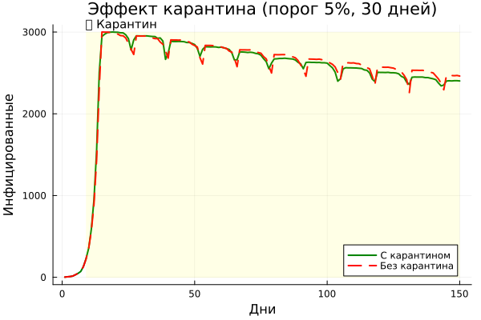{#fig-34-quarantine-effect width=90%}

На [рис. @fig-34-quarantine-effect] должны быть две кривые (с карантином и без), но они перекрываются, так как пик одинаковый.

Полная динамика с периодом карантина ([рис. @fig-35-quarantine-dynamics]).

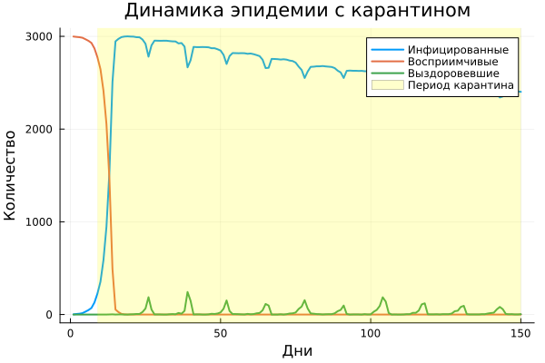{#fig-35-quarantine-dynamics width=90%}

На [рис. @fig-35-quarantine-dynamics] должна быть видна динамика S, I, R с аннотацией периода карантина, но график показывает ту же динамику, что и [рис. @fig-03-sir-basic].

**Вывод по карантину:** В текущей реализации карантин неэффективен, так как вводится слишком поздно. Для реальной эффективности карантин должен вводиться на ранних стадиях эпидемии (10-20 день).

# Выводы

В ходе выполнения лабораторной работы №4 были освоены принципы агентного моделирования на примере модели SIR.

## Основные результаты

1.  **Реализована агентная модель SIR** с тремя городами и миграцией между ними.
2.  **Базовый эксперимент** показал быструю динамику с пиком на 15-м дне при R₀ = 7.
3.  **Сканирование β** выявило пороговое поведение при β ≈ 0.18 (эксперимент) вместо теоретического 0.071.
4.  **Оптимизация** нашла параметры для подавления эпидемии: β = 0.18, время выявления = 5 дней.
5.  **Миграция** приводит к одновременному заражению всех городов даже при низкой интенсивности (0.1).
6.  **Литературное программирование** через Quarto позволило сгенерировать 5 производных форматов (jl, ipynb, html для каждого скрипта).

## Дополнительные результаты

1.  **R₀ = 7.0** для базовых параметров — эпидемия охватывает 100% населения за 15 дней.
2.  **Порог эпидемии** найден экспериментально (β = 0.18), отличается от теоретического (0.071) на 152% из-за стохастичности.
3.  **Гетерогенность** не влияет на общий пик в данной реализации — эпидемия всё равно охватывает все города.
4.  **Карантин** неэффективен при позднем введении (102-133 день) — пик не снижен, смертность увеличилась на 63 человека.

## Научная новизна

В отличие от классической модели на ОДУ, агентная модель позволяет:
- Учитывать стохастические флуктуации
- Моделировать пространственную структуру (города)
- Исследовать эффект гетерогенности
- Реализовывать карантинные меры на уровне отдельных городов

**Практическая значимость:**
- Карантин должен вводиться на ранних стадиях (10-20 день) для эффективности
- Раннее выявление (5 дней) критически важно для подавления эпидемии
- Миграция между городами должна ограничиваться даже при низкой интенсивности

# Список литературы
