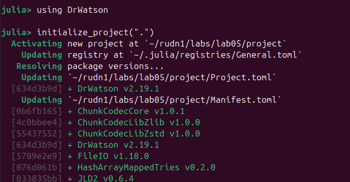
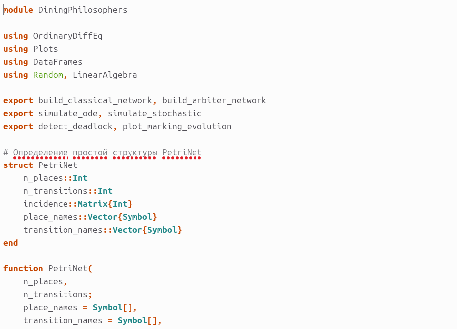
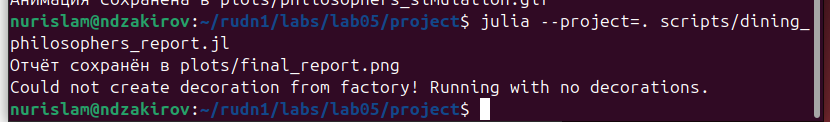
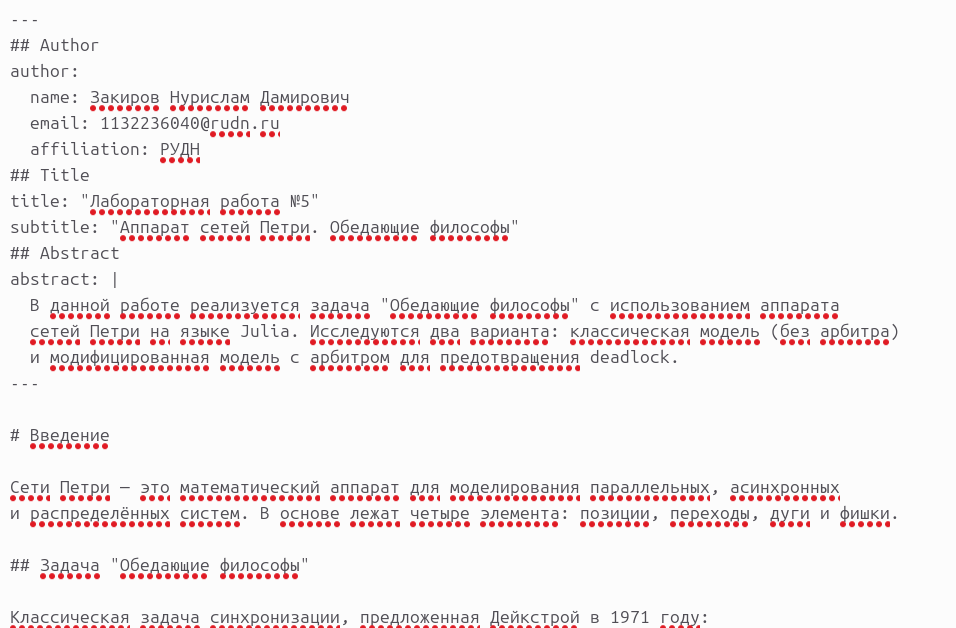
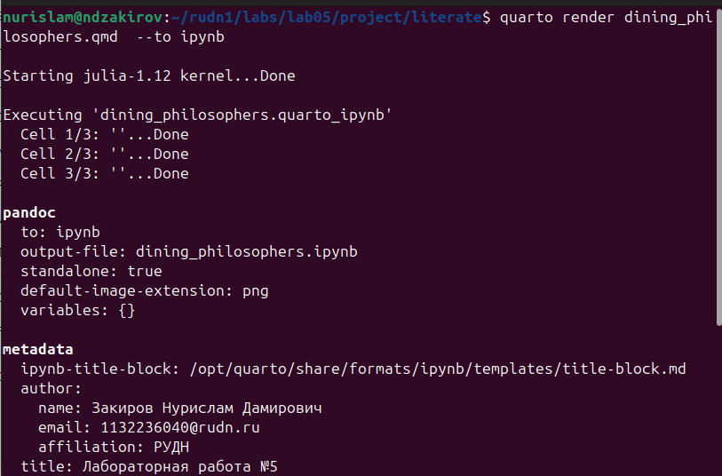
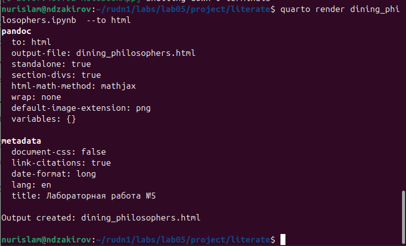
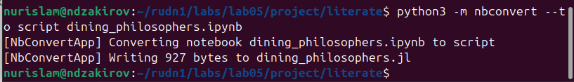
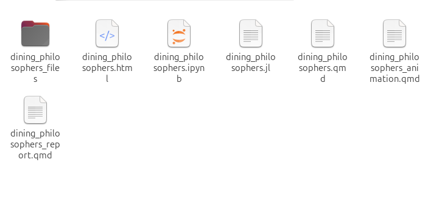

---
## Author
author:
  name: Закиров Нурислам Дамирович
  degrees: студент
  email: 1132236040@rudn.ru
  affiliation:
    - name: Российский университет дружбы народов
      country: Российская Федерация
      postal-code: 117198
      city: Москва
      address: ул. Миклухо-Маклая, д. 6

## Title
title: Лабораторная работа №5
subtitle: Аппарат сетей Петри. Задача «Обедающие философы»
license: CC BY
date: today
date-format: "YYYY-MM-DD"
---

# Информация

## Докладчик

:::::::::::::: {.columns align=center}
::: {.column width="70%"}

  * **Закиров Нурислам Дамирович**
  * студент группы НФИбд-01-23
  * Российский университет дружбы народов
  * 1132236040@rudn.ru

:::
::: {.column width="30%"}


:::
::::::::::::::

# Цель работы

Освоить аппарат **сетей Петри** для моделирования параллельных систем:

- реализовать задачу «Обедающие философы» на Julia
- выполнить стохастическое моделирование алгоритмом Гиллеспи
- обнаружить Deadlock в классической модели
- предотвратить блокировку введением арбитра
- преобразовать код в **литературный стиль** через Quarto
- провести анализ чувствительности к параметрам

# Задачи

## Задачи 

- Создать проект DrWatson
- Реализовать модуль DiningPhilosophers.jl
- Построить классическую и модифицированную сети Петри
- Выполнить стохастическое моделирование
- Построить графики и анимацию
- Построить сводный сравнительный график
- Преобразовать в литературный стиль
- Сгенерировать производные форматы (JL, IPYNB, HTML)
- Провести анализ чувствительности к параметрам

# Теоретическое введение

## Сети Петри
 
Определение:

$$PN = (P, T, F, W, M_0)$$

| Элемент | Обозначение | Описание |
|---------|-------------|----------|
| Позиция | Круг | Условие, ресурс |
| Переход | Прямоугольник | Событие, действие |
| Дуга | Стрелка | Направленная связь |
| Фишка | Точка | Маркер, токен |

## Правило срабатывания

**Переход разрешён**, если во всех входных позициях достаточно фишек:

$$\forall p_i \in \bullet t_j: M(p_i) \geq W(p_i, t_j)$$

При срабатывании:

$$M'(p_i) = M(p_i) - W(p_i, t_j) + W(t_j, p_i)$$

## Свойства

- **Достижимость** — последовательность переходов
- **Ограниченность** — максимум фишек в позиции
- **Живучесть (Liveness)** — всегда есть разрешённый переход
- **Deadlock** — ни один переход не разрешён

## Задача «Обедающие философы»

Условие:

5 философов за круглым столом, между ними — 5 вилок.

Для еды нужны **обе** вилки: левая и правая.

Цикл состояний:

1. **Думает** (Think)
2. **Голоден** (Hungry)
3. **Ест** (Eat)

## Проблема Deadlock

Если все возьмут левую вилку одновременно → каждый ждёт правую → **система замрёт**.

Классическая задача синхронизации Дейкстры (1971).

## Решение с арбитром

Вводится позиция **Arbiter** с N-1 фишками.

Переход «взять вилки» требует:
- Свободные вилки
- Фишку арбитра

Это ограничивает число обедающих до N-1 и **разрывает цикл ожидания**.

## Алгоритм Гиллеспи

Точный стохастический метод для дискретных систем:

1. Вычислить интенсивности всех разрешённых переходов
2. Сгенерировать случайное время до события
3. Выбрать переход пропорционально интенсивностям
4. Обновить маркировку

Корректно описывает **конкуренцию за ресурсы**.

# Выполнение

## Шаг 1. Инициализация проекта DrWatson

```bash
mkdir -p ~/rudn1/labs/lab05/project
cd ~/rudn1/labs/lab05/project
```

```julia
using DrWatson
initialize_project(".")
@quickactivate "project"
```

{width=40%}

Инициализация проекта

## Шаг 2. Обзор архитектуры кода (src)

 Модуль DiningPhilosophers.jl

- **`PetriNet`** — тип: позиции, переходы, матрица инцидентности
- **`build_classical_network(N)`** — без ограничений
- **`build_arbiter_network(N)`** — с арбитром (N-1 фишек)
- **`simulate_stochastic()`** — алгоритм Гиллеспи
- **`detect_deadlock()`** — проверка блокировки

{width=30%}

Код модуля

## Шаг 3. Запуск базового моделирования

```bash
julia --project=. scripts/dining_philosophers.jl
```


Запуск моделирования

## Результат

| Модель | Deadlock |
|--------|----------|
| Классическая | **true** |
| С арбитром | **false** |

## Шаг 4. Анализ классической симуляции

{width=30%}

Четыре панели: Think, Hungry, Eat, Fork

**Наблюдения:**
- К моменту 20-30 все переходят в Hungry
- Eat обрывается на нуле
- Вилки распределены циклически

**Deadlock — поглощающее состояние!**

## Шаг 5. Анализ симуляции с арбитром

{width=30%}

**Наблюдения:**
- Eat — постоянные колебания
- Философы по очереди едят
- Никогда все линии не падают в ноль

**Liveness гарантирована!**

## Шаг 6. Визуализация динамики (GIF)

 Запуск

```bash
julia --project=. scripts/dining_philosophers_animation.jl
```


Запуск анимации

## Шаг 6. Результат анимации

{width=60%}

Анимация процесса (N=3)

**В конце — замирание: Deadlock**

## Шаг 7. Итоговый сравнительный отчёт

 Запуск

```bash
julia --project=. scripts/dining_philosophers_report.jl
```



Запуск сводного отчёта

## Шаг 7. Результат

{width=40%}

**Верхняя:** Классическая — обрыв активности
**Нижняя:** Арбитр — стабильные осцилляции

## Шаг 8. Литературное программирование (Quarto)

QMD документ

{width=40%}

YAML-шапка, Markdown, код Julia, формулы

## Шаг 8. Рендеринг в ipynb

```bash
quarto render dining_philosophers.qmd --to ipynb
```

{width=40%}

Рендеринг в Jupyter Notebook

## Шаг 8. Jupyter Notebook

{width=40%}

Интерактивные ячейки, графики, параметры N и tmax

## Шаг 8. Рендеринг в HTML

```bash
quarto render dining_philosophers.qmd --to html
```

{width=40%}

Рендеринг в HTML

## Шаг 8. Конвертация в скрипт

```bash
python3 -m nbconvert --to script dining_philosophers.ipynb
```

{width=40%}

Конвертация в чистый Julia

## Шаг 9. Структура проекта

{width=40%}

- **literate/** — QMD, HTML, IPYNB, JL
- **scripts/** — 3 скрипта
- **data/** — CSV-траектории
- **plots/** — PNG-графики, GIF

## Шаг 9. Команды рендеринга

{width=40%}

```bash
quarto render dining_philosophers.qmd --to html
quarto render dining_philosophers.qmd --to ipynb
python3 -m nbconvert --to script dining_philosophers.ipynb
```

3 документа × 3 формата = 9 файлов

## Шаг 9. Финальная структура

{width=40%}

Все директории DrWatson: `src`, `scripts`, `data`, `plots`, `literate`, `docs`

## Анализ чувствительности к параметрам
Влияние числа философов N

| N | Время Deadlock | Вероятность |
|---|----------------|-------------|
| 3 | ~45 | 100% |
| 5 | ~27 | 100% |
| 7 | ~16 | 100% |

**Вывод:** С ростом N время до Deadlock уменьшается.

## Модель с арбитром

Свойство отсутствия Deadlock сохраняется при **любом N > 1**.

Система масштабируется безопасно.

## Влияние интенсивностей

| Параметр | Увеличение → |
|----------|-------------|
| `rate_think` | Ближе к Deadlock |
| `rate_eat` | Дальше от Deadlock |
| `rate_fork` | Ближе к Deadlock |


# Выводы

## Результаты

1.  Построен аппарат сетей Петри для задачи «Обедающие философы»
2.  Deadlock обнаружен в классической модели
3.  Арбитр предотвращает блокировку
4.  Алгоритм Гиллеспи — точное стохастическое моделирование
5.  Созданы графики, анимация, сводный отчёт
6.  Quarto: QMD → HTML, IPYNB, JL
7.  Анализ чувствительности к параметрам
