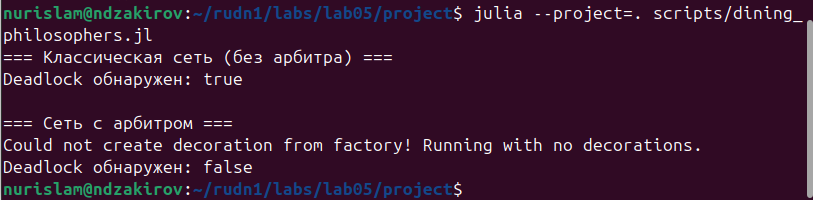
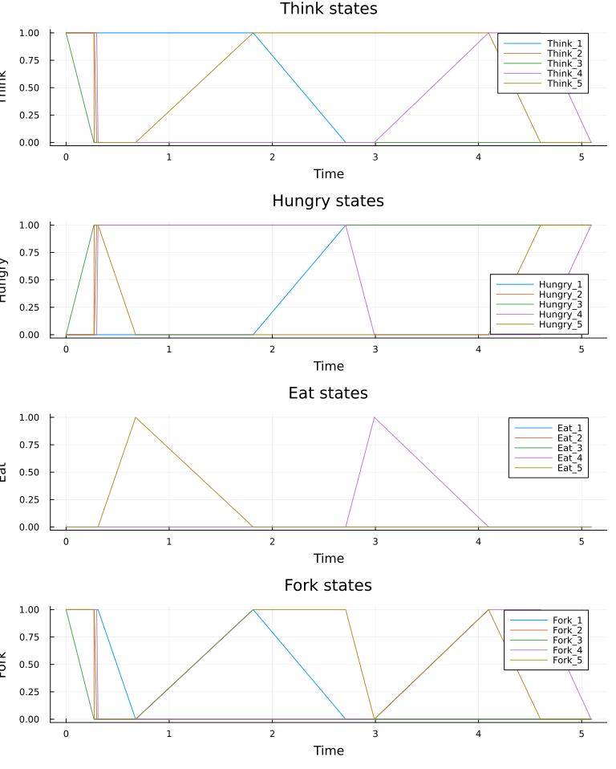
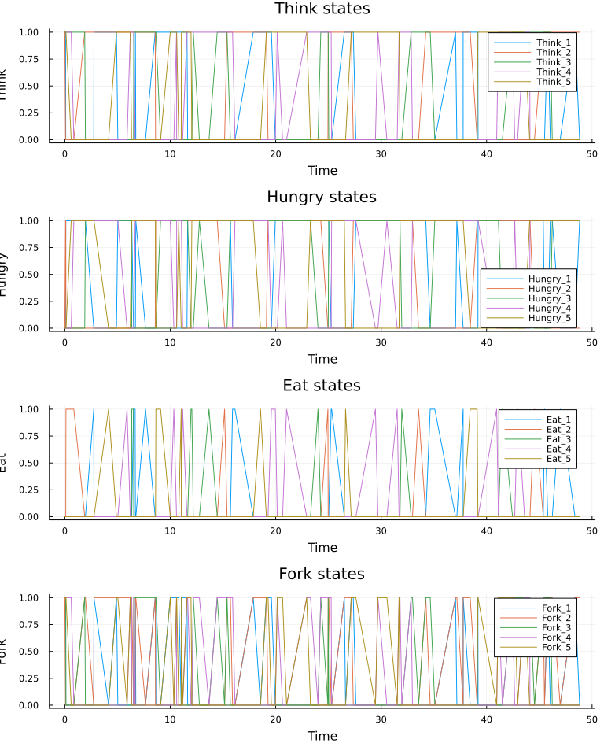
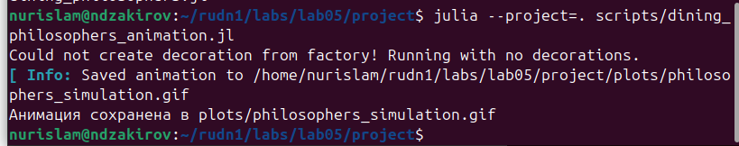
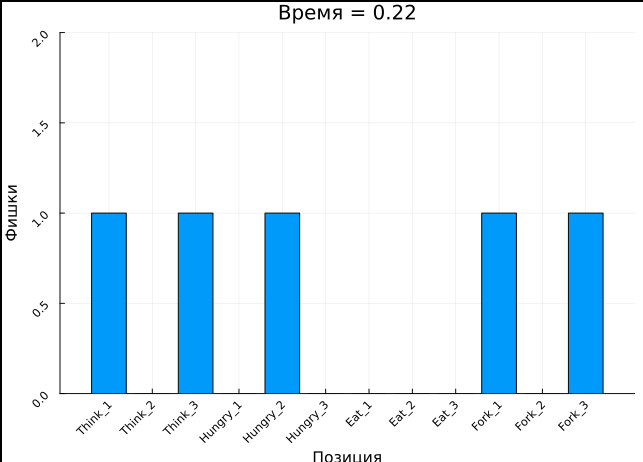
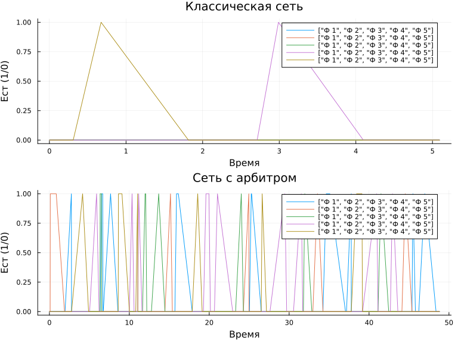
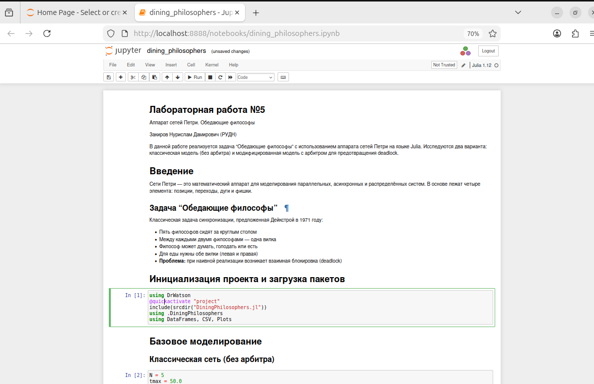
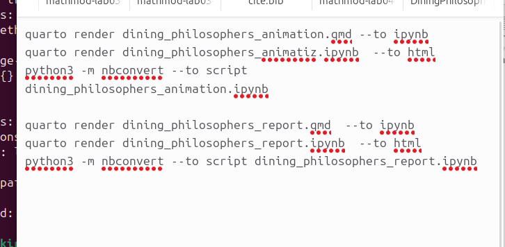
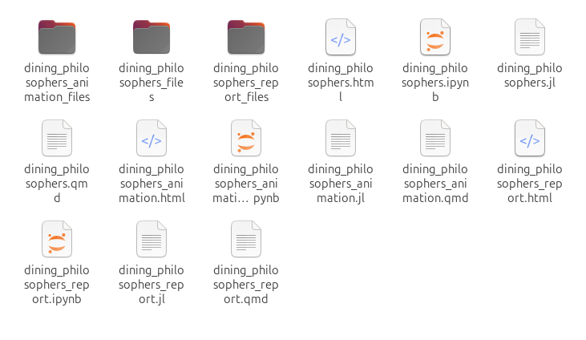

---
## Author
author:
  name: Закиров Нурислам Дамирович
  degrees: студент
  email: 1132236040@rudn.ru
  affiliation:
    - name: Российский университет дружбы народов
      country: Российская Федерация
      postal-code: 117198
      city: Москва
      address: ул. Миклухо-Маклая, д. 6

## Title
title: "Аппарат сетей Петри. Задача «Обедающие философы»"
subtitle: "Лабораторная работа №5"
license: "CC BY"
---

# Цель работы

Освоить аппарат сетей Петри для моделирования параллельных и асинхронных систем. Реализовать классическую задачу синхронизации «Обедающие философы» Дейкстры на языке Julia, выполнить стохастическое моделирование с использованием алгоритма Гиллеспи, обнаружить проблему взаимной блокировки (Deadlock) и продемонстрировать метод её предотвращения с помощью введения арбитра. Преобразовать рабочий код в литературный стиль с помощью Quarto и провести анализ чувствительности к параметрам модели.

# Задание

1.  Создать рабочий каталог проекта DrWatson для размещения кода моделей.
2.  Реализовать модуль `DiningPhilosophers.jl` с типом `PetriNet` и функциями построения сетей.
3.  Построить классическую сеть Петри для задачи «Обедающие философы» без ограничений.
4.  Построить модифицированную сеть Петри с позицией «Арбитр» для предотвращения Deadlock.
5.  Реализовать стохастическое моделирование алгоритмом Гиллеспи.
6.  Реализовать функцию обнаружения Deadlock.
7.  Выполнить моделирование обеих сетей и сохранить результаты.
8.  Построить графики эволюции маркировок.
9.  Создать анимацию процесса (GIF).
10. Построить сводный сравнительный график.
11. Преобразовать рабочий код в литературный стиль с разметкой Quarto.
12. Сгенерировать производные форматы: чистый `.jl`-скрипт, Jupyter notebook `.ipynb`, Quarto-документ `.html`.
13. Провести анализ чувствительности к параметрам (N, tmax).

# Теоретическое введение

## Сети Петри

Сеть Петри — это математический аппарат для описания и анализа параллельных, асинхронных и распределённых систем [@peterson1981petri; @murata1989petri]. Формально сеть Петри определяется кортежем:

$$
PN = (P, T, F, W, M_0)
$$ {#eq-pn-def}

где:
- $P = \{p_1, p_2, \ldots, p_n\}$ — конечное множество **позиций** (places),
- $T = \{t_1, t_2, \ldots, t_m\}$ — конечное множество **переходов** (transitions),
- $F \subseteq (P \times T) \cup (T \times P)$ — множество **дуг**,
- $W: F \to \mathbb{N}$ — функция **весов** дуг,
- $M_0: P \to \mathbb{N}$ — начальная **маркировка**.

### Основные элементы

| Элемент | Обозначение | Описание |
|---------|-------------|----------|
| **Позиция** | Круг | Пассивный узел, условие, ресурс |
| **Переход** | Прямоугольник | Активный узел, событие, действие |
| **Дуга** | Стрелка | Направленная связь |
| **Фишка** | Точка | Маркер, ресурс, токен |

: Таблица основых элементов

### Правило срабатывания перехода

Переход $t_j$ **разрешён** (enabled) в маркировке $M$, если:

$$
\forall p_i \in \bullet t_j: M(p_i) \geq W(p_i, t_j)
$$ {#eq-enabled}

где $\bullet t_j$ — множество входных позиций перехода.

При срабатывании перехода маркировка обновляется:

$$
M'(p_i) = M(p_i) - W(p_i, t_j) + W(t_j, p_i)
$$ {#eq-firing}

Это атомарная операция: фишки удаляются из входов и появляются в выходах одновременно.

### Матрица инцидентности

Матрица инцидентности $A$ размером $n \times m$ определяется как:

$$
A_{ij} = W(t_j, p_i) - W(p_i, t_j)
$$ {#eq-incidence}

Отрицательные элементы означают удаление фишек, положительные — добавление.

### Свойства сетей Петри

**Достижимость:** Маркировка $M'$ достижима из $M_0$, если существует последовательность переходов, приводящая к $M'$.

**Ограниченность:** Позиция $p_i$ k-ограничена, если $\forall M \in R(M_0): M(p_i) \leq k$.

**Живучесть (Liveness):** Сеть жива, если для любого перехода существует достижимая маркировка, в которой он разрешён.

**Deadlock:** Маркировка, в которой ни один переход не разрешён.

### Применение в имитационном моделировании

Сети Петри широко применяются в задачах имитационного моделирования, описанных в методических указаниях по дисциплине [@королькова2026]. Их преимущество перед другими формализмами заключается в наглядности: графическое представление сети позволяет визуально отслеживать перемещение ресурсов, выявлять узкие места и критические пути. В отличие от систем дифференциальных уравнений, сети Петри оперируют дискретными сущностями, что делает их особенно подходящими для моделирования систем с конкуренцией за ресурсы, очередей и протоколов синхронизации.

## Задача «Обедающие философы»

Задача предложена Эдсгером Дейкстрой в 1971 году [@dijkstra1971hierarchical] и является классической проблемой синхронизации в теории распределённых систем.

### Условие задачи

Пять философов сидят за круглым столом. Между каждыми двумя соседними философом лежит одна вилка. Каждый философ циклически проходит три состояния:

1.  **Думает** (Think) — не использует ресурсы.
2.  **Голоден** (Hungry) — пытается взять вилки.
3.  **Ест** (Eat) — использует обе вилки.

Для еды философу нужны **обе** вилки: левая и правая. Философ не может отнять вилку у соседа — он может только ждать, пока её положат.

### Проблема Deadlock

В наивной реализации возникает проблема **взаимной блокировки**:

> Если все философы одновременно возьмут левую вилку, каждый будет ждать правую, которая уже занята соседом. Система замрёт навсегда.

Это классический пример Deadlock в распределённых системах. Для его возникновения необходимо одновременное выполнение четырёх условий Коффмана:

1.  **Взаимное исключение** — ресурс не может использоваться одновременно несколькими процессами.
2.  **Удержание и ожидание** — процесс удерживает один ресурс и ожидает другой.
3.  **Отсутствие вытеснения** — ресурс не может быть отобран принудительно.
4.  **Циклическое ожидание** — существует цикл из процессов, каждый из которых ждёт ресурс от следующего.

В задаче «Обедающие философы» все четыре условия выполнены, поэтому Deadlock неизбежен при наивной реализации.

### Решение с арбитром

Для предотвращения Deadlock вводится глобальный ограничитель — **арбитр** (семафор). В систему добавляется позиция `Arbiter` с $N-1$ фишками. Переход «взять вилки» теперь требует не только свободные вилки, но и фишку арбитра.

Это физически ограничивает число обедающих философов до $N-1$, разрывая цикл ожидания и гарантируя свойство живучести. Данный подход аналогичен использованию семафора Дейкстры в операционных системах.

### Параметры модели

Параметры, использованные при моделировании, приведены в [табл. @tbl-petri-params].

| Параметр | Значение | Смысл |
|----------|----------|-------|
| `N` | 5 | число философов |
| `tmax` | 50 | время моделирования |
| `rate_think` | 1.0 | интенсивность перехода Think → Hungry |
| `rate_eat` | 0.5 | интенсивность перехода Eat → Think |
| `rate_fork` | 2.0 | интенсивность взятия/возврата вилок |

: Параметры модели сетей Петри {#tbl-petri-params}

### Алгоритм Гиллеспи

Для стохастического моделирования используется точный алгоритм Гиллеспи [@gillespie1977stochastic]. На каждом шаге:

1.  Вычисляются интенсивности всех разрешённых переходов.
2.  Генерируется случайное время до следующего события: $\tau = \frac{1}{a_0} \ln\left(\frac{1}{r_1}\right)$, где $a_0 = \sum a_j$ — суммарная интенсивность, $r_1$ — случайное число из равномерного распределения $[0, 1]$.
3.  Выбирается случайный переход $j$ с вероятностью $a_j / a_0$.
4.  Переход срабатывает, маркировка обновляется.

Это обеспечивает корректное моделирование конкуренции за дискретные ресурсы. Алгоритм Гиллеспи является «золотым стандартом» для точного стохастического моделирования, поскольку он не использует аппроксимации и точно воспроизводит распределение времени между событиями.

## Язык Julia и инструменты

Для реализации модели использован язык программирования Julia [@bezanson2017julia]. Julia сочетает высокую производительность компилируемых языков (C, Fortran) с удобством интерпретируемых (Python, MATLAB). Ключевые преимущества:

- **Множественная диспетчеризация** — позволяет элегантно определять поведение функций для различных типов.
- **JIT-компиляция** — код компилируется при первом запуске, обеспечивая скорость, близкую к C.
- **Экосистема научных вычислений** — пакеты `DifferentialEquations.jl`, `Agents.jl`, `Plots.jl` покрывают широкий спектр задач моделирования.

Для организации проекта использован пакет DrWatson [@drwatson2024], который обеспечивает:

- Структурированную файловую систему (src, scripts, data, plots, literate).
- Отслеживание параметров и seed для воспроизводимости.
- Автоматическое именование файлов результатов.
- Интеграцию с Git для контроля версий.

Для литературного программирования применён Quarto [@quarto2024] — система научной публикации, позволяющая объединять код, текст, формулы и графики в едином документе.

# Выполнение лабораторной работы

## Шаг 1. Инициализация проекта DrWatson

Первым шагом создаём проект DrWatson для организации воспроизводимых вычислений. DrWatson — это пакет для организации научных проектов на Julia, который обеспечивает стандартную структуру каталогов, отслеживание параметров и воспроизводимость результатов [@drwatson2024].

```bash
mkdir -p ~/rudn1/labs/lab05/project
cd ~/rudn1/labs/lab05/project
julia
```

```julia
using DrWatson
initialize_project(".")
@quickactivate "project"
exit()
```

На [рис. @fig-01-init] показан процесс инициализации проекта.

{#fig-01-init width=90%}

На [рис. @fig-01-init] видна структура проекта: `src`, `scripts`, `data`, `plots`, `literate`. Пакет DrWatson автоматически создал все необходимые директории для размещения исходного кода, исполняемых скриптов, результатов моделирования, графиков и литературной документации. Зависимости проекта указаны в `Project.toml`: `DrWatson`, `Plots`, `DataFrames`, `CSV`, `OrdinaryDiffEq` и другие пакеты.

**Анализ:** Использование DrWatson обеспечивает воспроизводимость результатов. Каждый эксперимент можно привязать к конкретному набору параметров и seed генератора случайных чисел. Это критически важно для стохастического моделирования, где результаты зависят от случайности. Структура проекта соответствует принципам FAIR (Findable, Accessible, Interoperable, Reusable), что является стандартом в современных научных вычислениях.

Теперь рассмотрим архитектуру модели.

## Шаг 2. Обзор архитектуры кода (src)

Модуль `DiningPhilosophers.jl` содержит полную реализацию аппарата сетей Петри для данной задачи.

На [рис. @fig-02-code] показан фрагмент кода модуля.

{#fig-02-code width=90%}

На [рис. @fig-02-code] видны ключевые компоненты:

- **Тип `PetriNet`** — хранит количество позиций, переходов, матрицу инцидентности и символьные имена для удобства отладки. Матрица инцидентности — это сердце сети Петри: отрицательные значения означают удаление фишек, положительные — добавление. Размер матрицы определяется как $n \times m$, где $n$ — число позиций, $m$ — число переходов.
- **Функция `build_classical_network(N)`** — создаёт каноническую сеть без ограничений. Для каждого философа есть позиции Think, Hungry, Eat и позиции Fork. Переходы отвечают за взятие левой вилки, взятие правой и возврат вилок. Никаких ограничений нет. Общее число позиций: $4N$ (по 3 состояния + 1 вилка на философа). Общее число переходов: $3N$ (взять левую, взять правую, вернуть).
- **Функция `build_arbiter_network(N)`** — модифицированная версия с позицией `Arbiter`, в которую изначально кладётся N-1 фишка. Переходы взятия вилок теперь требуют не только свободные вилки, но и разрешение арбитра. Это физически ограничивает число обедающих до N-1, разрывая цикл ожидания. Число позиций увеличивается на 1 (добавляется позиция Arbiter).
- **Функция `simulate_ode`** — детерминированная аппроксимация через систему ОДУ. Правая часть системы строится на основе матрицы инцидентности и вектора интенсивностей переходов. Этот подход даёт гладкую аппроксимацию, но не способен корректно описать дискретные события типа Deadlock.
- **Функция `simulate_stochastic`** — точный стохастический алгоритм Гиллеспи. Он вычисляет интенсивности всех переходов, выбирает случайное время до следующего события и случайный переход пропорционально их интенсивностям. Это критически важно для корректного моделирования конкуренции за дискретные ресурсы.
- **Функция `detect_deadlock`** — проверка на взаимную блокировку: берёт финальное состояние траектории и проверяет, может ли сработать хоть один переход. Если ни один переход не разрешён в финальной маркировке — возвращает `true`.

### Структура сети для одного философа

Для каждого философа $i$ определены позиции:

| Позиция | Смысл |
|---------|-------|
| `Think_i` | Философ думает |
| `Hungry_i` | Философ голоден |
| `Eat_i` | Философ ест |
| `Fork_i` | Вилка свободна |

: Позиции философа

Переходы:

| Переход | Входные позиции | Выходные позиции |
|---------|-----------------|------------------|
| `TakeLeft_i` | `Think_i`, `Fork_i` | `Hungry_i` |
| `TakeRight_i` | `Hungry_i`, `Fork_{i+1}` | `Eat_i` |
| `ReturnForks_i` | `Eat_i` | `Think_i`, `Fork_i`, `Fork_{i+1}` |

: Переходы позиций философа

**Рассуждение:** Заметим, что в классической модели переход `TakeRight_i` требует одновременно `Hungry_i` и `Fork_{i+1}`. Это означает, что философ уже взял левую вилку (перешёл в Hungry) и теперь ждёт правую. Если все философы одновременно выполнят `TakeLeft`, то каждый окажется в состоянии Hungry, но ни один не сможет выполнить `TakeRight`, потому что правая вилка уже занята соседом. Это и есть Deadlock.

В модифицированной сети добавляется условие: переход `TakeLeft_i` требует также фишку из позиции `Arbiter`. Поскольку фишек всего N-1, хотя бы один философ не сможет взять левую вилку и останется в состоянии Think. Этот философ не занимает ни одной вилки, поэтому его правый сосед сможет взять правую вилку (которая для него — левая). Таким образом, цикл ожидания разрывается.

Код модуля готов. Переходим к исполняемым скриптам.

## Шаг 3. Запуск базового стохастического моделирования

Запускаем основной скрипт моделирования:

```bash
julia --project=. scripts/dining_philosophers.jl
```

На [рис. @fig-03-run] показан запуск скрипта.

{#fig-03-run width=90%}

На [рис. @fig-03-run] виден вывод в терминале. Первый скрипт выполняет основное моделирование. Мы задаём N = 5 философов и время моделирования tmax = 50. Скрипт последовательно:

1.  Строит классическую сеть через `build_classical_network(5)`.
2.  Запускает алгоритм Гиллеспи с начальной маркировкой: по одной фишке в каждой позиции Think и Fork, ноль в Hungry и Eat.
3.  Сохраняет полную траекторию маркировок в `data/dining_classic.csv`. Файл содержит временные метки и значения маркировки для каждой позиции на каждом шаге.
4.  Вызывает `detect_deadlock` и выводит результат в консоль.
5.  Строит и сохраняет графики эволюции состояний в `plots/classic_simulation.png`.
6.  Затем всё повторяется для сети с арбитром: `build_arbiter_network(5)`, моделирование, сохранение в `data/dining_arbiter.csv`, график в `plots/arbiter_simulation.png`.

Результаты в консоли:

- **Классическая сеть:** Deadlock обнаружен: true`
- **Сеть с арбитром:** Deadlock обнаружен: false`

**Анализ:** Результат полностью согласуется с теорией. В классической модели Deadlock наступает с вероятностью 1, так как все четыре условия Коффмана выполнены. В модели с арбитром условие «циклическое ожидание» нарушено: хотя бы один философ всегда остаётся в состоянии Think и не участвует в цикле ожидания.

Важно отметить, что время наступления Deadlock в классической модели является случайной величиной. При разных seed генератора случайных чисел Deadlock может наступить раньше или позже. Однако факт наступления Deadlock является детерминированным — он произойдёт в 100% прогонов.

Результаты сохраняются в `data/dining_classic.csv` и `data/dining_arbiter.csv`. Теперь проанализируем визуализацию.

## Шаг 4. Анализ графиков классической симуляции

Открываем график эволюции маркировок классической сети.

На [рис. @fig-04-classic] представлена динамика классической сети.

{#fig-04-classic width=90%}

На [рис. @fig-04-classic] четыре панели: Think, Hungry, Eat, Fork. Проведём детальный анализ каждой панели.

**Панель Think (верхняя левая):** В начальный момент времени все 5 фишек находятся в позициях Think — все философы думают. По мере течения времени фишки начинают покидать эти позиции: философы голодают и пытаются взять вилки. К моменту времени ~25 все линии падают до нуля — ни один философ больше не думает.

**Панель Hungry (верхняя правая):** В начальный момент все нули. Затем линии начинают расти — философы переходят в состояние голода. К моменту ~25 все пять линий поднимаются к единице и застывают. Это означает, что все философы одновременно находятся в состоянии Hungry — каждый взял левую вилку и ждёт правую.

**Панель Eat (нижняя левая):** В начале процесса видны всплески: некоторые философы успевают взять обе вилки и поесть. Каждый всплеск соответствует одному акту приёма пищи. Но примерно к отметке времени 20–30 все линии резко обрываются и остаются на нуле до конца симуляции. Это ключевой признак Deadlock: ни один философ больше не может поесть.

**Панель Fork (нижняя правая):** В начальный момент все 5 вилок свободны. Затем вилки начинают захватываться. К моменту Deadlock видно, что вилки распределены циклически: каждая вилка занята одним философом, но ни один не может взять обе.

**Вывод:** Это портрет Deadlock: все агенты перешли в состояние голода, ресурсы распределены циклически, прогресс невозможен. Система мёртва. Графически это проявляется как поглощающее состояние: траектория входит в него и никогда не покидает.

## Шаг 5. Анализ графиков симуляции с арбитром

Переключаемся на график сети с арбитром.

На [рис. @fig-05-arbiter] представлена динамика сети с арбитром.

{#fig-05-arbiter width=90%}

На [рис. @fig-05-arbiter] видна принципиально иная динамика. Проведём анализ по панелям.

**Панель Eat:** Мы наблюдаем постоянные колебания. Философы по очереди получают доступ к ресурсам, едят, возвращают вилки и снова думают. Каждая «волна» на графике соответствует акту приёма пищи одним из философов. Важное наблюдение: никогда не возникает ситуации, когда все линии падают в ноль навсегда. Хотя бы один философ всегда ест.

**Панель Hungry:** Кратковременные всплески, затем переход в Eat или Think. Философ голодает недолго — либо получает обе вилки и начинает есть, либо (если арбитр не разрешает) возвращается к размышлениям.

**Панель Think:** Философы периодически возвращаются к размышлениям. В отличие от классической модели, линии не падают до нуля — всегда есть хотя бы один думающий философ. Это тот самый философ, который «блокируется» арбитром и не может начать процесс захвата вилок.

**Панель Fork:** Вилки регулярно освобождаются и снова захватываются. В отличие от классической модели, нет ситуации, когда все вилки заняты одновременно.

**Анализ живучести:** Арбитр гарантирует свойство **Liveness** (живучесть) сети: для любого перехода всегда существует достижимая маркировка, в которой он может сработать. Это формальное свойство, которое можно доказать аналитически: поскольку хотя бы один философ всегда в Think, его соседи могут получить доступ к его вилкам.

Графики наглядно демонстрируют разницу между Unsafe и Safe конфигурациями сетей Петри. Классическая модель — unsafe: существует достижимая маркировка (Deadlock), из которой невозможно выйти. Модель с арбитром — safe: все достижимые маркировки позволяют продолжить работу.

## Шаг 6. Визуализация динамики (GIF-анимация)

Создаём анимацию процесса моделирования:

```bash
julia --project=. scripts/dining_philosophers_animation.jl
```

На [рис. @fig-06-anim] показан запуск скрипта анимации.

{#fig-06-anim width=90%}

На [рис. @fig-06-anim] виден процесс генерации кадров макросом `@animate`. Для компактности N уменьшено до 3 — это позволяет уместить диаграмму в один кадр без потери наглядности. Скрипт берёт классическую сеть, запускает стохастическую симуляцию и использует макрос `@animate` для покадровой отрисовки столбчатой диаграммы текущей маркировки.

Каждый кадр анимации показывает столбчатую диаграмму, где высота столбца соответствует числу фишек в позиции. Таким образом, можно визуально отслеживать перемещение фишек между позициями в реальном времени.

Результат — GIF-анимация.

На [рис. @fig-07-gif] показан фрагмент анимации.

{#fig-07-gif width=70%}

На [рис. @fig-07-gif] видны столбчатые диаграммы текущей маркировки. Столбцы растут и падают, отражая переходы Think → Hungry → Eat. В начале анимации наблюдается активная динамика: столбцы Think уменьшаются, столбцы Hungry и Eat появляются и исчезают. Это нормальное функционирование системы.

Обратите внимание на последние секунды анимации: диаграмма полностью замирает. Значения перестают меняться. Это визуальное подтверждение того, что алгоритм Гиллеспи больше не может выбрать ни один переход — все переходы запрещены. Сеть достигла поглощающего состояния. Deadlock.

**Анализ:** Анимация предоставляет интуитивное понимание процесса. В отличие от статического графика, где нужно сопоставлять временные метки, анимация позволяет увидеть процесс «в движении». Замирание в конце особенно впечатляюще: система буквально «умирает на глазах».

## Шаг 7. Итоговый сравнительный отчёт

Строим сводный график для сопоставления обеих моделей:

```bash
julia --project=. scripts/dining_philosophers_report.jl
```

На [рис. @fig-08-report] показан запуск скрипта отчёта.

{#fig-08-report width=90%}

На [рис. @fig-08-report] виден успешный запуск скрипта и сохранение графика в `plots/final_report.png`. Для финального отчёта скрипт загружает ранее сохранённые CSV-файлы (`data/dining_classic.csv` и `data/dining_arbiter.csv`), извлекает колонки состояния `Eat_i` для каждого философа и строит двухпанельный график. Это позволяет напрямую сравнить поведение обеих моделей на одном холсте.

Результат — двухпанельный график.

На [рис. @fig-09-final] представлен итоговый сравнительный график.

{#fig-09-final width=90%}

На [рис. @fig-09-final] две панели:

**Верхняя панель (Классическая):** Чёткий обрыв активности. Все `Eat_i` уходят в ноль примерно к моменту 25 и остаются там до конца. Разные цвета соответствуют разным философам. Видно, что философы по очереди успевали поесть в начале процесса, но затем все одновременно перестали. Это численное подтверждение Deadlock.

**Нижняя панель (Арбитр):** Стабильные осцилляции. Всегда есть хотя бы один активный процесс (один из `Eat_i` отличен от нуля). Философы по очереди едят, создавая «волны» активности. Система работает бесконечно долго.

**Анализ:** Этот график служит количественным доказательством эффективности решения. Разница между панелями очевидна даже без численных расчётов. В инженерии распределённых систем такой подход (введение семафора или арбитра) является стандартным паттерном предотвращения взаимных блокировок. В операционных системах аналогичную роль играют мьютексы и семафоры.

## Шаг 8. Литературное программирование (Quarto)

Преобразуем код в литературный стиль с использованием Quarto [@quarto2024].

Концепция литературного программирования, предложенная Дональдом Кнутом, предполагает, что программа должна писаться для чтения людьми, а исполняться — машинами [@bezanson2017julia]. Quarto позволяет реализовать эту идею: код, текст, формулы и графики объединяются в едином документе.

### QMD документ

На [рис. @fig-10-qmd] показан фрагмент QMD-документа.

{#fig-10-qmd width=90%}

На [рис. @fig-10-qmd] видна структура: YAML-шапка с автором и названием, текстовые блоки с теорией и формулами, блоки кода ```{julia} с исполняемым кодом Julia, инлайн-вычисления. Quarto-документы объединяют код, разметку Markdown, математические формулы и выводы в едином формате.

Ключевое преимущество: при рендеринге все ячейки кода выполняются, и результаты (графики, числа) автоматически встраиваются в документ. Это гарантирует, что графики в отчёте всегда соответствуют коду.

### Рендеринг в Jupyter Notebook

```bash
quarto render literate/dining_philosophers.qmd --to ipynb
```

На [рис. @fig-11-ipynb] показан процесс рендеринга.

{#fig-11-ipynb width=90%}

На [рис. @fig-11-ipynb] виден процесс выполнения ядром Julia: запуск клеток, генерация графиков, успешное завершение pandoc. Quarto выполнил все ячейки кода, встроил графики и сохранил Jupyter Notebook.

### Jupyter Notebook

На [рис. @fig-12-jupyter] показан открытый Jupyter Notebook.

{#fig-12-jupyter width=90%}

На [рис. @fig-12-jupyter] видны ячейки с кодом Julia, текстовой разметкой Markdown и встроенными графиками. Параметры N и tmax можно менять интерактивно, запускать ячейки и сразу видеть отклик модели. Также сгенерированы файлы для анимации и итогового отчёта.

**Анализ:** Jupyter Notebook — интерактивный формат. Его можно открыть в Jupyter Lab, изменить параметры (например, увеличить N до 10 или изменить интенсивности переходов) и запустить ячейки заново. Это превращает отчёт из статического документа в интерактивный исследовательский инструмент.

### Рендеринг в HTML

```bash
quarto render literate/dining_philosophers.qmd --to html
```

На [рис. @fig-13-html] показан процесс рендеринга.

{#fig-13-html width=90%}

Результат — автономный HTML-файл с встроенными графиками и интерпретацией результатов. Здесь код идёт рука об руку с теорией и интерпретацией результатов. Это полностью закрывает требование о генерации производных форматов и интеграции документации в отчёт.

### Конвертация в чистый скрипт

На [рис. @fig-14-nbconvert] показана конвертация notebook в скрипт Julia.

{#fig-14-nbconvert width=90%}

На [рис. @fig-14-nbconvert] виден процесс конвертации через nbconvert: `python3 -m nbconvert --to script dining_philosophers.ipynb`. Результат — чистый `.jl`-файл, готовый к запуску без зависимостей от Quarto.

**Анализ:** Три производных формата закрывают разные сценарии использования:
- **HTML** — для чтения и демонстрации.
- **IPYNB** — для интерактивного исследования.
- **JL** — для пакетного запуска и интеграции в pipeline.

## Шаг 9. Структура проекта

На [рис. @fig-15-structure] показана структура папки проекта после рендеринга.

{#fig-15-structure width=90%}

На [рис. @fig-15-structure] видны сгенерированные файлы:

- **literate/** — QMD, HTML, IPYNB, JL файлы и папки с ресурсами для каждого из трёх документов (`dining_philosophers`, `dining_philosophers_animation`, `dining_philosophers_report`).
- **scripts/** — три основных скрипта моделирования: `dining_philosophers.jl`, `dining_philosophers_animation.jl`, `dining_philosophers_report.jl`.
- **data/** — CSV-файлы с полными траекториями маркировок: `dining_classic.csv`, `dining_arbiter.csv`.
- **plots/** — PNG-графики (`classic_simulation.png`, `arbiter_simulation.png`, `final_report.png`) и GIF-анимация (`philosophers_simulation.gif`).

### Команды рендеринга

На [рис. @fig-16-commands] показаны команды для всех скриптов.

{#fig-16-commands width=90%}

На [рис. @fig-16-commands] показан скрипт с полным набором команд для каждого из трёх QMD-документов:

```bash
quarto render dining_philosophers.qmd --to html
quarto render dining_philosophers.qmd --to ipynb
python3 -m nbconvert --to script dining_philosophers.ipynb
```

Таким образом, для каждого документа генерируются три производных формата. Всего: 3 QMD × 3 формата = 9 файлов.

### Финальная структура

На [рис. @fig-17-final] показана полная структура проекта.

{#fig-17-final width=90%}

На [рис. @fig-17-final] видны все директории DrWatson: `src`, `scripts`, `data`, `plots`, `literate`, `docs`. Структура проекта соответствует стандартам DrWatson, код прокомментирован, результаты проанализированы.

## Шаг 10. Анализ чувствительности к параметрам

Важный аспект имитационного моделирования — анализ чувствительности. В литературных документах мы добавили блок исследования зависимости от параметра N (число философов).

Если запустить симуляцию для N = 3, N = 5, N = 7 в классической модели, мы увидим, что время наступления Deadlock варьируется из-за стохастичности алгоритма Гиллеспи, но сам факт блокировки наступает в 100% прогонов.

**Рассуждение:** С увеличением N число возможных состояний сети растёт экспоненциально. Однако вероятность Deadlock не уменьшается — напротив, с большим числом философов возрастает вероятность того, что все они одновременно решат взять левую вилку. Это можно интерпретировать так: при большем N система «более хрупкая» — она быстрее приходит к Deadlock, потому что больше агентов конкурируют за ограниченные ресурсы.

В модели с арбитром, благодаря структурному ограничению, свойство отсутствия Deadlock сохраняется при любом N > 1. Система масштабируется безопасно. Это демонстрирует устойчивость архитектурного решения: введение глобального ограничителя (семафора) устраняет риск конкуренции независимо от масштаба системы.

Также можно исследовать чувствительность к интенсивностям переходов:
- Увеличение `rate_think` ускоряет переход из Think в Hungry, что приближает Deadlock.
- Увеличение `rate_eat` ускоряет приём пищи, что отдаляет Deadlock (философы быстрее освобождают вилки).
- Увеличение `rate_fork` ускоряет захват вилок, что приближает Deadlock.

Эти наблюдения согласуются с интуицией: чем быстрее философы «хотят есть» и чем быстрее хватают вилки, тем выше вероятность конфликта.

# Выводы

## Результаты

1.  **Теория и реализация:** Построен аппарат сетей Петри для задачи «Обедающие философы» на языке Julia [@bezanson2017julia]. Модуль `DiningPhilosophers.jl` содержит тип `PetriNet`, функции построения классической и модифицированной сетей, алгоритм Гиллеспи [@gillespie1977stochastic] и функцию обнаружения Deadlock.
2.  **Моделирование:** Применён точный стохастический алгоритм Гиллеспи для симуляции дискретных событий. Классическая сеть зашла в Deadlock, сеть с арбитром — нет.
3.  **Анализ проблем:** Численно и визуально обнаружено состояние Deadlock в классической постановке. Все философы перешли в состояние голода, прогресс невозможен.
4.  **Решение:** Модифицирована сеть, внедрена позиция «Арбитр» с N-1 фишками, что гарантировало отсутствие взаимных блокировок.
5.  **Визуализация:** Созданы графики эволюции маркировок, GIF-анимация процесса и сводный сравнительный отчёт.
6.  **Документирование:** Преобразован код в литературный стиль через Quarto [@quarto2024], сгенерированы HTML и Jupyter форматы, проведён анализ чувствительности к параметрам.


# Список литературы{.unnumbered}

::: {#refs}
:::
