---
## Author
author:
  name: Закиров Нурислам Дамирович
  degrees: студент
  email: 1132236040@rudn.ru
  affiliation:
    - name: Российский университет дружбы народов
      country: Российская Федерация
      postal-code: 117198
      city: Москва
      address: ул. Миклухо-Маклая, д. 6

## Title
title: Лабораторная работа №6
subtitle: SIR-модель в подходе сетей Петри
license: CC BY
date: today
date-format: "YYYY-MM-DD"
---

# Информация

## Докладчик

:::::::::::::: {.columns align=center}
::: {.column width="70%"}

  * **Закиров Нурислам Дамирович**
  * студент группы НФИбд-01-23
  * Российский университет дружбы народов
  * 1132236040@rudn.ru

:::
::: {.column width="30%"}


:::
::::::::::::::

# Цель работы

Реализовать **SIR-модель** в подходе **сетей Петри** и выполнить полный цикл имитационного эксперимента:

- построить сеть Петри с состояниями `S`, `I`, `R`
- выполнить детерминированное моделирование
- выполнить стохастическое моделирование алгоритмом Гиллеспи
- провести анализ чувствительности к параметру `beta`
- построить графики, GIF-анимацию и сводные результаты
- преобразовать код в **литературный стиль** через Quarto
- подготовить отчет, презентацию и материалы для публикации

# Задачи

## Задачи

- Создать воспроизводимый проект DrWatson
- Реализовать модуль `SIRPetri.jl`
- Построить SIR-сеть Петри
- Выполнить базовый прогон модели
- Сравнить детерминированную и стохастическую динамику
- Просканировать параметр `beta`
- Построить GIF-анимацию процесса
- Сформировать сводные графики
- Отрендерить QMD в HTML и IPYNB
- Получить чистые Julia-скрипты через `nbconvert`

# Теоретическое введение

## Сети Петри

Определение:

$$PN = (P, T, F, W, M_0)$$

| Элемент | Обозначение | Описание |
|---------|-------------|----------|
| Позиция | Круг | Состояние или ресурс |
| Переход | Прямоугольник | Событие или действие |
| Дуга | Стрелка | Направленная связь |
| Фишка | Точка | Маркер состояния |

## Правило срабатывания

**Переход разрешен**, если во всех входных позициях достаточно фишек:

$$\forall p_i \in \bullet t_j: M(p_i) \geq W(p_i, t_j)$$

При срабатывании перехода маркировка обновляется:

$$M'(p_i) = M(p_i) - W(p_i, t_j) + W(t_j, p_i)$$

## Модель SIR как сеть Петри

Позиции модели:

| Позиция | Смысл |
|---|---|
| `S` | восприимчивые |
| `I` | инфицированные |
| `R` | выздоровевшие |

Переходы:

- `infection`: `S + I -> I + I`
- `recovery`: `I -> R`

## Математическая модель

Интенсивность заражения:

$$\lambda_{inf} = \beta \frac{SI}{N}$$

Интенсивность выздоровления:

$$\lambda_{rec} = \gamma I$$

Базовое репродуктивное число:

$$R_0 = \frac{\beta}{\gamma}$$

## Алгоритм Гиллеспи

Точный стохастический метод для дискретных систем:

1. Вычислить интенсивности всех возможных переходов
2. Сгенерировать случайное время до следующего события
3. Выбрать переход пропорционально его интенсивности
4. Обновить маркировку сети Петри

Алгоритм позволяет получить одну конкретную случайную траекторию процесса.

# Выполнение лабораторной работы

## Шаг 1. Инициализация проекта DrWatson

```bash
julia
```

```julia
using DrWatson
initialize_project(".")
@quickactivate "project"
```

{width=40%}


## Шаг 2. Обзор основного сценария

Основной сценарий `sirpetri_run.jl`:

- активирует проект
- подключает `SIRPetri.jl`
- задает `beta = 0.3`, `gamma = 0.1`
- запускает две симуляции
- сохраняет CSV и PNG

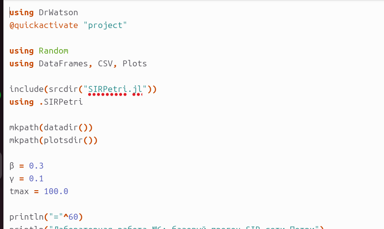{width=35%}

## Шаг 3. Запуск базового моделирования

```bash
julia --project=. scripts/sirpetri_run.jl
```

{width=40%}

Результаты:

| Показатель | Значение |
|---|---:|
| `beta` | 0.3 |
| `gamma` | 0.1 |
| `R0` | 3.0 |
| `I_det max` | 303.0 |
| `I_stoch max` | 282.0 |

## Шаг 4. Детерминированная динамика

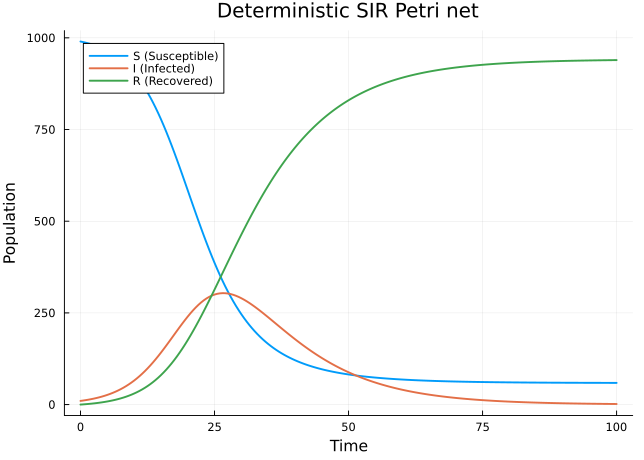{width=35%}

**Наблюдения:**

- `S` постепенно убывает
- `I` достигает пика около 303
- `R` монотонно возрастает

Детерминированная модель показывает гладкую среднюю траекторию процесса.

## Шаг 5. Стохастическая динамика

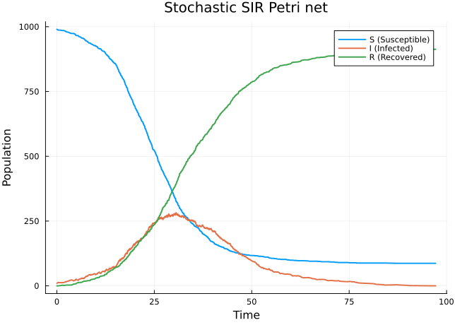{width=35%}

**Наблюдения:**

- траектория имеет случайные скачки
- пик инфицированных ниже: около 282
- общая форма совпадает с детерминированной моделью

Стохастическая модель отражает отдельные случайные события.

## Шаг 6. Сканирование параметра `beta`

Запуск:

```bash
julia --project=. scripts/sirpetri_scan_parameters.jl
```

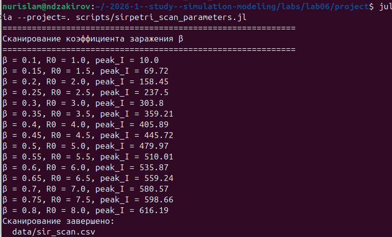{width=40%}

Параметр `beta` изменялся от `0.1` до `0.8`.

## Шаг 6. Результат сканирования

{width=35%}

**Наблюдения:**

- при `R0 = 1.0` вспышка почти не развивается
- при росте `beta` пик инфицированных увеличивается
- итоговое число переболевших также возрастает

## Шаг 7. Создание GIF-анимации

Запуск:

```bash
julia --project=. scripts/sirpetri_animate.jl
```

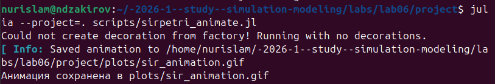{width=40%}

Анимация показывает изменение маркировки `S`, `I`, `R` во времени.

## Шаг 7. Результат анимации

{width=35%}

GIF может не воспроизводиться в PDF-отчете и презентации.

Поэтому анимация будет опубликована отдельным видео на **ВК Видео** и **Rutube**.

## Шаг 8. Итоговые сводные графики

Запуск:

```bash
julia --project=. scripts/sirpetri_report.jl
```

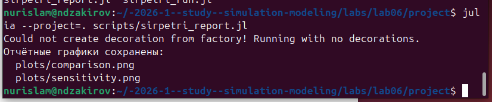{width=40%}

Скрипт формирует `comparison.png` и `sensitivity.png`.

## Шаг 8. Сравнение траекторий

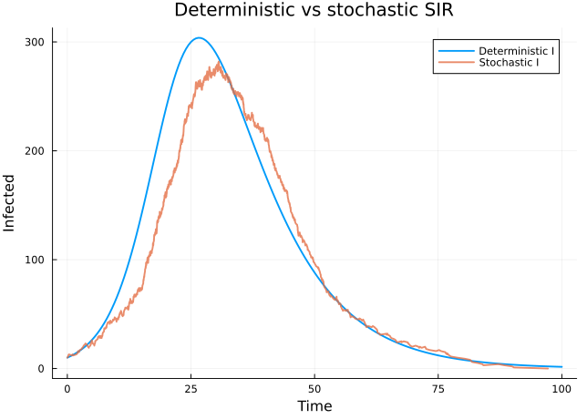{width=35%}

**Вывод:**

- детерминированный пик выше и гладкий
- стохастическая траектория ниже и неровнее
- качественная динамика совпадает

## Шаг 8. Чувствительность к `beta`

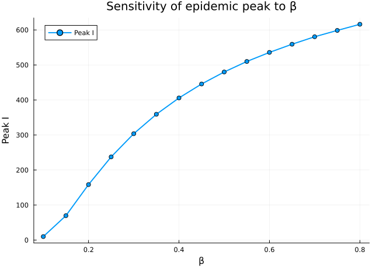{width=35%}

**Вывод:** `beta` является ключевым параметром, управляющим высотой эпидемической волны.

## Шаг 9. Литературное программирование

QMD-документ преобразован в Jupyter Notebook:

```bash
quarto render sirpetri_run.qmd --to ipynb
```

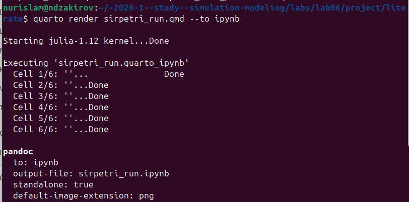{width=40%}

## Шаг 9. Jupyter Notebook

{width=40%}

Notebook содержит текст, код и результаты моделирования.

## Шаг 9. Рендеринг в HTML

```bash
quarto render sirpetri_run.qmd --to html
```

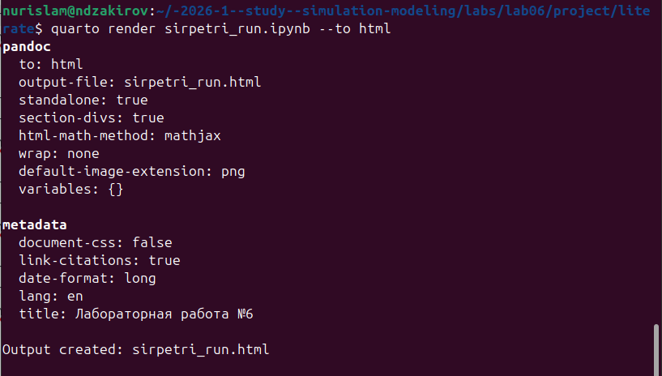{width=40%}

## Шаг 9. HTML-документация

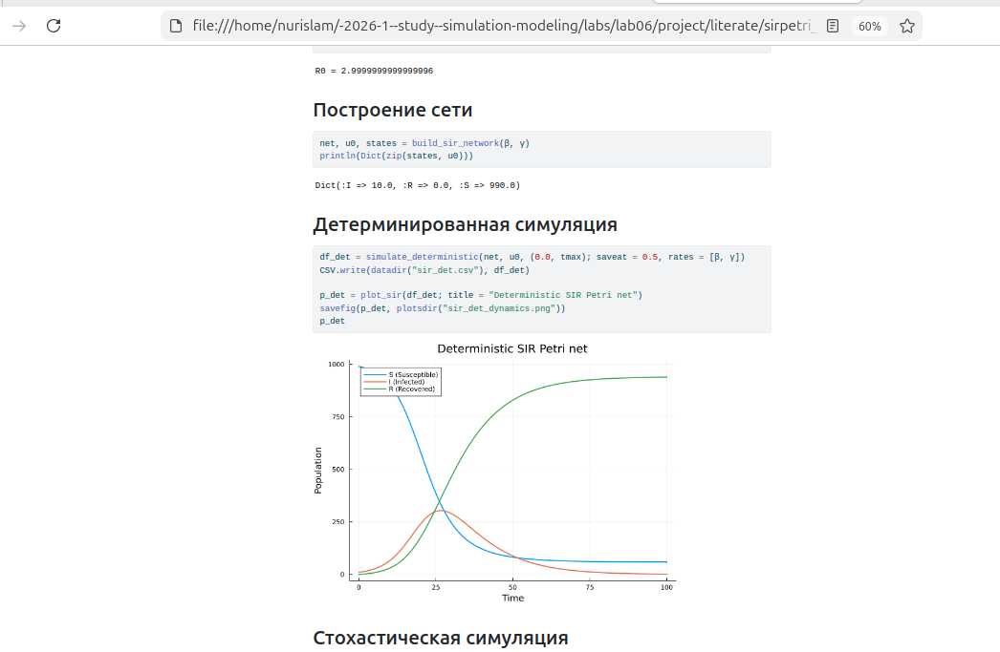{width=40%}

HTML-версия удобна для просмотра результатов в браузере.

## Шаг 9. Конвертация в скрипт

```bash
python3 -m nbconvert --to script sirpetri_run.ipynb
```

{width=40%}

Получен чистый Julia-скрипт.

## Шаг 10. Проверка QMD-документа

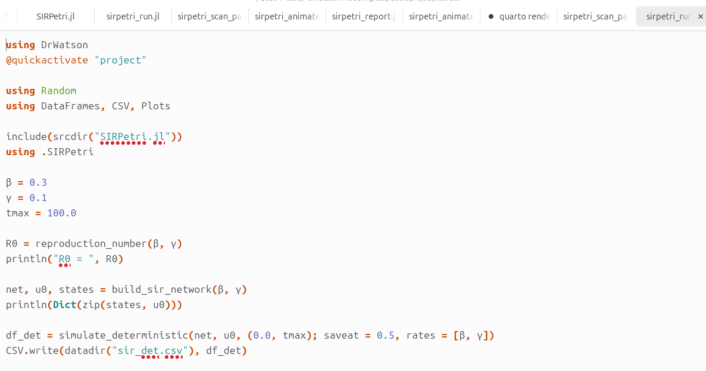{width=40%}

QMD содержит YAML-шапку, Markdown-текст, фрагменты Julia-кода и ссылки на результаты.

## Шаг 10. Рендеринг остальных документов

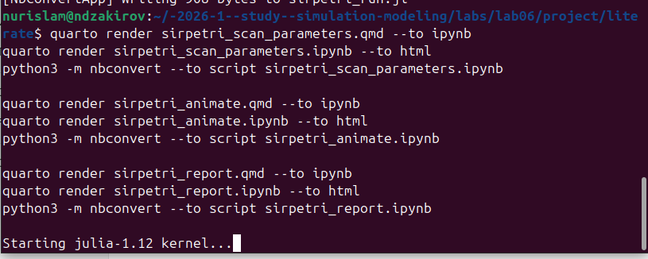{width=40%}

Отрендерены документы для сканирования, анимации и сводных графиков.

## Шаг 10. Финальная структура `literate`

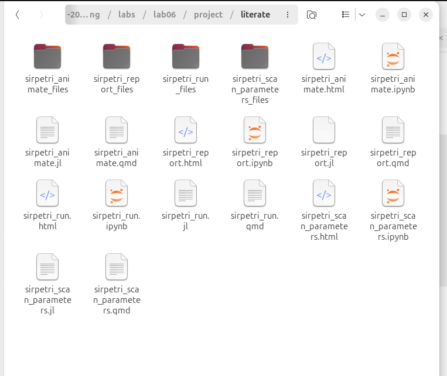{width=40%}

В папке `literate` получены:

- QMD
- HTML
- IPYNB
- JL

# Анализ чувствительности к параметрам

## Влияние `beta`

| `beta` | `R0` | Пик инфицированных |
|---:|---:|---:|
| 0.10 | 1.0 | 10.00 |
| 0.30 | 3.0 | 303.00 |
| 0.50 | 5.0 | 479.77 |
| 0.80 | 8.0 | 616.19 |

**Вывод:** чем выше интенсивность заражения, тем выше пик эпидемии.

## Детерминированный и стохастический подходы

| Подход | Результат |
|---|---|
| Детерминированный | гладкая средняя траектория |
| Стохастический | одна случайная реализация |

Оба подхода дают одинаковую качественную картину: рост, пик и спад числа инфицированных.

# Выводы

## Результаты

1. Построена SIR-сеть Петри с переходами `infection` и `recovery`
2. Выполнено детерминированное моделирование
3. Выполнено стохастическое моделирование алгоритмом Гиллеспи
4. Получены CSV-таблицы, PNG-графики и GIF-анимация
5. Выполнено сканирование параметра `beta`
6. Подготовлена Quarto-документация: QMD, HTML, IPYNB, JL
7. GIF-анимация будет опубликована отдельно на ВК Видео и Rutube

Главный вывод: сеть Петри удобно описывает структуру SIR-процесса, а Julia/DrWatson/Quarto позволяют воспроизводимо пройти путь от модели до отчета и презентации.
