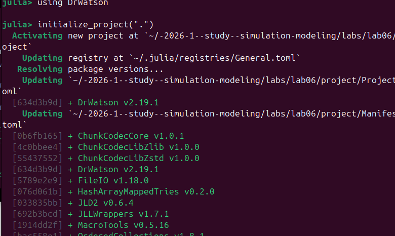
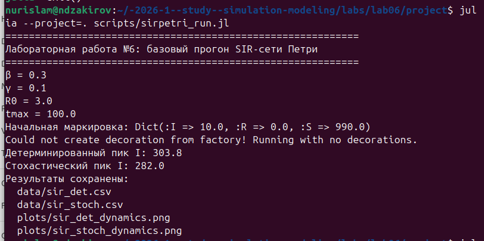
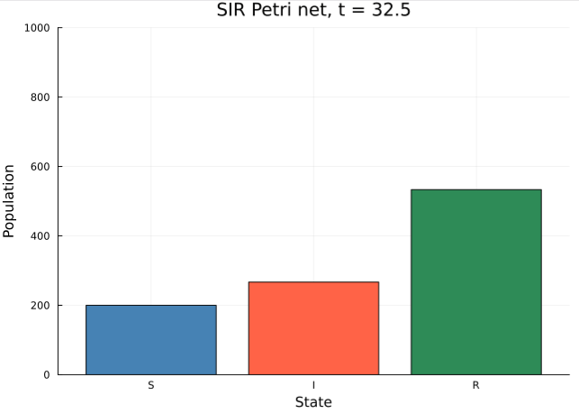
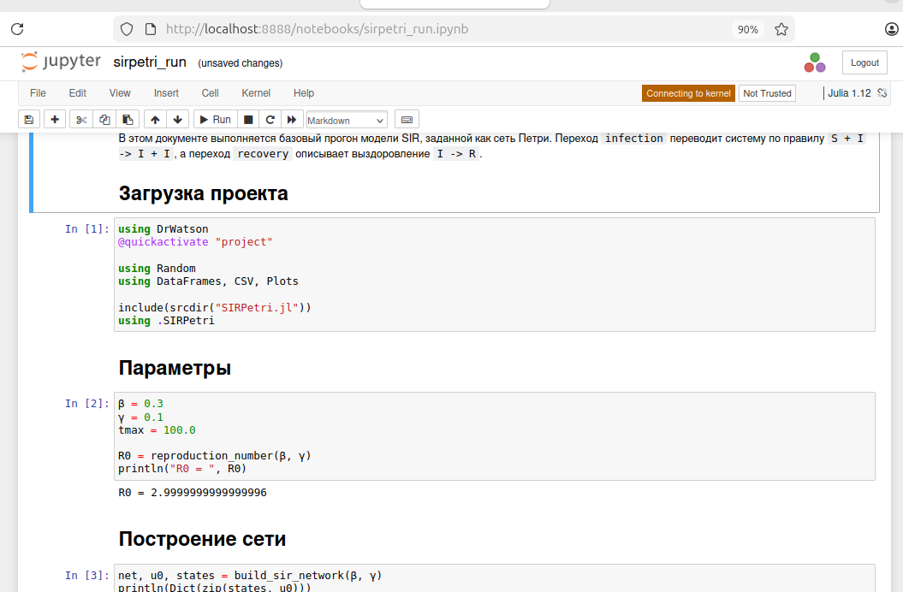
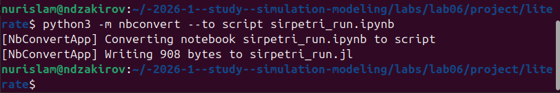

---
## Author
author:
  name: Закиров Нурислам Дамирович
  degrees: студент
  email: 1132236040@rudn.ru
  affiliation:
    - name: Российский университет дружбы народов
      country: Российская Федерация
      postal-code: 117198
      city: Москва
      address: ул. Миклухо-Маклая, д. 6

## Title
title: "Реализация основных моделей в подходе сетей Петри"
subtitle: "Лабораторная работа №6. Модель SIR"
license: "CC BY"
---

# Цель работы

Цель лабораторной работы — реализовать модель распространения инфекции SIR в подходе сетей Петри, выполнить детерминированное и стохастическое моделирование, исследовать чувствительность результатов к параметру заражения `beta`, подготовить графики, анимацию, литературную документацию, отчет и презентацию.

Дополнительно в работе важно показать полный воспроизводимый цикл: от структуры Julia-проекта и запуска скриптов на Ubuntu до анализа полученных изображений и подготовки материалов для защиты.

# Задание

В рамках лабораторной работы необходимо выполнить следующие этапы:

1. Создать воспроизводимый Julia-проект с использованием DrWatson.
2. Реализовать SIR-модель как сеть Петри с состояниями `S`, `I`, `R`.
3. Задать переходы `infection` и `recovery`.
4. Выполнить детерминированное моделирование через систему обыкновенных дифференциальных уравнений.
5. Выполнить стохастическое моделирование прямым алгоритмом Гиллеспи.
6. Построить графики динамики восприимчивых, инфицированных и выздоровевших.
7. Провести сканирование параметра `beta` и оценить влияние на пик эпидемии.
8. Сформировать GIF-анимацию процесса.
9. Построить сводные графики для сравнения результатов.
10. Подготовить литературные QMD-документы, HTML-страницы, Jupyter Notebook и чистые Julia-скрипты.
11. Сформировать отчет, презентацию, changelog и release-заметку.

# Теоретическое введение

## Сети Петри

Сеть Петри — это математический аппарат описания дискретных динамических систем. Состояние системы задается распределением фишек по позициям, а изменение состояния происходит при срабатывании переходов [@peterson1981petri; @murata1989petri]. Формально сеть Петри можно записать как:

$$
PN = (P, T, F, W, M_0),
$$

где $P$ — множество позиций, $T$ — множество переходов, $F$ — множество дуг, $W$ — веса дуг, а $M_0$ — начальная маркировка.

Для данной лабораторной работы сеть Петри используется не как отдельная абстрактная конструкция, а как форма записи эпидемиологической модели. В такой постановке фишки соответствуют людям или единицам популяции, позиции соответствуют состояниям, а переходы описывают возможные события.

| Понятие сети Петри | Интерпретация в модели SIR |
|---|---|
| Позиция | Эпидемиологическое состояние группы |
| Фишка | Один индивид или единица численности |
| Маркировка | Распределение популяции по состояниям |
| Переход | Событие заражения или выздоровления |
| Интенсивность перехода | Скорость или вероятность наступления события |

: Соответствие элементов сети Петри элементам SIR-модели

Такое представление удобно тем, что одна и та же структура сети может использоваться в двух режимах: как источник правой части для детерминированной модели и как набор событий для стохастической симуляции.

## Модель SIR

Классическая модель SIR описывает распространение инфекции в замкнутой популяции [@kermack1927sir]. Популяция разбивается на три группы:

| Позиция | Полное название | Смысл |
|---|---|---|
| `S` | Susceptible | восприимчивые индивиды |
| `I` | Infected | инфицированные индивиды |
| `R` | Recovered | выздоровевшие индивиды |

: Позиции SIR-сети Петри 

Переходы модели описаны в таблице.

| Переход | Реакция | Интерпретация |
|---|---|---|
| `infection` | `S + I -> I + I` | восприимчивый индивид становится инфицированным при контакте с инфицированным |
| `recovery` | `I -> R` | инфицированный индивид переходит в состояние выздоровевшего |

: Переходы SIR-сети Петри 

В работе используется нормированная интенсивность заражения:

$$
\lambda_{inf} = \beta \frac{S I}{N},
$$

где $N = S + I + R$ — размер популяции, $\beta$ — коэффициент заражения.

Интенсивность выздоровления задается выражением:

$$
\lambda_{rec} = \gamma I,
$$

где $\gamma$ — коэффициент выздоровления.

Детерминированная система имеет вид:

$$
\frac{dS}{dt} = -\beta \frac{S I}{N},
$$

$$
\frac{dI}{dt} = \beta \frac{S I}{N} - \gamma I,
$$

$$
\frac{dR}{dt} = \gamma I.
$$

Базовое репродуктивное число рассчитывается как:

$$
R_0 = \frac{\beta}{\gamma}.
$$

Если $R_0 > 1$, то в начале процесса инфекция имеет возможность распространяться. Если $R_0 \leq 1$, то вспышка либо не развивается, либо остается слабой.

## Детерминированный и стохастический подходы

В детерминированном подходе изменение численности групп считается непрерывным. Система ОДУ решается численным методом, и результатом являются гладкие траектории `S(t)`, `I(t)`, `R(t)`. Для этого используется Julia и экосистема DifferentialEquations/OrdinaryDiffEq [@rackauckas2017differentialequations; @bezanson2017julia].

В стохастическом подходе процесс рассматривается как последовательность отдельных случайных событий. На каждом шаге алгоритм Гиллеспи выбирает время до следующего события и сам тип события: заражение или выздоровление [@gillespie1977exact]. Из-за этого стохастическая траектория не обязана совпадать с детерминированной: пик может быть ниже или выше, а время пика может смещаться.

| Подход | Что моделируется | Особенности результата |
|---|---|---|
| Детерминированный | Средняя непрерывная динамика | гладкие линии, хорошо виден общий тренд |
| Стохастический | Конкретная случайная траектория событий | дискретные скачки, возможны отклонения от среднего поведения |

: Сравнение детерминированного и стохастического подходов

# Реализация проекта

Проект оформлен как Julia/DrWatson-репозиторий [@datseris2020drwatson]. Это позволяет хранить код, данные, графики и документацию в согласованной структуре, а также использовать переносимые пути `srcdir()`, `datadir()` и `plotsdir()`.

| Каталог или файл | Назначение |
|---|---|
| `Project.toml` | список зависимостей Julia-проекта |
| `src/SIRPetri.jl` | основной модуль SIR-сети Петри |
| `scripts/` | исполняемые сценарии моделирования |
| `literate/` | QMD-документы в литературном стиле |
| `data/` | CSV-результаты симуляций |
| `plots/` | графики и GIF-анимация |
| `image/` | хронологически переименованные скриншоты и графики для отчета |
| `report/` | отчет лабораторной работы |
| `presentation/` | презентация и текст выступления |

: Структура проекта лабораторной работы 

Основной модуль `src/SIRPetri.jl` содержит функции, перечисленные в таблице.

| Функция | Назначение |
|---|---|
| `build_sir_network` | построение размеченной SIR-сети Петри |
| `reproduction_number` | расчет $R_0 = \beta / \gamma$ |
| `epidemic_threshold` | формальная функция порогового значения |
| `simulate_deterministic` | детерминированное моделирование через ОДУ |
| `simulate_stochastic` | стохастическое моделирование алгоритмом Гиллеспи |
| `plot_sir` | построение графиков `S`, `I`, `R` |
| `plot_scan` | визуализация сканирования параметра `beta` |
| `plot_infected_comparison` | сравнение детерминированной и стохастической траекторий `I(t)` |

: Основные функции модуля `SIRPetri.jl` 

Ниже приведен ключевой фрагмент модуля, в котором SIR-модель задается именно как сеть Петри: позиции соответствуют состояниям `S`, `I`, `R`, а переходы соответствуют заражению и выздоровлению.

```julia
function build_sir_network(β = 0.3, γ = 0.1; S0 = 990.0, I0 = 10.0, R0 = 0.0)
    states = [:S, :I, :R]
    net = LabelledPetriNet(
        states,
        :infection => ([:S, :I] => [:I, :I]),
        :recovery => ([:I] => [:R]),
    )
    u0 = Float64[S0, I0, R0]
    return net, u0, states
end
```

Правую часть детерминированной SIR-модели формирует функция `sir_ode`. В ней переход `infection` задает поток из `S` в `I`, а переход `recovery` задает поток из `I` в `R`.

```julia
function sir_ode(net, rates = [0.3, 0.1]; normalized = true)
    function f!(du, u, p, t)
        S, I, R = u
        β, γ = rates

        infection_rate = infection_propensity(S, I, R, β; normalized)
        recovery_rate = γ * I

        du[1] = -infection_rate
        du[2] = infection_rate - recovery_rate
        du[3] = recovery_rate
        return nothing
    end
    return f!
end
```

Рабочие сценарии проекта приведены в таблице.

| Скрипт | Назначение | Основные выходные файлы |
|---|---|---|
| `sirpetri_run.jl` | базовый прогон модели | `sir_det.csv`, `sir_stoch.csv`, `sir_det_dynamics.png`, `sir_stoch_dynamics.png` |
| `sirpetri_scan_parameters.jl` | сканирование `beta` | `sir_scan.csv`, `sir_scan.png` |
| `sirpetri_animate.jl` | GIF-анимация динамики | `sir_animation.gif` |
| `sirpetri_report.jl` | сводные графики | `comparison.png`, `sensitivity.png` |

: Назначение исполняемых сценариев 

Базовые параметры эксперимента указаны в таблице.

| Параметр | Значение | Интерпретация |
|---|---:|---|
| `S0` | 990 | начальное число восприимчивых |
| `I0` | 10 | начальное число инфицированных |
| `R0` | 0 | начальное число выздоровевших |
| `beta` | 0.3 | интенсивность заражения |
| `gamma` | 0.1 | интенсивность выздоровления |
| `tmax` | 100 | горизонт моделирования |
| `seed` | 123 | зерно стохастического прогона |

: Базовые параметры вычислительного эксперимента 

Для этих параметров теоретическое значение базового репродуктивного числа равно:

$$
R_0 = \frac{0.3}{0.1} = 3.0.
$$

# Выполнение работы

## Инициализация проекта

Работа началась с создания и настройки DrWatson-проекта. На этом этапе была сформирована стандартная структура каталогов, подключены зависимости и подготовлено окружение Julia. Этот шаг важен не только технически, но и организационно: после переноса проекта с Windows на Ubuntu все команды должны выполняться из корня проекта без ручной правки путей.

{#fig-init width=90%}

На @fig-init видно, что проект был инициализирован в Julia, а пакеты были добавлены в окружение. Это подтверждает готовность рабочей директории к последующим запускам.

## Подготовка базового сценария

Затем был подготовлен и проверен сценарий `sirpetri_run.jl`. Этот файл выполняет базовый эксперимент:

1. Активирует проект через `@quickactivate "project"`.
2. Подключает модуль `SIRPetri.jl`.
3. Задает параметры `beta = 0.3`, `gamma = 0.1`, `tmax = 100`.
4. Создает SIR-сеть Петри.
5. Выполняет детерминированную симуляцию.
6. Выполняет стохастическую симуляцию.
7. Сохраняет данные и графики.

{#fig-code-run width=90%}

На @fig-code-run показан основной фрагмент сценария. Видно, что код не использует абсолютные пути: модуль подключается через `srcdir`, а результаты сохраняются через `datadir` и `plotsdir`.

Основной фрагмент сценария `sirpetri_run.jl`, отвечающий за параметры и запуск двух симуляций, выглядит следующим образом:

```julia
using DrWatson
@quickactivate "project"

using Random
using DataFrames, CSV, Plots

include(srcdir("SIRPetri.jl"))
using .SIRPetri

β = 0.3
γ = 0.1
tmax = 100.0

net, u0, states = build_sir_network(β, γ)

df_det = simulate_deterministic(
    net,
    u0,
    (0.0, tmax);
    saveat = 0.5,
    rates = [β, γ],
)

Random.seed!(123)
df_stoch = simulate_stochastic(
    net,
    u0,
    (0.0, tmax);
    rates = [β, γ],
)
```

После выполнения симуляций результаты сохраняются в CSV-файлы и в папку `plots`. Это делает дальнейший отчет независимым от повторного запуска модели: графики и таблицы уже лежат в структуре проекта.

```julia
CSV.write(datadir("sir_det.csv"), df_det)
CSV.write(datadir("sir_stoch.csv"), df_stoch)

p_det = plot_sir(df_det; title = "Deterministic SIR Petri net")
savefig(p_det, plotsdir("sir_det_dynamics.png"))

p_stoch = plot_sir(df_stoch; title = "Stochastic SIR Petri net")
savefig(p_stoch, plotsdir("sir_stoch_dynamics.png"))
```

## Запуск базового прогона

Базовый прогон был выполнен на Ubuntu командой:

```bash
julia --project=. scripts/sirpetri_run.jl
```

{#fig-run-basic width=90%}

В терминале были зафиксированы ключевые значения эксперимента. Результаты базового прогона сведены в таблицы.

| Показатель | Значение |
|---|---:|
| `beta` | 0.3 |
| `gamma` | 0.1 |
| $R_0$ | 3.0 |
| Начальное `S` | 990 |
| Начальное `I` | 10 |
| Начальное `R` | 0 |
| Детерминированный пик `I` | 303.0 |
| Стохастический пик `I` | 282.0 |

: Результаты базового прогона модели 

Сценарий также сохранил результаты в файлы, перечисленные в таблице.

| Файл | Содержание |
|---|---|
| `data/sir_det.csv` | временной ряд детерминированной модели |
| `data/sir_stoch.csv` | временной ряд стохастической модели |
| `plots/sir_det_dynamics.png` | график детерминированной динамики |
| `plots/sir_stoch_dynamics.png` | график стохастической динамики |

! Выходные файлы базового прогона 

## Детерминированная динамика

Детерминированный график показывает классическую эпидемическую волну. Число восприимчивых `S` убывает, поскольку часть популяции заражается. Число инфицированных `I` сначала растет, потому что при $R_0 = 3.0$ каждый инфицированный в среднем порождает больше одного нового заражения. Затем, когда восприимчивых становится меньше, поток новых заражений ослабевает, и кривая `I` начинает снижаться. Число выздоровевших `R` монотонно растет.

{#fig-det width=85%}

Пик инфицированных в детерминированном прогоне составил примерно `303`. Это означает, что в наиболее напряженный момент моделирования одновременно инфицированной оказалась примерно треть всей популяции.

## Стохастическая динамика

Стохастический прогон был выполнен с фиксированным зерном генератора случайных чисел `Random.seed!(123)`. В отличие от детерминированного подхода, здесь динамика строится как последовательность конкретных событий: заражений и выздоровлений.

{#fig-stoch width=85%}

На @fig-stoch видно, что общая форма процесса сохраняется, но линии становятся менее гладкими. Стохастический пик инфицированных составил около `282`, то есть оказался ниже детерминированного. Это не является ошибкой: стохастическая модель показывает одну возможную реализацию процесса, а не усредненную траекторию.

## Сканирование параметра `beta`

После базового прогона был выполнен анализ чувствительности к параметру заражения:

```bash
julia --project=. scripts/sirpetri_scan_parameters.jl
```

Сценарий изменял `beta` от `0.1` до `0.8` при фиксированном `gamma = 0.1`. Для каждого значения рассчитывались $R_0$, пик инфицированных и итоговое число выздоровевших.

Фрагмент скрипта `sirpetri_scan_parameters.jl` показывает, как выполнялось сканирование параметра. Для каждого значения `beta` строилась сеть Петри, выполнялась детерминированная симуляция и сохранялись агрегированные показатели.

```julia
β_range = 0.1:0.05:0.8
γ_fixed = 0.1
tmax = 100.0

rows = DataFrame(
    β = Float64[],
    γ = Float64[],
    R0 = Float64[],
    peak_I = Float64[],
    final_R = Float64[],
)

for β in β_range
    net, u0, states = build_sir_network(β, γ_fixed)
    df = simulate_deterministic(
        net,
        u0,
        (0.0, tmax);
        saveat = 0.5,
        rates = [β, γ_fixed],
    )

    push!(rows, (
        β,
        γ_fixed,
        reproduction_number(β, γ_fixed),
        maximum(df.I),
        last(df.R),
    ))
end

CSV.write(datadir("sir_scan.csv"), rows)
```

{#fig-scan-terminal width=90%}

Полная таблица результатов сканирования приведена в таблице.

| `beta` | $R_0$ | Пик инфицированных |
|---:|---:|---:|
| 0.10 | 1.0 | 10.00 |
| 0.15 | 1.5 | 69.72 |
| 0.20 | 2.0 | 158.45 |
| 0.25 | 2.5 | 237.50 |
| 0.30 | 3.0 | 303.00 |
| 0.35 | 3.5 | 359.91 |
| 0.40 | 4.0 | 405.89 |
| 0.45 | 4.5 | 445.72 |
| 0.50 | 5.0 | 479.77 |
| 0.55 | 5.5 | 510.01 |
| 0.60 | 6.0 | 535.87 |
| 0.65 | 6.5 | 559.24 |
| 0.70 | 7.0 | 580.57 |
| 0.75 | 7.5 | 599.60 |
| 0.80 | 8.0 | 616.19 |

: Результаты сканирования параметра `beta` 

{#fig-scan width=85%}

Из таблицы и @fig-scan видно, что при `beta = 0.1` значение $R_0 = 1.0$, и пик остается на уровне начального количества инфицированных. При увеличении `beta` пик растет практически монотонно. Это подтверждает, что коэффициент заражения является ключевым параметром интенсивности эпидемической волны.

## Анимация процесса

Для визуализации изменения маркировки SIR-сети Петри был запущен сценарий:

```bash
julia --project=. scripts/sirpetri_animate.jl
```

В скрипте анимации на каждом кадре строится столбчатая диаграмма текущей маркировки `S`, `I`, `R`, а затем набор кадров сохраняется в GIF.

```julia
anim = @animate for i in 1:step:nrow(df_det)
    bar(
        ["S", "I", "R"],
        [df_det.S[i], df_det.I[i], df_det.R[i]];
        ylim = (0, maximum(df_det.S)),
        title = "SIR Petri net dynamics, t=$(round(df_det.time[i], digits = 1))",
        legend = false,
    )
end

gif(anim, plotsdir("sir_animation.gif"), fps = 10)
```

{#fig-animation-terminal width=90%}

Результатом стал файл `plots/sir_animation.gif`, который дополнительно помещен в папку `image` как `09_animation_sir.gif`. GIF показывает, как фишки постепенно переходят из позиции `S` в `I`, а затем из `I` в `R`.

Так как GIF-анимация может не воспроизводиться в финальных отчетных форматах, особенно при рендеринге в PDF и при показе презентации, она будет опубликована отдельно как видео на **ВК Видео** и **Rutube**. Для защиты и публикации будет использоваться видео-версия этой анимации.

{#fig-animation-terminalд width=90%}

## Сводные графики

Для итогового анализа был запущен сценарий:

```bash
julia --project=. scripts/sirpetri_report.jl
```

Сценарий `sirpetri_report.jl` не пересчитывает модель заново, а читает уже сохраненные CSV-файлы и строит сводные изображения. Такой подход удобен для воспроизводимости: сначала генерируются данные, затем отдельно формируется аналитическая визуализация.

```julia
df_det = CSV.read(datadir("sir_det.csv"), DataFrame)
df_stoch = CSV.read(datadir("sir_stoch.csv"), DataFrame)
df_scan = CSV.read(datadir("sir_scan.csv"), DataFrame)

p_comparison = plot_infected_comparison(df_det, df_stoch)
savefig(p_comparison, plotsdir("comparison.png"))

p_sensitivity = plot(
    df_scan.β,
    df_scan.peak_I;
    marker = :circle,
    xlabel = "β",
    ylabel = "Peak infected",
    title = "Peak infected vs β",
    linewidth = 2,
)
savefig(p_sensitivity, plotsdir("sensitivity.png"))
```

{#fig-report-terminal width=90%}

Он сформировал два дополнительных графика: сравнение детерминированной и стохастической траекторий `I(t)`, а также график чувствительности пика инфицированных к `beta`.

{#fig-comparison width=85%}

На @fig-comparison видно, что детерминированная траектория имеет более гладкий и высокий пик. Стохастическая траектория ниже и неровнее, но качественно повторяет тот же сценарий: рост, пик и спад числа инфицированных.

{#fig-sensitivity width=85%}

На @fig-sensitivity видна монотонная зависимость: чем больше `beta`, тем больше пик инфицированных. При больших значениях `beta` рост постепенно замедляется, потому что размер популяции ограничен.

## Литературная документация

Код был оформлен в литературном стиле с помощью Quarto [@quarto]. Для основного документа `sirpetri_run.qmd` был выполнен рендеринг в Jupyter Notebook:

```bash
quarto render sirpetri_run.qmd --to ipynb
```

{#fig-render-ipynb width=90%}

Полученный notebook был открыт и проверен в браузере.

{#fig-notebook width=90%}

Затем тот же QMD-документ был отрендерен в HTML:

```bash
quarto render sirpetri_run.qmd --to html
```

{#fig-render-html width=90%}

HTML-документ содержит связанное описание эксперимента, код, результаты запуска и графики.

{#fig-html-view width=90%}

После этого notebook был преобразован в чистый Julia-скрипт через `nbconvert`.

{#fig-nbconvert width=90%}

Также был проверен исходный QMD-код.

{#fig-qmd-code width=90%}

Далее были отрендерены остальные QMD-документы: сканирование параметров, анимация и сводный отчет.

{#fig-render-other width=90%}

Итоговая папка `literate` содержит исходные QMD, HTML-версии, Jupyter Notebook и Julia-скрипты.

{#fig-literate-final width=90%}

# Анализ результатов

Выполненная модель корректно воспроизводит базовую логику SIR-процесса. Начальная популяция состоит из `990` восприимчивых, `10` инфицированных и `0` выздоровевших. При `beta = 0.3` и `gamma = 0.1` значение $R_0 = 3.0$, поэтому инфекция распространяется и формирует выраженный эпидемический пик.

Детерминированная модель показывает среднюю непрерывную динамику. Пик инфицированных равен примерно `303`, после чего число инфицированных уменьшается. Причина снижения состоит в том, что восприимчивых становится меньше, и инфекция уже не может поддерживать прежний темп распространения.

Стохастическая модель дает ту же качественную картину, но учитывает случайность отдельных событий. Пик равен примерно `282`, что ниже детерминированного значения. Это различие показывает, что в конечной популяции даже при одинаковых параметрах возможны разные траектории процесса.

Сканирование `beta` демонстрирует пороговый характер распространения инфекции. При $R_0 = 1.0$ вспышка практически не усиливается. При $R_0 > 1$ пик быстро растет. Максимальное значение в проведенном диапазоне наблюдалось при `beta = 0.8`: пик инфицированных составил `616.19`.

С точки зрения сетей Петри модель удобна тем, что ее элементы имеют наглядную интерпретацию. Фишки в позициях `S`, `I`, `R` показывают распределение популяции, а переходы `infection` и `recovery` описывают события, изменяющие это распределение. Поэтому сеть Петри выступает мостом между дискретным описанием процесса и численным моделированием.

# Выводы

В лабораторной работе была реализована SIR-модель в подходе сетей Петри. Были выполнены детерминированная и стохастическая симуляции, построены графики динамики, выполнено сканирование параметра `beta`, создана GIF-анимация и подготовлена литературная Quarto-документация.

Полученные результаты согласуются с теорией SIR: при $R_0 = 3.0$ возникает выраженная эпидемическая волна, а при увеличении `beta` пик инфицированных возрастает. Сравнение детерминированной и стохастической траекторий показывает, что оба подхода дают одинаковую качественную динамику, но стохастическая модель дополнительно отражает случайность отдельных событий.

Также была подтверждена практическая ценность DrWatson и Quarto для лабораторной работы. DrWatson обеспечивает переносимые пути и аккуратную структуру проекта, а Quarto позволяет связать код, результаты, графики и текстовое объяснение в единый воспроизводимый документ.

Таким образом, сети Петри оказались удобным инструментом для описания дискретной структуры SIR-модели, а Julia/DrWatson/Quarto обеспечили полный цикл подготовки: код, данные, графики, документация, отчет и презентация.

# Список литературыa

::: {#refs}
:::
