---
## Author
author:
  name: Закиров Нурислам Дамирович
  degrees: студент
  email: 1132236040@rudn.ru
  affiliation:
    - name: Российский университет дружбы народов
      country: Российская Федерация
      postal-code: 117198
      city: Москва
      address: ул. Миклухо-Маклая, д. 6

## Title
title: Лабораторная работа №7
subtitle: Дискретно-событийное моделирование
license: CC BY
date: today
date-format: "YYYY-MM-DD"
---


# Информация

## Докладчик

:::::::::::::: {.columns align=center}
::: {.column width="70%"}

  * **Закиров Нурислам Дамирович**
  * студент группы НФИбд-01-23
  * Российский университет дружбы народов
  * 1132236040@rudn.ru

:::
::: {.column width="30%"}


:::
::::::::::::::

# Цель работы

## Цель

Изучить дискретно-событийное моделирование на двух примерах:

- система массового обслуживания `M/M/c`
- модель Росса с резервными машинами и ремонтом
- сравнение имитации с аналитическими расчетами
- подготовка воспроизводимых вычислительных материалов

# Теория

## Дискретно-событийный подход

Состояние системы меняется только в моменты событий:

- поступление заявки
- начало обслуживания
- завершение обслуживания
- отказ машины
- завершение ремонта

Между событиями состояние не пересчитывается.

## Модель M/M/c

`M/M/c` -- это очередь с несколькими каналами обслуживания.

| Элемент | Смысл |
|---|---|
| `M` | пуассоновский поток заявок |
| `M` | экспоненциальное обслуживание |
| `c` | число параллельных каналов |

Условие устойчивости:

$$\rho = \frac{\lambda}{c\mu} < 1$$

## Модель Росса

В системе есть:

- основные машины
- резервные машины
- ремонтники
- отказы
- очередь ремонта

Падение происходит, когда исправных машин становится меньше требуемого числа основных машин.

# Выполнение

## Шаг 1. Подготовка проекта

Код был оформлен как Julia-проект с модулем `DESModels.jl`.

```text
project/src/DESModels.jl
project/scripts/
project/data/
project/plots/
```

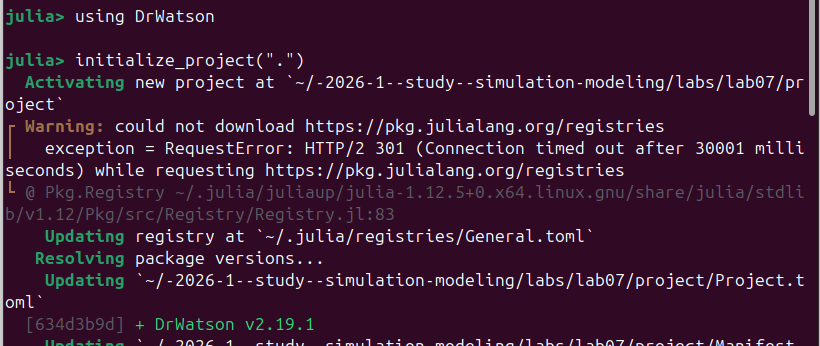{width=58%}

## Шаг 2. Запуск M/M/c

```bash
julia --project=. scripts/mmc_run.jl
```

Результаты:

- `mmc_events.csv`
- `mmc_summary.csv`
- `mmc_waiting_time.png`
- `mmc_queue_load.png`

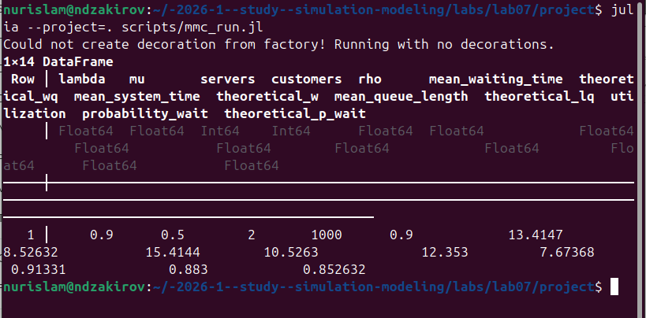{width=58%}

## Шаг 3. Время ожидания

Среднее ожидание в имитации получилось выше аналитического значения.

| Метрика | Имитация | Аналитика |
|---|---:|---:|
| Среднее ожидание | 13.4147 | 8.5263 |
| Вероятность ожидания | 0.8830 | 0.8526 |

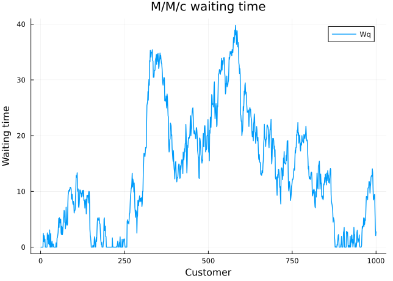{width=46%}

## Шаг 4. Очередь M/M/c

Загрузка системы равна `0.9`, поэтому очередь появляется волнами.

| Метрика | Значение |
|---|---:|
| Средняя длина очереди | 12.3530 |
| Теоретическая длина очереди | 7.6737 |
| Загрузка каналов | 0.9133 |

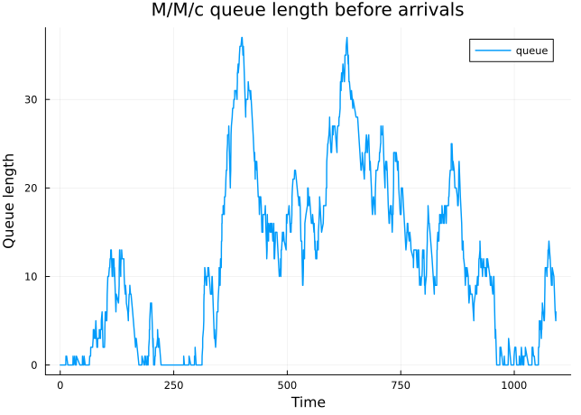{width=46%}

## Шаг 5. Запуск модели Росса

```bash
julia --project=. scripts/ross_run.jl
```

Базовые параметры:

- 10 основных машин
- 3 резервные машины
- 1 ремонтник
- 200 прогонов

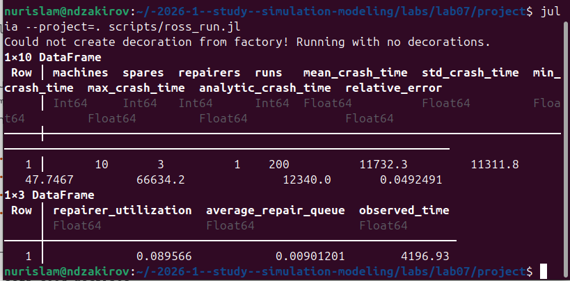{width=58%}

## Шаг 6. Исправные машины

График показывает траекторию первого имитационного прогона.

| Показатель | Значение |
|---|---:|
| Среднее время до падения | 11732.27 |
| Аналитическое среднее | 12340.00 |
| Относительная ошибка | 4.92% |

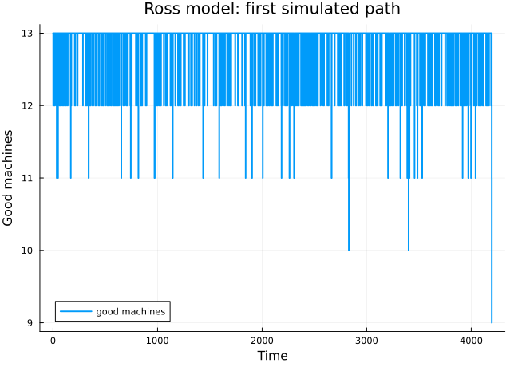{width=46%}

## Шаг 7. Очередь ремонта

В базовом прогоне очередь ремонта возникает редко.

| Метрика | Значение |
|---|---:|
| Загрузка ремонтника | 0.0896 |
| Средняя очередь ремонта | 0.0090 |
| Наблюдаемое время | 4196.93 |

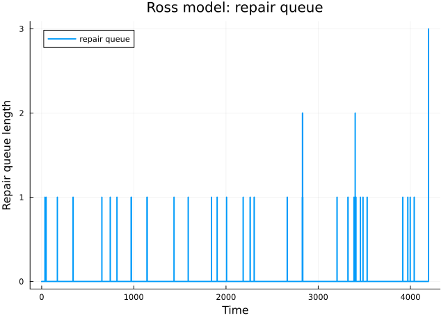{width=46%}

## Шаг 8. Распределение времени до падения

Время до падения системы имеет большую случайную вариативность.

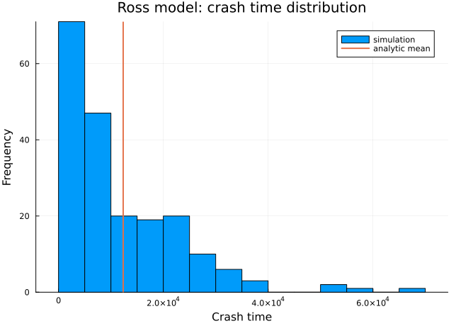{width=46%}

# Сканирование

## Шаг 9. Скан параметров

```bash
julia --project=. scripts/ross_scan_parameters.jl
```

Облегченный режим:

- `machines = [6, 10]`
- `spares = [1, 3]`
- `repairers = [1, 2]`
- `runs = 10`

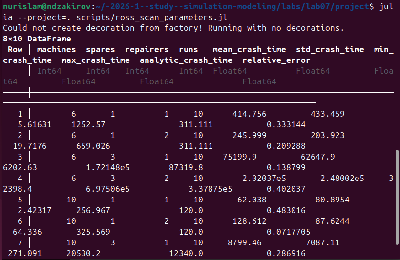{width=58%}

## Шаг 10. Влияние резерва

Увеличение числа резервных машин обычно повышает время до падения системы.

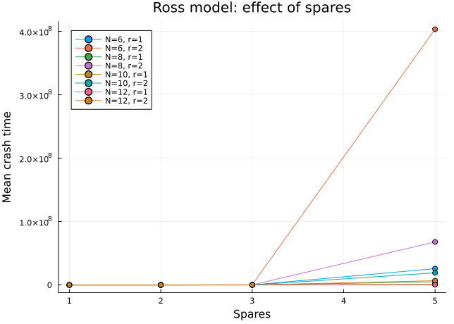{width=46%}

## Шаг 11. Влияние ремонтников

Дополнительный ремонтник ускоряет восстановление, но эффект зависит от конфигурации.

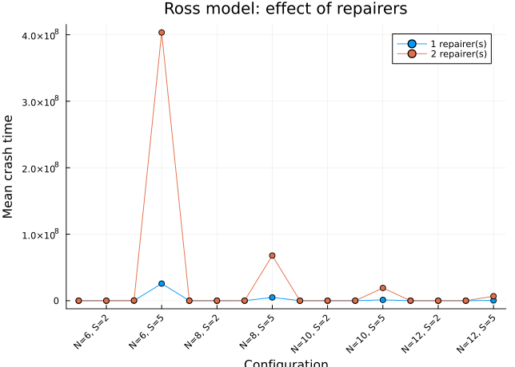{width=46%}

# Сводные результаты

## Шаг 12. Общий отчет

```bash
julia --project=. scripts/des_report.jl
```

| Модель | Метрика | Имитация | Аналитика |
|---|---|---:|---:|
| `M/M/c` | ожидание | 13.4147 | 8.5263 |
| Ross | время до падения | 11732.27 | 12340.00 |

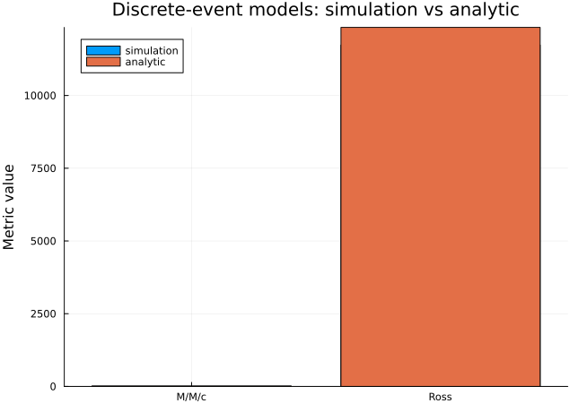{width=46%}

# Литературный стиль

## Шаг 13. Производные файлы

Для сценариев были сформированы:

- `QMD`
- `IPYNB`
- `HTML`
- `JL`

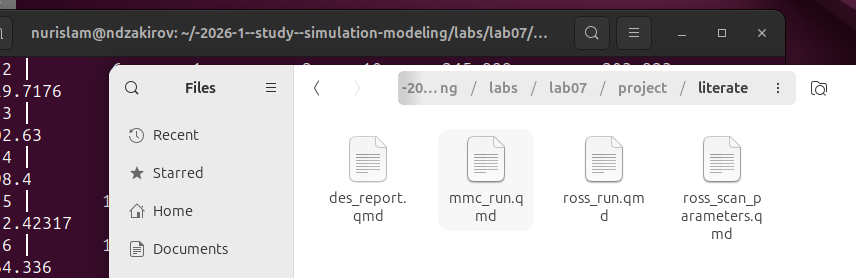{width=58%}

## Шаг 14. Рендеринг notebook

Документы были выполнены и преобразованы в notebook/HTML. На слайде показан пример рендеринга notebook для модели Росса.

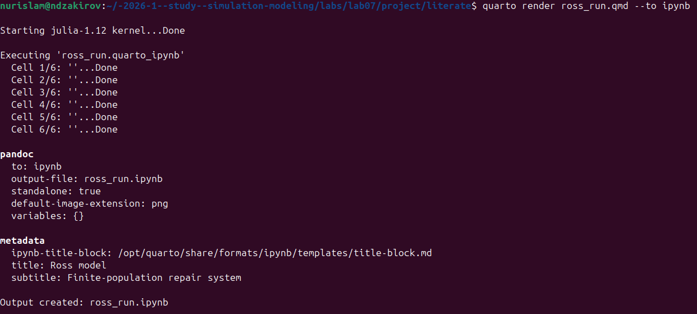{width=48%}

## Шаг 15. Готовые производные файлы

Мы успешно отрендерили все файлы формата qmd и получили по 3 производных формата.

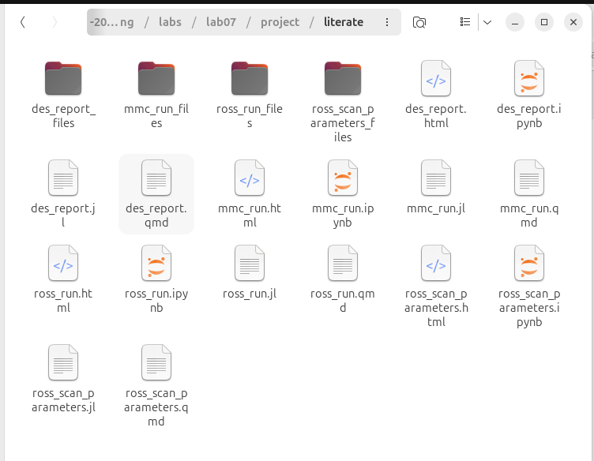{width=35%}


# Выводы

## Выводы

1. Реализованы дискретно-событийные модели `M/M/c` и Росса.
2. Получены таблицы, графики и сводные метрики.
3. Для `M/M/c` показано влияние высокой загрузки на очередь.
4. Для модели Росса оценено время до падения системы.
5. Сканирование параметров показало влияние резерва и ремонтников.
6. Подготовлены производные материалы в литературном стиле.
