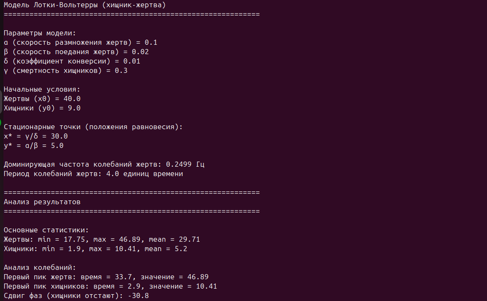
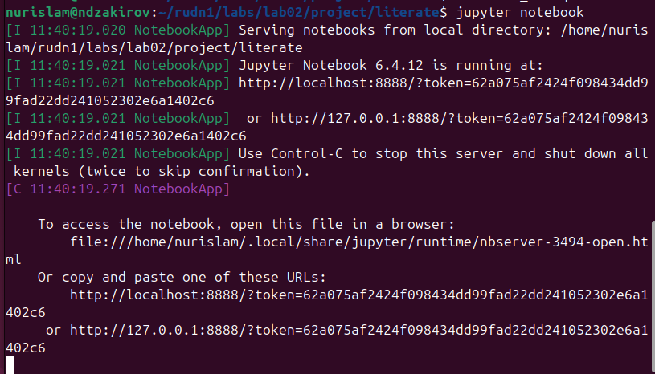
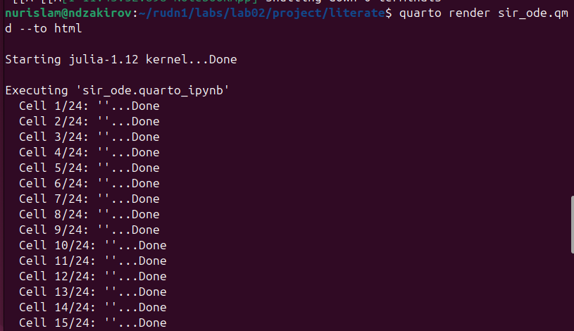
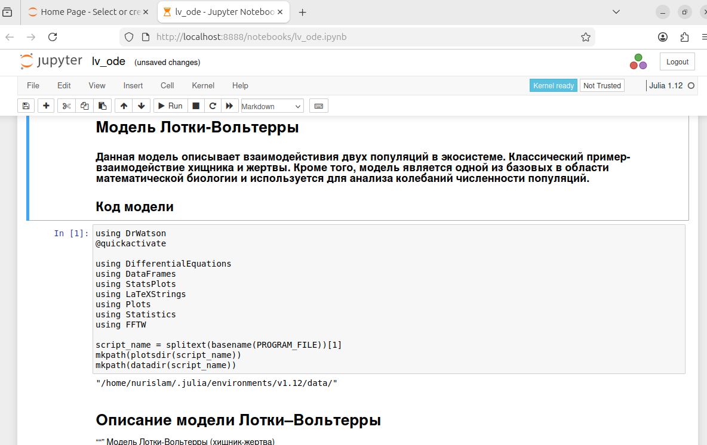
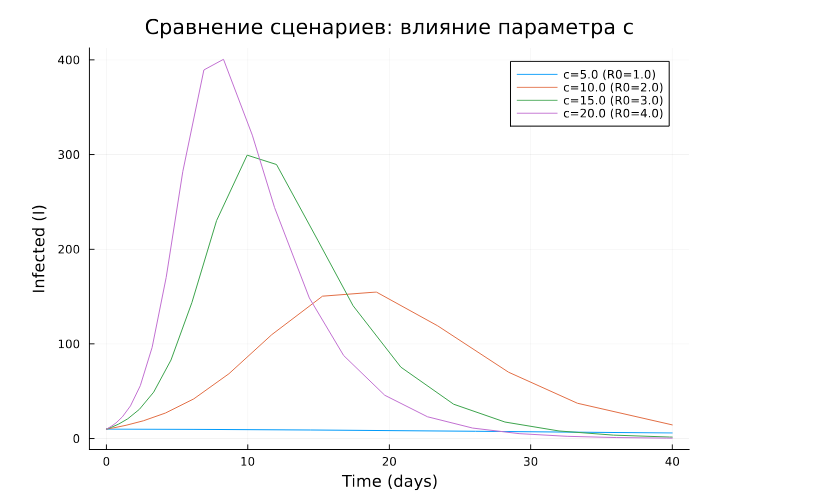

---
## Author
author:
  name: Закиров Нурислам Дамирович
  degrees: DSc
  orcid: 0000-0002-0877-7063
  email: 1132236040@rudn.ru
  affiliation:
    - name: Российский университет дружбы народов
      country: Российская Федерация
      postal-code: 117198
      city: Москва
      address: ул. Миклухо-Маклая, д. 6
## Title
title: "Лабораторная работа 2"
subtitle: "Основные модели: SIR и Лотки-Вольтерры"
license: CC BY
date: today
date-format: "YYYY-MM-DD"
---

# Цель работы

- Изучение и программная реализация базовых математических моделей
- Модель эпидемии SIR
- Модель хищник-жертва Лотки-Вольтерры
- Освоение методов программирования в литературном стиле

# Задание

::: incremental

- Создать рабочий каталог для кода
- Установить необходимые пакеты
- Выполнить предложенный код
- Преобразовать код в литературный стиль
- Сгенерировать из литературного кода: чистый код, Jupyter notebook, документацию Quarto
- Интегрировать документацию в отчёт
- Добавить вычисления для набора параметров

:::

# Теоретическое введение

## Модель SIR

- Классическая математическая модель эпидемиологии
- Описывает распространение инфекционного заболевания в закрытой популяции
- Три компартмента:

::: incremental

- **S** (Susceptible) — восприимчивые
- **I** (Infected) — инфицированные/заразные
- **R** (Recovered) — выздоровевшие/удаленные

:::

## Уравнения модели SIR

$$\frac{dS}{dt}=-\beta IS/N$$

$$\frac{dI}{dt}=\beta IS/N-\gamma I$$

$$\frac{dR}{dt}=\gamma I$$

## Модель Лотки-Вольтерры

- Фундаментальная математическая модель в экологии
- Описывает динамику взаимодействия двух видов: хищник и жертва

## Уравнения модели Лотки-Вольтерры

$$\frac{dx}{dt}=\alpha x-\beta xy$$

$$\frac{dy}{dt}=\delta xy-\gamma y$$

# Выполнение работы

## Создание рабочего каталога

- Созданы папки: `scripts`, `notebooks`, `docx`

::: {.columns align=center}
::: {.column width="70%"}

:::
::::::::::::::

## Установка пакетов Julia

- Все необходимые пакеты загружены в процессе выполнения

::: {.columns align=center}
::: {.column width="70%"}

:::
::::::::::::::

## Модель SIR: исходный код

- Файл: `sir_ode.jl`
- Исходный код из инструкции

::: {.columns align=center}
::: {.column width="70%"}

:::
::::::::::::::

## Модель SIR: попытка запуска

- Не все пакеты были установлены заранее

::: {.columns align=center}
::: {.column width="70%"}

:::
::::::::::::::

## Модель SIR: установка пакетов

- Установка недостающих пакетов Julia

::: {.columns align=center}
::: {.column width="70%"}

:::
::::::::::::::

## Модель SIR: успешный запуск

- Успешное выполнение модели

::: {.columns align=center}
::: {.column width="70%"}

:::
::::::::::::::

## Модель SIR: результат

- Построение графика динамики компартментов

::: {.columns align=center}
::: {.column width="70%"}

:::
::::::::::::::

## Модель Лотки-Вольтерры: исходный код

- Файл: `lv_ode.jl`
- Исходный код из инструкции

::: {.columns align=center}
::: {.column width="70%"}

:::
::::::::::::::

## Модель Лотки-Вольтерры: попытка запуска

- Не все пакеты были установлены заранее

::: {.columns align=center}
::: {.column width="70%"}

:::
::::::::::::::

## Модель Лотки-Вольтерры: успешный запуск

- Успешное выполнение модели

::: {.columns align=center}
::: {.column width="70%"}

:::
::::::::::::::

## Модель Лотки-Вольтерры: результат

- Построение графика динамики популяций

::: {.columns align=center}
::: {.column width="70%"}

:::
::::::::::::::

# Литературное программирование

## Преобразование кода SIR в литературный стиль

- Создание файла формата `.qmd`
- Разделение кода и комментариев

::: {.columns align=center}
::: {.column width="70%"}

:::
::::::::::::::

## Код в литературном стиле

- Использование блоков ```{julia}```
- Автоматическое форматирование в Markdown

::: {.columns align=center}
::: {.column width="70%"}

:::
::::::::::::::

## Генерация Jupyter Notebook

- Команда: `quarto render`

::: {.columns align=center}
::: {.column width="70%"}

:::
::::::::::::::

## Запуск Jupyter Notebook

- Выполнение кода из ноутбука

::: {.columns align=center}
::: {.column width="70%"}

:::
::::::::::::::

## Результат выполнения Notebook

- Успешное выполнение кода

::: {.columns align=center}
::: {.column width="70%"}

:::
::::::::::::::

## Генерация HTML-документации

- Конвертация через `quarto render`

::: {.columns align=center}
::: {.column width="70%"}

:::
::::::::::::::

## Файл документации

- Создан файл `sir_ode.html`

::: {.columns align=center}
::: {.column width="70%"}

:::
::::::::::::::

## Результат документации

- Наглядная документация с результатами

::: {.columns align=center}
::: {.column width="70%"}

:::
::::::::::::::

## Генерация чистого кода

- Конвертация через `nbconvert` в формат `.jl`

::: {.columns align=center}
::: {.column width="70%"}

:::
::::::::::::::

## Чистый код

- Получение чистого исполняемого кода

::: {.columns align=center}
::: {.column width="70%"}

:::
::::::::::::::

## Преобразование кода LV в литературный стиль

- Создание файла формата `.qmd` для модели Лотки-Вольтерры

::: {.columns align=center}
::: {.column width="70%"}

:::
::::::::::::::

## Код LV в литературном стиле

- Разделение кода и комментариев

::: {.columns align=center}
::: {.column width="70%"}

:::
::::::::::::::

## Генерация Notebook для LV

- Команда: `quarto render`

::: {.columns align=center}
::: {.column width="70%"}

:::
::::::::::::::

## Результат выполнения Notebook LV

- Успешное выполнение кода

::: {.columns align=center}
::: {.column width="70%"}

:::
::::::::::::::

## Генерация HTML-документации для LV

- Конвертация через `quarto render`

::: {.columns align=center}
::: {.column width="70%"}

:::
::::::::::::::

## Результат документации LV

- Наглядная документация с результатами

::: {.columns align=center}
::: {.column width="70%"}

:::
::::::::::::::

## Генерация чистого кода для LV

- Конвертация через `nbconvert`

::: {.columns align=center}
::: {.column width="70%"}

:::
::::::::::::::

## Итоговая структура каталога

- Папка `project/literate/`
- Папки `sir_ode/` и `lv_ode/`
- Папка `lv_ode/Plots/` с графиками

::: {.columns align=center}
::: {.column width="70%"}

:::
::::::::::::::

## Структура проекта

- Все необходимые файлы сгенерированы

::: {.columns align=center}
::: {.column width="70%"}

:::
::::::::::::::

# Работа с параметрами

## Модификация для набора параметров

- Создание версии `sir_ode(edited).qmd`
- Добавление вычислений для различных параметров

::: {.columns align=center}
::: {.column width="70%"}

:::
::::::::::::::

## Генерация форматов с параметрами

- Генерация всех трёх форматов: JL, IPYNB, HTML

::: {.columns align=center}
::: {.column width="70%"}

:::
::::::::::::::

## Результаты с параметрами

- Визуализация различных сценариев

::: {.columns align=center}
::: {.column width="70%"}

:::
::::::::::::::

## График результатов

- Сравнительный анализ результатов

::: {.columns align=center}
::: {.column width="70%"}

:::
::::::::::::::

# Выводы

## Основные результаты

::: incremental

- Изучены принципы математического моделирования
- Реализованы модели SIR и Лотки-Вольтерры
- Освоено литературное программирование
- Автоматизирована генерация кода и документации
- Научились использовать Jupyter-ноутбуки и документацию Quarto
- Расширили понимание влияния параметров на математические модели

:::

# Спасибо за внимание!

## Контакты

- **Закиров Нурислам Дамирович**
- Российский университет дружбы народов им. П. Лумумбы
- [1132236040@rudn.ru](mailto:1132236040@rudn.ru)
